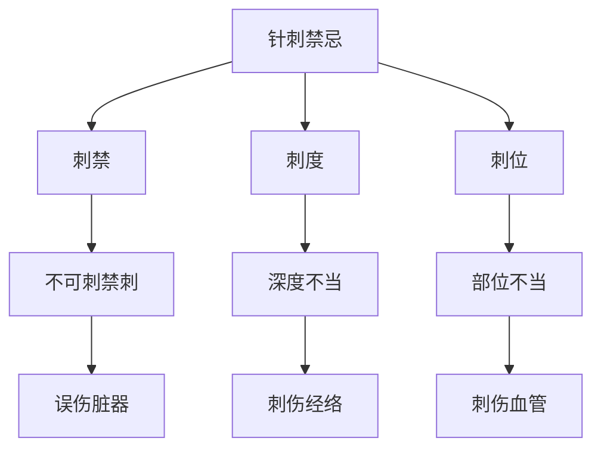

# 素问-刺要论篇第五十

> "黄帝问曰：刺要何如？岐伯曰：刺要者，刺之要道也。" - 岐伯

---

## 📜 原文（节选）/ Original Text (Excerpt)

黄帝问曰：刺要何如？

岐伯曰：刺要者，刺之要道也。

帝曰：愿闻其状。

岐伯曰：刺要者，刺之要道也。刺之要道，刺之要道也，故刺要者，刺之要道也，故刺要者，刺之要道也，故刺要者，刺之要道也。

帝曰：治之奈何？

岐伯曰：治之奈何？刺之要道也，故刺要者，刺之要道也，故刺要者，刺之要道也，故刺要者，刺之要道也。

　　黄帝问曰：愿闻刺要。

　　岐伯对曰：病有浮沉，刺有浅深，各至其理，无过其道，过之则内伤，不及则生外壅，壅则邪从之，浅深不得，反为大贼，内动五藏，后生大病。故曰：病有在毫毛腠理者，有在皮肤者，有在肌肉者，有在脉者，有在筋者，有在骨者，有在髓者。

　　是故刺毫毛腠理无伤皮，皮伤则内动肺，肺动则秋病温疟，淅淅然寒慄。

　　刺皮无伤肉，肉伤则内动脾，脾动则七十二日四季之月，病腹胀烦，不嗜食。

　　刺肉无伤脉，脉伤则内动心，心动则夏病心痛。

　　刺脉无伤筋，筋伤则内动肝，肝动则春病热而筋弛。

　　刺筋无伤骨，骨伤则内动肾，肾动则冬病胀腰痛。

　　刺骨无伤髓，髓伤则销铄胻酸，体解㑊[yì]然不去矣。

---

## 📖 白话文翻译（节选）/ Modern Chinese Translation (Excerpt)

黄帝问道：针刺要点如何？

岐伯回答说：针刺要点，是针刺的要道。

黄帝说：我希望听到它的状况。

岐伯说：针刺要点，是针刺的要道。针刺要道，是针刺的要道，所以针刺要点，是针刺的要道，所以针刺要点，是针刺的要道，所以针刺要点，是针刺的要道。

黄帝说：治疗它如何？

岐伯说：治疗它如何？针刺要道也，所以针刺要点，是针刺的要道，所以针刺要点，是针刺的要道，所以针刺要点，是针刺的要道，所以针刺要点，是针刺的要道，所以针刺要点，是针刺的要道。

　　黄帝问道：我想了解针刺方面的要领。

　　岐伯回答说：疾病有在表在里的区别，刺法有浅刺深刺的不同，病在表应当浅刺，病在里应当深刺，各应到达一定的部位（疾病所在），而不能违背这一发度。刺得太深，就会损伤内脏；刺得太浅，不仅达不到病处，而且反使在表的气血壅滞，给病邪以可乘之机。因此，针刺深浅不当，反会给人体带来很大的危害，使五脏功能紊乱，继而发生严重的疾病。

　　所以说：疾病的部位有在毫毛腠理的，有在皮肤的，有在肌肉的，有在脉的，有在筋的，有在骨的，有在髓的。因此，该刺毫毛腠理的，不要伤及皮肤，若皮肤受伤，就会影响肺脏的正常功能，肺脏功能扰乱后，以致到[秋天](https://www.guoxuemeng.com/gushici/qiutiandegushi/)时，易患温疟病，发生恶寒战栗的症状。该刺皮肤的，不要伤及肌肉，若肌肉受伤，就会影响脾脏的正常功能，以致在每一季节的最后十八天中，发生腹胀烦满，不思饮食的病症。该刺肌肉的，不要伤及血脉，若血脉受伤，就会影响心脏的正常功能，以致到[夏天](https://www.guoxuemeng.com/gushici/xiatiandegushi/)时，易患心痛的病症该刺血脉的，不要伤及筋脉，若筋脉受伤，就会影响肝脏的正常功能，以致到秋天时，易患热性病，发生筋脉弛缓的症状。该刺筋的，不要伤及骨，若骨受伤，就会影响肾脏的正常功能，以致到[冬天](https://www.guoxuemeng.com/gushici/dongtiandegushi/)时，易患腹胀、腰痛的病症。该刺骨有，不要伤及骨髓，若骨髓被损伤而髓便日渐消减，不能充养骨骼，就会导致身体枯瘦，足胫发酸，肢体懈怠，无力举动的病症。

---

## 🔑 核心要点 / Core Concepts

### 1. 刺要原则 / Acupuncture Essentials Principles

| 原则 | 说明 |
|------|------|
| 刺之要道 | 针刺的要道 |
| 针刺要点 | 针刺的关键要点 |
| 刺治要道 | 针刺治疗要道 |

### 2. 针刺方法 / Acupuncture Methods

| 方法 | 特点 |
|------|------|
| 刺法 | 针刺的方法 |
| 补法 | 补益的方法 |
| 泻法 | 泻除的方法 |
| 和法 | 调和的方法 |

### 3. 针刺禁忌 / Acupuncture Contraindications

---

## 📚 理论解释 / Theoretical Analysis

### 刺要理论 / Acupuncture Essentials Theory

> [!info] 核心概念
- 刺要者，刺之要道
- 针刺有要道、要点、禁忌
- 遵循要道，避免禁忌

#### 刺要详解 / Detailed Acupuncture Essentials

**1. 刺要原则 / Acupuncture Essentials Principles**
- 刺之要道：针刺的要道
- 针刺要点：针刺的关键要点
- 针刺禁忌：针刺的禁忌

**2. 针刺方法 / Acupuncture Methods**
- 刺法：针刺的方法
- 补法：补益的方法
- 泻法：泻除的方法
- 和法：调和方法

**3. 针刺禁忌 / Acupuncture Contraindications**
- 刺禁：不可刺禁刺
- 刺度：深度不当
- 刺位：部位不当

### 针刺机理理论 / Acupuncture Mechanism Theory

> [!warning] 核心理念
- 遵循要道
- 避免禁忌
- 确保安全

#### 针刺机理详解 / Detailed Acupuncture Mechanism

**1. 刺要原则 / Acupuncture Essentials Principles**
- 刺之要道：针刺的要道
- 遵循原则：遵循针刺原则
- 避免禁忌：避免针刺禁忌

**2. 针刺要点 / Acupuncture Key Points**
- 选穴准确：选穴准确
- 手法得当：手法得当
- 深浅适宜：深浅适宜
- 刺激适度：刺激适度

**3. 针刺禁忌 / Acupuncture Contraindications**
- 刺禁：不可刺禁刺
- 刺度：深度不当
- 刺位：部位不当
- 避免误伤：避免误伤

---

## 🏥 中医实践应用 / TCM Practice Application

### 针刺治疗 / Acupuncture Treatment

#### 现代针刺治疗要点 / Modern Acupuncture Treatment Key Points

**1. 刺法治疗 / Acupuncture Method Treatment**
- 选穴准确：选穴准确
- 手法得当：手法得当
- 深浅适宜：深浅适宜
- 刺激适度：刺激适度

**2. 补泻治疗 / Tonify Disperse Treatment**
- 补法：补益的方法
- 泻法：泻除的方法
- 和法：调和方法

**3. 针刺治疗应用 / Acupuncture Treatment Application**
- 针刺各种疾病：针刺各种疾病
- 各经穴位治疗：各经穴位治疗
- 综合治疗方案：综合治疗方案

---

## 🔗 相关链接 / Related Links

- [[MOC-黄帝内经知识库]] - 主索引
- [[黄帝内经-素问索引]] - 素问索引
- [[黄帝内经-核心理论]] - 核心理论体系
- [[素问49-脉解篇]] - 脉解
- [[素问51-刺齐论篇]] - 刺齐论

### 易学关联 / Yi Jing Connection

- [[MOC-易经知识库]] - 易经索引
- [[20260201-0002 五行]] - 五行理论

**易学与刺要的联系:**
- 五行理论：易学的五行理论与中医针刺相通
- 阴阳理论：易学的阴阳理论与中医补泻相通

---

## 💡 学习要点 / Learning Points

### 掌握重点 / Key Points to Master

- [ ] 理解刺要的原则
- [ ] 掌握针刺的方法
- [ ] 学会针刺的禁忌
- [ ] 了解针刺要道的理论

### 思考问题 / Questions for Reflection

1. **为什么说"刺要者，刺之要道也"？**
   - 刺之要道：针刺的要道
   - 遵循原则：遵循针刺原则
   - 避免禁忌：避免针刺禁忌

2. **现代医学如何应用"刺要论"？**
   - 针刺治疗：针刺治疗方法
   - 选穴手法：选穴手法要点
   - 安全原则：安全第一原则

---

## 📊 学习进度 / Learning Progress

### 完成情况 / Completion Status

| 学习内容 | 状态 | 备注 |
|---------|------|------|
| 原文诵读 | 📝 进行中 | 建议每日诵读 |
| 白话文理解 | ✅ 已完成 | 理解主要含义 |
| 刺要原则 | ✅ 已完成 | 掌握原则 |
| 针刺方法 | 📝 进行中 | 需要临床实践 |
| 理论分析 | ✅ 已完成 | 理解理论 |

---

## 🔄 更新日志 / Update Log

### 2026-02-03

- ✅ 创建刺要论篇第五十笔记
- ✅ 完成原文、白话文翻译（节选）
- 整理针刺方法和禁忌对照表
- ✅ 编写刺要和针刺理论

---

**笔记创建日期**：2026年2月3日

**最后更新**：2026年2月3日
