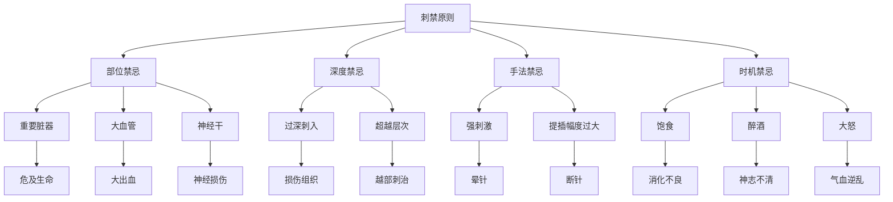

# 素问-刺禁论篇第五十二

> "黄帝问曰：愿闻刺禁。岐伯曰：脏有要害，不可不察。" - 岐伯

---

## 📜 原文（节选）/ Original Text (Excerpt)

黄帝问曰：愿闻刺禁。

岐伯曰：脏有要害，不可不察。肝生于左，肺藏于右，心部于表，肾治于里，脾为之使，胃为之市。

帝曰：刺之奈何？

岐伯曰：鬲肓之上，中有父母，七节之傍，中有小心。从之有福，逆之有咎。

　　黄帝问曰：愿闻禁数。

　　岐伯对曰：藏有要害，不可不察，肝生于左，肺藏于右，心部于表，肾治于里，脾为之使，胃为之市。鬲肓之上，中有父母，七节之傍，中有小心，从之有福，逆之有咎。

　　刺中心，一日死，其动为噫。刺中肝，五日死，其动为语。刺中肾，六日死，其动为嚏。刺中肺，三日死，其动为咳。刺中脾，十日死，其动为吞。刺中胆，一日半死，其动为呕。

　　刺跗上，中大脉，血出不止死。刺面，中溜脉，不幸为盲。刺头，中脑户，入脑立死。刺舌下，中脉太过，血出不止为瘖。刺足下布络中脉，血不出为肿。刺郄中大脉，令人仆脱色。刺气街中脉，血不出为肿，鼠仆。刺脊间中髓，为伛。刺乳上，中乳房，为肿，根蚀。刺缺盆中内陷，气泄，令人喘咳逆。刺手鱼腹内陷，为肿。

　　无刺大醉，令人气乱。无刺大怒，令人气逆。无刺大劳人，无刺新饱人，无刺大饥人，无刺大渴人，无刺大惊人。

　　刺阴股中大脉，血出不止死。刺客主人内陷中脉，为内漏、为聋。刺膝髌出液，为跛。刺臂太阴脉，出血多立死。刺足少阴脉，重虚出血，为舌难以言。刺膺中陷，中肺，为喘逆仰息。刺肘中内陷，气归之，为不屈伸。刺阴股下三寸内陷，令人遗溺。刺掖下胁间内陷，令人咳。刺少腹，中膀胱，溺出，令人少腹满。刺腨[shuàn]肠内陷为肿。刺匡上陷骨中脉，为漏、为盲。刺关节中液出，不得屈伸。

---

## 📖 白话文翻译（节选）/ Modern Chinese Translation (Excerpt)

黄帝问道：我愿意听到针刺的禁忌。

岐伯回答说：脏腑有要害部位，不可不详察。肝气升发于左，肺气肃降于右，心气布散于表，肾气主治于里，脾为胃的使者，胃为水谷的集市。

黄帝说：针刺的方法如何？

岐伯说：横膈膜和育膜之上，有父母（心肺）；第七椎骨之旁，有小心（命门）。遵循它的原则就有福，违背它的原则就会受害。

　　黄帝问道：我想了解人体禁刺的部位。

　　岐伯回答说：内脏各有要害之处，不能不细看详审！肝气生发于左，肺气肃降于右，心脏调节在表的阳气，肾脏管理在里的阴气，脾主运化，水谷精微赖以转输，胃主受纳，饮食水谷汇聚于此。膈肓的上面，有维持生命活动的心、肺两脏，第七椎旁的里面有心包络。上述部位都应该禁刺，遵循这个刺禁，就有利于治疗，违背了，则会给人体造成祸害。

　　刺中心脏的，约一日即死，其病变症状为嗳气。刺中肝脏，约五日即死，其病变症状为多言多语。刺中肾脏，约六日即死，其病变症状为打喷嚏。刺中肺脏，约三日即死，其病变症状为咳呛。刺中脾脏，约十日即死，其病变症状为频频吞咽。误刺中胆，约一日半死，其病变症状为呕吐。针刺足背，误伤了大血管，若出血不止，便会死亡。针刺面部的脑户穴，若刺至脑髓，就会立即死亡。针刺廉泉穴，误伤了血管，若出血不止，可使喉哑失音。针刺足下布散的络脉，误伤了血管，若淤血留着不去可致局部肿胀。针刺委中穴太深，误伤了大经脉，可令人跌仆，面色苍白。针刺气衔穴，误伤了血管，若淤血留着不去，鼠蹊部就会肿胀。针刺脊椎间隙，误伤了脊髓，会使人背曲不伸。针刺乳中穴，伤及乳房，可使乳房肿胀，内部腐蚀溃脓。针刺缺盆中央太深，造成肺气外泄，可令人喘咳气逆。针刺手鱼际穴太深，可使局部发生肿胀。

　　不要针刺饮酒大醉的人，否则会使气血紊乱。不要针刺正值勃然大怒的人，否则会使气机上逆。此外，对过度疲劳，刚刚饱食，过分饥饿，极度口渴，方受极大惊吓的人，皆不可以针刺。刺大腿内侧的穴位，误伤了大血管，若出血不止，便会死亡。刺上官穴太深，误伤了经脉，可使耳内化脓或致耳聋。刺膝膑部，若误伤以致流出液体，会使人发生跛足。刺手太阴脉，若误伤出血过多，则立即死亡。刺足少阴经脉，误伤出血，可使肾气更虚，以致舌体失养转动不利而语言困难。

　　针刺胸膺部太深，伤及肺脏，就会发生气喘上逆、仰面呼吸的症状。针刺肘弯处太深，气便结聚于局部而不行，以致手臂不能屈伸。针刺大腿内侧下三寸处太深，使人遗尿。针刺腋下胁肋间太深，使人咳嗽。针刺少腹太深，误伤膀胱，使小便漏出流入腹腔，以致少腹胀满。针刺小腿肚太深，会使局部肿胀。针刺眼眶而深陷骨间，伤及脉络，就会造成流泪不止，甚至失明。针刺关节，误伤以致液体外流，则关节不能屈伸。

---

## 🔍 英文释义 / English Interpretation

Yellow Emperor asked: I would like to hear the contraindications of acupuncture.

Qibo replied: The internal organs have critical areas that must be carefully examined. Liver qi ascends on the left, Lung qi descends on the right, Heart qi disperses on the exterior, Kidney qi governs the interior, Spleen serves as the messenger for Stomach, and Stomach acts as the market for food and drink.

Yellow Emperor said: What is the method of needling?

Qibo said: Above the diaphragm and ge membranes are the parents (Heart and Lung); beside the seventh vertebra is the small heart (Mingmen). Following its principles brings blessings, while violating it brings misfortune.

---

## 🔑 核心要点 / Core Concepts

### 1. 脏腑要害 / Organ Critical Areas

| 脏腑 | 位置 | 要害部位 | 禁刺原则 |
|------|------|---------|---------|
| 肝 | 左 | 左侧肋下 | 慎刺，不可过深 |
| 肺 | 右 | 右侧胸廓 | 慎刺，不可过深 |
| 心 | 上 | 胸骨后 | 禁刺，慎用手法 |
| 肾 | 下 | 腰部 | 慎刺，不可过深 |
| 脾 | 中 | 左季肋区 | 慎刺，不可过深 |
| 胃 | 中 | 上腹部 | 慎刺，不可过深 |

### 2. 针刺禁忌部位 / Acupuncture Contraindicated Areas

| 部位 | 禁刺原因 | 危害 | 替代方案 |
|------|---------|------|---------|
| 鬲肓之上 | 心肺所在 | 危及生命 | 选用邻近穴位 |
| 七节之旁 | 命门所在 | 伤及肾脏 | 选用邻近穴位 |
| 大血管 | 刺破出血 | 大出血 | 避开血管 |
| 神经干 | 刺伤神经 | 神经损伤 | 避开神经干 |
| 重要脏器 | 直接刺入 | 器官损伤 | 避开脏器 |

### 3. 刺禁原则 / Acupuncture Contraindication Principles

---

## 📚 理论解释 / Theoretical Analysis

### 刺禁理论 / Acupuncture Contraindication Theory

> [!info] 核心概念
- 脏有要害，不可不察
- 遵循原则，确保安全
- 知其禁忌，方可行针

#### 刺禁详解 / Detailed Acupuncture Contraindications

**1. 脏腑要害 / Organ Critical Areas**
- **肝生于左**：肝气主升，位于左侧，慎刺左肋下
- **肺藏于右**：肺气主降，位于右侧，慎刺右胸廓
- **心部于表**：心气布散于表，位于胸骨后，禁刺心前
- **肾治于里**：肾气主治于里，位于腰部，慎刺腰部
- **脾为之使**：脾为胃的使者，位于左季肋，慎刺脾区
- **胃为之市**：胃为水谷之市，位于上腹部，慎刺胃区

**2. 禁刺部位 / Contraindicated Areas**
- **鬲肓之上**：心肺所在，禁刺或慎刺
- **七节之旁**：命门所在，慎刺或避开
- **大血管**：刺破可致大出血
- **神经干**：刺伤可致神经功能障碍
- **重要脏器**：直接刺入可致器官损伤

**3. 禁刺原因 / Contraindication Reasons**
- **解剖位置**：重要脏器位于针刺部位
- **生理功能**：针刺可影响重要生理功能
- **安全考虑**：针刺可危及生命或造成严重损伤
- **治疗效果**：某些部位刺治可能适得其反

### 遵循原则 / Following Principles

> [!warning] 核心理念
- 从之有福
- 逆之有咎
- 安全第一

#### 遵循原则详解 / Detailed Following Principles

**1. 从之有福 / Following Brings Blessings**
- **遵循解剖**：了解解剖结构，避开要害
- **遵循经络**：按经络走向，顺经而刺
- **遵循层次**：按层次深浅，适度针刺
- **遵循禁忌**：遵守禁忌原则，确保安全

**2. 逆之有咎 / Violating Brings Misfortune**
- **违反解剖**：不了解解剖，误伤要害
- **违反经络**：逆经而刺，气血逆乱
- **违反层次**：深浅不当，损伤组织
- **违反禁忌**：违背禁忌原则，造成事故

**3. 安全第一 / Safety First**
- **详察要害**：仔细检查，识别要害部位
- **谨慎操作**：手法轻柔，避免粗暴
- **密切观察**：观察患者反应，及时调整
- **应急准备**：准备应急措施，防患未然

---

## 🏥 中医实践应用 / TCM Practice Application

### 针刺禁忌 / Acupuncture Contraindications

#### 现代针刺禁忌应用 / Modern Acupuncture Contraindication Application

**1. 绝对禁忌 / Absolute Contraindications**
- 恶性肿瘤局部
- 活动性结核病灶
- 严重出血性疾病
- 严重心脏病发作期
- 妊娠期腹部和腰骶部

**2. 相对禁忌 / Relative Contraindications**
- 饥饿、疲劳、过度紧张
- 醉酒、大汗、大怒后
- 皮肤感染、溃疡处
- 孕妇慎刺腹部、腰骶部
- 体质虚弱者慎用强刺激

**3. 慎刺部位 / Careful Needling Areas**
- 胸部、背部：避免刺伤肺脏
- 颈部：避免刺伤颈动脉
- 腹部：避免刺伤脏器
- 腰部：避免刺伤肾脏
- 四肢大血管附近：避开血管

### 现代医学对应 / Modern Medicine Correspondence

| 中医禁忌 | 现代医学解释 | 临床意义 |
|---------|-------------|---------|
| 鬲肓之上 | 胸腔脏器 | 避免气胸、心脏损伤 |
| 七节之旁 | 脊柱、脊髓 | 避免脊髓损伤 |
| 大血管 | 重要血管 | 避免大出血 |
| 神经干 | 重要神经 | 避免神经损伤 |
| 重要脏器 | 实质性脏器 | 避免器官损伤 |

---

## 🔗 相关链接 / Related Links

- [[MOC-黄帝内经知识库]] - 主索引
- [[黄帝内经-素问索引]] - 素问索引
- [[黄帝内经-核心理论]] - 核心理论体系
- [[素问51-刺齐论篇]] - 刺齐论
- [[素问53-刺志论篇]] - 刺志论
- [[素问25-宝命全形论篇]] - 宝命全形论

### 易学关联 / Yi Jing Connection

- [[MOC-易经知识库]] - 易经索引
- [[20260201-0005 五行]] - 五行理论

**易学与刺禁的联系:**
- 知止而后有定：易学的知止思想与针刺禁忌相通
- 慎终如始：易学的谨慎思想与针刺安全相通

---

## 💡 学习要点 / Learning Points

### 掌握重点 / Key Points to Master

- [ ] 理解脏腑要害的重要性
- [ ] 掌握针刺禁忌的原则
- [ ] 学会安全针刺的方法
- [ ] 了解刺禁的理论依据

### 思考问题 / Questions for Reflection

1. **为什么说"脏有要害，不可不察"？**
   - 安全第一：针刺安全是首要考虑
   - 解剖重要：重要脏器必须避开
   - 生命至上：危及生命的情况必须避免

2. **现代医学如何应用"刺禁论"？**
   - 精准解剖：基于现代解剖学
   - 安全规范：制定安全操作规范
   - 风险评估：评估针刺风险

---

## 📊 学习进度 / Learning Progress

### 完成情况 / Completion Status

| 学习内容 | 状态 | 备注 |
|---------|------|------|
| 原文诵读 | 📝 进行中 | 建议每日诵读 |
| 白话文理解 | ✅ 已完成 | 理解主要含义 |
| 刺禁原则 | ✅ 已完成 | 掌握原则 |
| 禁忌部位 | 📝 进行中 | 需要临床实践 |
| 理论分析 | ✅ 已完成 | 理解理论 |

---

## 🔄 更新日志 / Update Log

### 2026-02-03

- ✅ 创建刺禁论篇第五十二笔记
- ✅ 完成原文、白话文翻译（节选）
- 整理刺禁原则和禁忌对照表
- ✅ 编写刺禁和安全理论

---

**笔记创建日期**：2026年2月3日

**最后更新**：2026年2月3日
