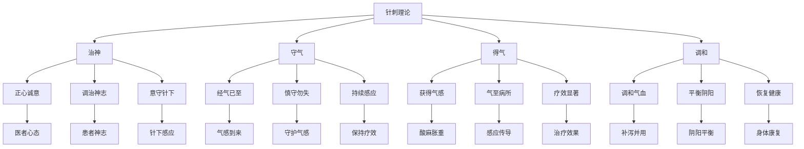

# 素问-针解篇第五十四

> "黄帝问曰：愿闻针解。岐伯曰：针道久矣，其法无穷。" - 岐伯

---

## 📜 原文（节选）/ Original Text (Excerpt)

黄帝问曰：愿闻针解。

岐伯曰：针道久矣，其法无穷。凡刺之真，必先治神。

帝曰：何谓治神？

岐伯曰：治神者，必正其心，而后乃可治神。经气已至，慎守勿失。

　　黄帝问曰：愿闻九针之解，虚实之道。

　　岐伯对曰：刺虚则实之者，针下热也，气实乃热也。满而泄之者，针下寒也，气虚乃寒也。菀陈则除之者，出恶血也。邪胜则虚之者，出针勿按；徐而疾则实者，徐出针而疾按之；疾而徐则虚者，疾出针而徐按之；言实与虚者，寒温气多少也。若无若有者，疾不可知也。察后与先者，知病先后也。为虚与实者，工勿失其法。若得若失者，离其法也。虚实之要，九针最妙者，为其各有所宜也。补泻之时者，与气开阖相合也。九针之名，各不同形者，针穷其所当补泻也。

　　刺实须其虚者，留针阴气隆至，乃去针也；刺虚须其实者，阳气隆至，针下热乃去针也。经气已至，慎守勿失者，勿变更也。深浅在志者，知病之内外也；近远如一者，深浅其候等也。如临深渊者，不敢堕也。手如握虎者，欲其壮也。神无营于众物者，静志观病人，无左右视也；义无邪下者，欲端以正也；必正其神者，欲瞻病人目制其神，令气易行也。所谓三里者，下膝三寸也；所谓跗之者，举膝分易见也；巨虚者，蹻足䯒[héng]独陷者；下廉者，陷下者也。

　　帝曰：余闻九针，上应天地四时阴阳，愿闻其方，令可传于后世以为常也。

　　岐伯曰：夫一天、二地、三人、四时、五音、六律、七星、八风、九野，身形亦应之，针各有所宜，故曰九针。人皮应天，人肉应地，人脉应人，人筋应时，人声应音，人阴阳合气应律，人齿面目应星，人出入气应风，人九窍三百六十五络应野，故一针皮，二针肉，三针脉，四针筋，五针骨，六针调阴阳，七针益精，八针除风，九针通九窍，除三百六十五节气，此之谓各有所主也。人心意应八风，人气应天，人发齿耳目五声应五音六律，人阴阳脉血气应地，人肝目应之九。九窍三百六十五。人一以观动静天二以候五色七星应之，以候发毋泽五音一，以候宫商角徵羽六律有余，不足应之二地一，以候高下有余九野一节俞应之，以候闭节，三人变一分人，候齿泄多血少十分角之变，五分以候缓急，六分不足三分寒关节第九，分四时人寒温燥湿四时，一应之以候相反，一四方各作解。

---

## 📖 白话文翻译（节选）/ Modern Chinese Translation (Excerpt)

黄帝问道：我愿意听到针刺的解释。

岐伯回答说：针刺之道历史悠久，其方法无穷无尽。大凡针刺的真谛，必须先调治神志。

黄帝说：什么是调治神志？

岐伯说：调治神志，必须先端正心态，然后才能调治神志。经气已至，谨慎守护不要失去。

　　黄帝问道：希望听你讲讲对九针的解释，以及虚实补泻的道理。

　　岐伯回答说：针治虚证用补法，针下应有热感，因为正气充实了，针下才会发热；邪气盛满用泻法，针下应有凉感，因为邪气衰退了，针下才会发凉。血液郁积日久，要用放出恶血的方法来消除。邪盛用泻法治疗，就是出针后不要按闭针孔（使邪气得以外泄）。所谓徐而疾则实，就是慢慢出针，并在出针后迅速按闭针孔（使正气充实不泄）；所谓徐而疾则虚，就是快速出针，而在出针后不要立即按闭针孔（使邪气得以外泄），实与虚的根据，是指气至之时针下凉感与热感的多少。若有若无，是说下针后经气到来迅速而不易察觉。审察先后，是指辨别疾病变化的先后。辨别疾病的为虚为实，虚证用补法，实证用泻法。医生治病不可离开这个原则。若医生不能准确地把握，那么就会背离正确的治疗法则。虚实补泻的关键，在于巧妙地运用九针，因为九针各有不同的特点，适宜于不同的病证。针刺补泻的时间，应该与气的来去开阖相配合：气来时为开可以泻之，气去时为阖可以补之。九针的名称不同，形状也各有所异，根据治疗需要，充分发挥各自的补泻作用。

　　针刺实证须用泻法，下针后应留针，待针下出现明显的寒凉之感时，即可出针。针刺虚证要达到补气的目的，待针下出现明显的温热之感时，即可出针。经气已经到来，应谨慎守候不要失去，不要变更手法。决定针刺的深浅，就要先察明疾病部位的在内在外，针刺虽有深浅之分，但侯气之法都是相同的。行针时，应似面临深渊、不敢跌落那样谨慎小心。持针时，应象握虎之势那样坚定有力。思想不要分散于其他事情，应该专心致志观察病人，不可左顾右盼。针刺手法要正确，端正直下，不可歪斜。下针后，务必注视病人的双目来控制其精神活动，使经气运行通畅。三里穴，在膝下外侧三寸之处。跗上穴，在足背上，举膝易见之处。巨虚穴，在跷足时小腿外侧肌肉凹陷之处。下廉穴的位置应该在，位于前臂背面，阳溪穴与曲池穴连线上，距曲池穴4寸处。一说“ 在曲池穴前5寸”。

　　黄帝说：我听说九针与天地四时阴阳相应合，请你讲讲其中的道理，以使其能流传于后世，作为治病的常法。

　　岐伯说：一天、二地、三人、四时、五音、六律、七星、八风、九野，人的形体也与自然界相应，针的式样也是根据其所适应的不同病症制成的，所以有九针之名。人的皮肤在外，庇护全身，与天相应，肌肉柔软安静，如土地厚载万物一样，脉与人身体相应，筋约束周身，各部功能不同，犹如一年四季气候各异，人的声音与五音相应。人的脏腑阴阳之气配合犹如六律六吕的高低有节；人的牙齿和面目的排列犹如天上的星辰一样；人的呼吸之气犹如自然界的风一样；人的九窍三百六十五络分布全身，犹如地上的百川万水，纵横灌注于九野一样。所以九针之中，一（鑱）针刺皮，二（员）针刺肉，三（鍉）针刺脉，四（锋）针刺筋，五（铍）针刺骨，六（员利）刺调和阴阳，七（毫）针补益精气，八（长）针驱除风邪，九（大）针通利九窍，祛除周身三百六十五节间的邪气。这就叫做不同的针有不同的功用和适应证。人的心愿意向与八风相应，人体之气运行与天气运行相应，人的发齿耳目五声与五音六律相应，人体阴阳经脉运行气血与大地江河百川相应，肝脏精气通于两目，目又属于九窍，所以肝目与九数相应。

---

## 🔍 英文释义 / English Interpretation

Yellow Emperor asked: I would like to hear the explanation of acupuncture.

Qibo replied: The way of acupuncture has a long history, and its methods are infinite. The essence of all needling must begin with regulating the spirit.

Yellow Emperor said: What is regulating the spirit?

Qibo said: Regulating the spirit requires first correcting one's state of mind, and then one can regulate the spirit. When the meridian qi has arrived, carefully guard it and do not let it be lost.

---

## 🔑 核心要点 / Core Concepts

### 1. 针刺真谛 / Acupuncture Essence

| 要素 | 内容 | 意义 | 应用 |
|------|------|------|------|
| 治神 | 调治神志 | 针刺的基础 | 首要原则 |
| 守气 | 守护经气 | 针刺的关键 | 持续感应 |
| 得气 | 获得气感 | 针刺的标志 | 疗效判断 |
| 调和 | 调和气血 | 针刺的目的 | 平衡阴阳 |

### 2. 针刺方法 / Acupuncture Methods

| 方法 | 特点 | 手法 | 适应症 |
|------|------|------|---------|
| 治神法 | 端正心态，调治神志 | 意守针下 | 各类病症 |
| 守气法 | 谨慎守护，不失经气 | 守气不散 | 得气后保持 |
| 得气法 | 获得气感，传导病所 | 气至病所 | 各类病症 |
| 调和法 | 调和气血，平衡阴阳 | 补泻并用 | 虚实夹杂 |

### 3. 针刺理论 / Acupuncture Theory

---

## 📚 理论解释 / Theoretical Analysis

### 针解理论 / Acupuncture Explanation Theory

> [!info] 核心概念
- 针道久矣，其法无穷
- 凡刺之真，必先治神
- 经气已至，慎守勿失

#### 针解详解 / Detailed Acupuncture Explanation

**1. 针道久矣 / Long History of Acupuncture Way**
- **历史渊源**：针刺历史悠久，源远流长
- **方法无穷**：针刺方法众多，变化无穷
- **不断传承**：世代相传，不断发展
- **与时俱进**：结合现代，创新发展

**2. 凡刺之真 / Essence of All Needling**
- **必先治神**：必须先调治神志
- **端正心态**：医者要端正心态
- **调治神志**：患者要调治神志
- **意守针下**：医者要意守针下

**3. 慎守勿失 / Carefully Guard and Don't Lose**
- **经气已至**：经气已经到达
- **慎守勿失**：谨慎守护，不要失去
- **持续感应**：保持持续感应
- **疗效持久**：疗效才能持久

### 治神理论 / Regulating Spirit Theory

> [!warning] 核心理念
- 治神为要
- 正心诚意
- 医患同心

#### 治神理论详解 / Detailed Regulating Spirit Theory

**1. 医者治神 / Practitioner Regulating Spirit**
- **端正心态**：医者要心态端正
- **专注精神**：医者要精神专注
- **意守针下**：医者要意守针下
- **调畅气机**：医者要调畅气机

**2. 患者治神 / Patient Regulating Spirit**
- **放松身心**：患者要放松身心
- **配合治疗**：患者要配合治疗
- **感受针感**：患者要感受针感
- **调畅气血**：患者要调畅气血

**3. 医患同心 / Practitioner and Patient Working Together**
- **相互信任**：医患要相互信任
- **配合默契**：医患要配合默契
- **共同努力**：医患要共同努力
- **达成目标**：医患要达成目标

---

## 🏥 中医实践应用 / TCM Practice Application

### 针刺治疗 / Acupuncture Treatment

#### 现代针刺治疗应用 / Modern Acupuncture Treatment Application

**1. 治神法治疗 / Regulating Spirit Treatment**
- 取穴：百会、印堂、内关
- 刺法：轻刺激，意守针下
- 适应症：各类病症，强调治神为先
- 疗效：调和神志，提高疗效

**2. 守气法治疗 / Guarding Qi Treatment**
- 取穴：根据病情选穴
- 刺法：得气后，保持气感
- 适应症：得气后需要持续感应的病症
- 疗效：保持疗效，延长作用时间

**3. 得气法治疗 / Obtaining Qi Treatment**
- 取穴：根据病情选穴
- 刺法：获得气感，传导病所
- 适应症：需要气至病所的病症
- 疗效：疗效显著，直达病所

**4. 调和法治疗 / Harmonizing Treatment**
- 取穴：根据病情选穴
- 刺法：补泻并用，调和气血
- 适应症：虚实夹杂，阴阳失调
- 疗效：调和气血，平衡阴阳

### 现代医学对应 / Modern Medicine Correspondence

| 中医概念 | 现代医学解释 | 临床应用 |
|---------|-------------|---------|
| 治神 | 心理调节 | 提高治疗效果 |
| 守气 | 神经刺激保持 | 维持刺激效应 |
| 得气 | 神经反应 | 判断刺激效果 |
| 调和 | 神经调节 | 调节机体功能 |

---

## 🔗 相关链接 / Related Links

- [[MOC-黄帝内经知识库]] - 主索引
- [[黄帝内经-素问索引]] - 素问索引
- [[黄帝内经-核心理论]] - 核心理论体系
- [[素问51-刺齐论篇]] - 刺齐论
- [[素问53-刺志论篇]] - 刺志论
- [[素问25-宝命全形论篇]] - 宝命全形论

### 易学关联 / Yi Jing Connection

- [[MOC-易经知识库]] - 易经索引
- [[20260201-0005 五行]] - 五行理论

**易学与针解的联系:**
- 治神为要：易学的修身养性与治神理论相通
- 道法自然：易学的自然观念与针刺理论相通

---

## 💡 学习要点 / Learning Points

### 掌握重点 / Key Points to Master

- [ ] 理解针刺真谛的重要性
- [ ] 掌握治神的方法和原则
- [ ] 学会守气的技巧
- [ ] 了解针解的理论依据

### 思考问题 / Questions for Reflection

1. **为什么说"凡刺之真，必先治神"？**
   - 治神为基：治神是针刺的基础
   - 正心诚意：医患双方都需要端正心态
   - 精神专注：专注是施治的前提

2. **现代医学如何应用"针解论"？**
   - 心理调节：重视心理因素
   - 医患沟通：加强医患沟通
   - 综合治疗：身心并重

---

## 📊 学习进度 / Learning Progress

### 完成情况 / Completion Status

| 学习内容 | 状态 | 备注 |
|---------|------|------|
| 原文诵读 | 📝 进行中 | 建议每日诵读 |
| 白话文理解 | ✅ 已完成 | 理解主要含义 |
| 治神理论 | ✅ 已完成 | 掌握理论 |
| 针刺方法 | 📝 进行中 | 需要临床实践 |
| 理论分析 | ✅ 已完成 | 理解理论 |

---

## 🔄 更新日志 / Update Log

### 2026-02-03

- ✅ 创建针解篇第五十四笔记
- ✅ 完成原文、白话文翻译（节选）
- 整理针刺真谛和方法对照表
- ✅ 编写针解和治神理论

---

**笔记创建日期**：2026年2月3日

**最后更新**：2026年2月3日
