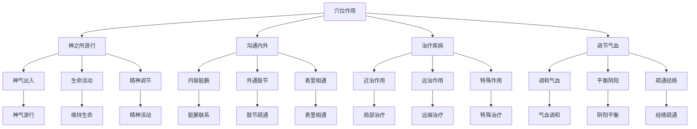

# 素问-气穴论篇第五十八

> "黄帝问曰：愿闻气穴。岐伯曰：气穴者，神之所游行出入也。" - 岐伯

---

## 📜 原文（节选）/ Original Text (Excerpt)

黄帝问曰：愿闻气穴。

岐伯曰：气穴者，神之所游行出入也。非皮肉筋骨也。

帝曰：其穴何如？

岐伯曰：穴有三百六十五，以应一岁。

　　黄帝问曰：余闻气穴三百六十五，以应一岁，未知其所，愿卒闻之。

　　岐伯稽首再拜对曰：窘乎哉问也！其非圣帝，孰能穷其道焉！因请溢意尽言其处。

　　帝捧手逡巡而却曰：夫子之开余道也，目未见其处，耳未闻其数，而目以明，耳以聪矣。

　　岐伯曰：此所谓圣人易语，良马易御也。

　　帝曰：余非圣人之易语也，世言真数开人意，今余所访问者真数，发蒙解惑，未足以论也。然余愿闻夫子溢志尽言其处，令解其意，请藏之金匮，不敢复出。

　　岐伯再拜而起曰：臣请言之，背与心相控而痛，所治天突与十椎及上纪，上纪者，胃脘也，下纪者，关元也。背胸邪系阴阳左右，如此其病前后痛濇，胸胁痛而不得息，不得卧，上气短气偏痛，脉满起，斜出尻脉，络胸胁支心贯鬲，上肩加天突，斜下肩交十椎下。

　　藏俞五十穴，府俞七十二穴，热俞五十九穴，水俞五十七穴，头上[五行](https://www.guoxuemeng.com/guoxue/wuxing/)行五，五五二十五穴，中两傍各五，凡十穴，大椎上两傍各一，凡二穴，目瞳子浮白二穴，两髀厌分中二穴，犊鼻二穴，耳中多所闻二穴，眉本二穴，完骨二穴，顶中央一穴，枕骨二穴，上关二穴，大迎二穴，下关二穴，天柱二穴，巨虚上下廉四穴，曲牙二穴，天突一穴，天府二穴，天牖二穴，扶突二穴，天窗二穴，肩解二穴，关元一穴，委阳二穴，肩贞二穴，瘖门一穴，齐一穴，胸俞十二穴，背俞二穴，膺俞十二穴，分肉二穴，踝上横二穴，阴阳蹻四穴，水俞在诸分，热俞在气穴，寒热俞在两骸厌中二穴，大禁二十五，在天府下五寸，凡三百六十五穴，针之所由行也。

　　帝曰：余已知气穴之处，游针之居，愿闻孙络谿谷，亦有所应乎？

　　岐伯曰：孙络三百六十五穴会，亦以应一岁，以溢奇邪，以通荣卫，荣卫稽留，卫散荣溢，气竭血着，外为发热，内为少气，疾泻无怠，以通荣卫，见而泻之，无问所会。

　　帝曰：善。愿闻谿谷之会也。

　　岐伯曰：肉之大会为谷，肉之小会为谿，肉分之间，谿谷之会，以行荣卫，以会大气。邪溢气壅，脉热肉败荣卫不行，必将为脓，内销骨髓，外破大腘，留于节凑，必将为败。积寒留舍，荣卫不居，卷肉缩筋，肋肘不得伸，内为骨痹，外为不仁，命曰不足，[大寒](https://www.guoxuemeng.com/ershisijieqi/dahan/)留于谿谷也。谿谷三百六十五穴会，亦应一岁，其小痹淫溢，循脉往来，微针所及，与法相同。

　　帝乃辟左右而起，再拜曰：今日发蒙解惑，藏之金匮，不敢复出，乃藏之金兰之室，署曰气穴所在。

　　岐伯曰：孙络之脉别经者，其血盛而当泻者，亦三百六十五脉，并注于络，传注十二络脉，非独十四络脉也，内解泻于中者十脉。

---

## 📖 白话文翻译（节选）/ Modern Chinese Translation (Excerpt)

黄帝问道：我愿意听到气穴的理论。

岐伯回答说：气穴，是神气游行出入的地方。不是皮肉筋骨的孔窍。

黄帝说：它的穴位如何？

岐伯说：穴位有三百六十五个，对应一年的天数。

　　黄帝问道：我听说人体上的气穴有三百六十五个，以应一年之日数，但不知其所在的部位，我想听你详尽地讲讲。

　　岐伯稽首拜了两拜回答说：你所提出的这个问题太重要了，若不是圣帝，谁能穷究这些深奥的道理，因此请允许我将气穴的部位都一一讲出来。

　　黄帝拱手谦逊退让地说：先生对我讲的道理，使我很受启发，虽然我尚未看到其具体部位，未听到其具体的数字，然而已经使我耳聪目明地领会了。

　　岐伯说：你领会得如此深刻，这真是所谓“圣人易语，良马易御”啊！

　　黄帝说道：我并不是易语的圣人，世人说气穴之数理可以开阔人的意识，现在我向你所询问的是气穴的数理，主要是开发蒙昧和解除疑惑，还谈不到什么深奥的理论。然而我希望听先生将气穴的部位尽情地全都讲出来，使我能了解它的意义，并藏于金匮之中，不敢轻[易传](https://www.guoxuemeng.com/guoxue/yizhuan/)授于人。

　　岐伯拜了两拜站起来说：我现在就谈吧！背部与心胸互相牵引而痛，其治疗方法应取任脉的天突穴和督脉的中枢穴，以及上纪下纪。上纪就是胃脘部的中脘穴，下纪就是关元穴。盖背在后为阳，胸在前为阴，经脉斜系于阴阳左右，因此其病前胸和背相引而痹涩，胸胁痛得不敢呼吸，不能仰卧，上气喘息，呼吸短促，或一侧偏痛，若经脉的邪气盛买则溢于络，此络从尻脉开始斜出，络胸胁部，支心贯穿横膈，上肩而至天突，再斜下肩交于背部第十椎节之下，所以取此处穴位治疗。

　　五脏各有井荥俞经和五俞，五五二十五，左右共五十穴；六腑各有井荥俞原经合六俞，六六三十六，左右共七十二穴；治热病的有五十九穴，治诸水病的有五十七穴。在头部有[五行](https://www.guoxuemeng.com/guoxue/wuxing/)，每行五穴，五五二十五穴。五脏在背部脊椎两旁各有五穴，二五共十穴。环跳二穴，犊鼻二穴，听宫二穴，攒竹二穴，完骨二穴，风府一穴，枕骨二穴，上关二穴，大迎二穴，下关二穴，天柱二穴，上巨虚，下巨虚左右共四穴，颊车二穴，天突一穴，天府二穴，天牖二穴，扶突二穴，天窗二穴，肩井二穴，关元一穴，委阳二穴，肩贞二穴，窨门一穴，神阙一穴，胸腧左右共十二穴，大杼二穴，膺俞左右共十二穴，分肉二穴，交信、跗阳左右共四穴，照海，申脉左右共四穴。治诸水病的五十七穴，皆在诸经的分肉之间；治热病的五十九穴，皆在精气聚会之处；治寒热之俞穴，在两膝关节的外侧，为足少阳胆经的阳关左右共二穴。大禁之穴是天府下五寸处的五里穴。以上共计三百六十五穴都是针刺的部位。

　　黄帝说道：我已经知道气穴的部位，即是行针刺的处所，还想听听孙络与溪谷是否也与一岁相应呢？

　　岐伯说：孙络与三百六十五穴相会以应一岁，若邪气客于孙络，溢注于络脉而不入于经就会产生奇病，孙络是外通于皮毛，内通于经脉以通行营危，若邪客之则营卫稽留，卫气外散，营血满溢，若卫气散尽，营鞋留滞，外则发热，内则少气，因此治疗时应迅速针刺用泻法，  
　　以通畅营卫，凡是见到有营卫稽留之处，即泻之，不必文其是否是穴会之处。 
　　 
黄帝说：好。我想听听溪骨之会合是怎样的。

　　岐伯说：较大的肌肉与肌肉会合的部位叫谷，娇小的肌肉与肌肉会合的部位叫溪。分肉之间，溪谷会合的部位，能通行营卫，会合宗气。若邪气溢满，正气壅滞，则脉发热，肌肉败坏，营卫不能畅行，必将郁热腐肉成脓，内则消烁骨髓，外则可溃大肉，若邪六连于关节肌腠，必使髓液皆溃为脓，而使筋骨败坏。若寒邪所客，积留而不去，则营卫不能正常运行，以致筋脉肌肉卷缩，肋肘不得伸展，内则发生骨痹，外则肌肤麻木不仁这是不足的症候，乃由寒邪留连溪骨所致。溪谷与三百六十五穴相会合，以应于一岁。若是邪在皮毛孙络的小痹，则邪气随脉往来无定，用微针即可治疗，方法与刺孙络是一样的。

　　黄帝于是摈退身边的人起身拜了两拜说道：今天承你启发，解除了我的疑惑，应把它藏于金匮之中，不敢轻易拿出传人。于是将它藏于金兰之室，提名叫做“气穴所在”。

　　岐伯说：孙络之脉是属于经脉支别的，其血盛而当泻的，也是与三百六十五脉相同，若邪气侵入孙络，同样是传注于络脉，复注于十二脉络，那就不是单独十四络脉的范围了。若骨解之中经络受邪，亦随时能够向内注泻于五脏之脉的。

---

## 🔍 英文释义 / English Interpretation

Yellow Emperor asked: I would like to hear the theory of qi points.

Qibo replied: Qi points are places where spirit qi moves and enters and exits. They are not the holes of skin, flesh, tendons, and bones.

Yellow Emperor said: What about the points?

Qibo said: There are 365 points, corresponding to the days of a year.

---

## 🔑 核心要点 / Core Concepts

### 1. 气穴概念 / Qi Point Concept

| 概念 | 说明 | 作用 | 临床意义 |
|------|------|------|---------|
| 气穴 | 神气游行出入处 | 沟通内外 | 针刺治疗 |
| 神气 | 生命活动之气 | 维持生命 | 生命基础 |
| 穴位 | 气穴的定位点 | 治疗部位 | 针刺取穴 |

### 2. 穴位分类 / Acupoint Classification

| 分类 | 数量 | 特点 | 作用 |
|------|------|------|------|
| 十四经穴 | 361个 | 分布于十四经脉 | 主治相关病症 |
| 奇穴 | 若干 | 经外奇穴 | 特殊治疗作用 |
| 阿是穴 | 不定 | 压痛反应点 | 局部止痛 |
| 经验穴 | 若干 | 临床经验总结 | 特殊治疗 |

### 3. 穴位作用 / Acupoint Functions

---

## 📚 理论解释 / Theoretical Analysis

### 气穴理论 / Qi Point Theory

> [!info] 核心概念
- 气穴者，神之所游行出入也
- 非皮肉筋骨也
- 穴有三百六十五，以应一岁

#### 气穴详解 / Detailed Qi Points

**1. 气穴定义 / Qi Point Definition**
- **概念**：神气游行出入的地方
- **特点**：不是皮肉筋骨的孔窍
- **本质**：神气聚集、转输、出入的场所
- **意义**：治疗疾病、调节气血的关键

**2. 神气游行 / Spirit Qi Movement**
- **神气**：生命活动之气，精神活动
- **游行**：在经络中游行流动
- **出入**：在穴位处出入转输
- **作用**：维持生命，调节功能

**3. 三百六十五穴 / 365 Points**
- **数量**：365个穴位
- **对应**：对应一年的天数
- **分布**：分布于全身各部
- **规律**：有规律的分布

### 穴位理论 / Acupoint Theory

> [!warning] 核心理念
- 穴有定处
- 穴有定性
- 穴有定用

#### 穴位理论详解 / Detailed Acupoint Theory

**1. 穴位定位 / Acupoint Location**
- **定位标准**：骨度分寸、指寸定位
- **定位方法**：解剖标志、骨度分寸
- **定位准确**：定位准确才能取穴准确
- **定位意义**：定位准确是治疗效果的基础

**2. 穴位特性 / Acupoint Characteristics**
- **近治作用**：治疗局部及邻近病症
- **远治作用**：治疗远端病症
- **特殊作用**：某些穴位有特殊治疗作用
- **双向调节**：某些穴位有双向调节作用

**3. 穴位分类 / Acupoint Classification**
- **十四经穴**：分布于十四经脉
- **奇穴**：经外奇穴，有特殊作用
- **阿是穴**：压痛点，不定位置
- **经验穴**：临床经验总结

---

## 🏥 中医实践应用 / TCM Practice Application

### 穴位治疗 / Acupoint Treatment

#### 现代穴位治疗应用 / Modern Acupoint Treatment Application

**1. 穴位针刺 / Acupoint Needling**
- **取穴原则**：循经取穴、近端取穴、远端取穴
- **针刺方法**：直刺、斜刺、平刺、透刺
- **刺激强度**：轻刺激、中刺激、强刺激
- **治疗作用**：疏通经络、调和气血

**2. 穴位艾灸 / Acupoint Moxibustion**
- **艾灸方法**：直接灸、间接灸、温针灸
- **艾灸时间**：根据病情确定
- **艾灸作用**：温通经络、散寒止痛
- **适应症**：虚证、寒证、慢性病

**3. 穴位按摩 / Acupoint Massage**
- **按摩方法**：点按、揉、推、拿
- **按摩时间**：每次5-15分钟
- **按摩作用**：疏通经络、调和气血
- **适应症**：各类病症

**4. 穴位贴敷 / Acupoint Application**
- **贴敷方法**：药物贴敷穴位
- **贴敷时间**：根据病情确定
- **贴敷作用**：药物刺激穴位
- **适应症**：慢性病、内科病

### 现代医学对应 / Modern Medicine Correspondence

| 中医概念 | 现代解剖 | 临床应用 |
|---------|---------|---------|
| 气穴 | 神经末梢、血管 | 针刺、艾灸 |
| 神气 | 神经冲动 | 神经调节 |
| 穴位 | 刺激点 | 穴位注射、埋线 |

---

## 🔗 相关链接 / Related Links

- [[MOC-黄帝内经知识库]] - 主索引
- [[黄帝内经-素问索引]] - 索引
- [[黄帝内经-核心理论]] - 核心理论体系
- [[素问57-经络论篇]] - 经络论
- [[素问59-气府论篇]] - 气府论
- [[灵枢-经脉第十]] - 经脉篇

### 易学关联 / Yi Jing Connection

- [[MOC-易经知识库]] - 易经索引
- [[20260201-0005 五行]] - 五行理论

**易学与气穴的联系:**
- 神气游行：易学的气化理论与神气游行相通
- 天人相应：易学的天人相应观与穴位分布相通

---

## 💡 学习要点 / Learning Points

### 掌握重点 / Key Points to Master

- [ ] 理解气穴的概念和作用
- [ ] 掌握穴位的分类和定位
- [ ] 学会穴位的治疗方法
- [ ] 了解气穴的理论依据

### 思考问题 / Questions for Reflection

1. **为什么说"气穴者，神之所游行出入也"？**
   - 神气游行：神气在经络中游行流动
   - 出入转输：神气在穴位处出入转输
   - 生命基础：神气是生命活动的基础

2. **现代医学如何应用"气穴论"？**
   - 神经刺激：基于现代神经生理学
   - 穴位刺激：穴位注射、埋线、贴敷
   - 综合治疗：针刺、艾灸、按摩

---

## 📊 学习进度 / Learning Progress

### 完成情况 / Completion Status

| 学习内容 | 状态 | 备注 |
|---------|------|------|
| 原文诵读 | 📝 进行中 | 建议每日诵读 |
| 白话文理解 | ✅ 已完成 | 理解主要含义 |
| 气穴理论 | ✅ 已完成 | 掌握理论 |
| 穴位分类 | 📝 进行中 | 需要记忆 |
| 理论分析 | ✅ 已完成 | 理解理论 |

---

## 🔄 更新日志 / Update Log

### 2026-02-03

- ✅ 创建气穴论篇第五十八笔记
- ✅ 完成原文、白话文翻译（节选）
- 整理气穴概念和穴位分类对照表
- ✅ 编写气穴和穴位理论

---

**笔记创建日期**：2026年2月3日

**最后更新**：2026年2月3日
