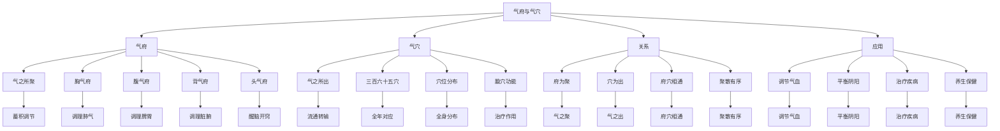

# 素问-气府论篇第五十九

> "黄帝问曰：愿闻气府。岐伯曰：气府者，气之所聚也。" - 岐伯

---

## 📜 原文（节选）/ Original Text (Excerpt)

黄帝问曰：愿闻气府。

岐伯曰：气府者，气之所聚也。气穴者，气之所出也。

帝曰：其府何如？

岐伯曰：胸气府、腹气府、背气府、头气府，各有其府。

　　足太阳脉气所发者七十八穴：两眉头各一，入发至项三寸半，傍五，相去三寸，其浮气在皮中者凡[五行](https://www.guoxuemeng.com/guoxue/wuxing/)，行五，五五二十五，项中大筋两傍各一，风府两傍各一，侠背以下至尻尾二十一节，十五间各一，五藏之俞各五，六府之俞各六，委中以下至足小指傍各六俞。

　　足少阳脉气所发者六十二穴：两角上各二，直目上发际内各五，耳前角上各一，耳前角下各一，锐发下各一，客主人各一，耳后陷中各一，下关各一，耳下牙车之后各一，缺盆各一，掖下三寸，胁下至胠，八间各一，髀枢中傍各一，膝以下至足小指次指各六俞。

　　足阳明脉气所发者六十八穴：额颅发际傍各三，面鼽骨空各一，大迎之骨空各一，人迎各一，缺盆外骨空各一，膺中骨间各一，侠鸠尾之外，当乳下三寸，侠胃脘各五，侠齐广三寸各三，下齐二寸侠之各三。气街动脉各一，伏菟上各一，三里以下至足中指各八俞，分之所在穴空。

　　手太阳脉气所发者三十六穴：目内眦各一，目外眦各一，鼽骨下各一，耳郭上各一，耳中各一，巨骨穴各一，曲掖上骨穴各一，柱骨上陷者各一，上天窗四寸各一，肩解各一，肩解下三寸各一，肘以下至手小指本各六俞。

　　手阳明脉气所发者二十二穴：鼻空外廉、项上各二，大迎骨空各一，柱骨之会各一，髃骨之会各一，肘以下至手大指次指本各六俞。

　　手少阳脉气所发者三十二穴：鼽骨下各一，眉后各一，角上各一，下完骨后各一，项中足太阳之前各一，侠扶突各一，肩贞各一，肩贞下三寸分间各一，肘以下至手小指次指本各六俞。

　　督脉气所发者二十八穴：项中央二，发际后中八，面中三，大椎以下至尻尾及傍十五穴，至骶下凡二十一节，脊椎法也。任脉之气所发者二十八穴：喉中央二，膺中骨陷中各一，鸠尾下三寸，胃脘五寸，胃脘以下至横骨六寸半一，腹脉法也。下阴别一，目下各一，下唇一，龂交一。

　　冲脉气所发者二十二穴：侠鸠尾外各半寸至齐寸一，侠齐下傍各五分至横骨寸一，腹脉法也。

　　足少阴舌下，厥阴毛中急脉各一，手少阴各一，阴阳蹻各一，手足诸鱼际脉气所发者，凡三百六十五穴也。

---

## 📖 白话文翻译（节选）/ Modern Chinese Translation (Excerpt)

黄帝问道：我愿意听到气府的理论。

岐伯回答说：气府，是气聚集的地方。气穴，是气流出的地方。

黄帝说：它的府如何？

岐伯说：胸气府、腹气府、背气府、头气府，各有其府。

　　足太阳膀胱经脉气所发的有七十八个逾穴；在眉头的陷中左右各有一穴，自眉头直上入发际，当发际正中至前顶穴，有神庭、上星、卤会三穴，其浮于头部的脉气，，运行在头皮中的有[五行](https://www.guoxuemeng.com/guoxue/wuxing/)，即中行、次两行和外两行，每行五穴，共行五行，五五二十五穴；下行至项中的大筋两傍左右各有一穴；侠脊自上而下至骶尾骨有二十一节，其中十五个椎间左右各有一穴；五脏肺、心、肝、脾、肾的俞穴，左右各有一穴；自委中以下至足中中趾傍左右各有井、荥、俞、原、经、合六个俞穴。

　　足少阳胆经脉气所发的有六十二穴：头两角上各有二穴；两目瞳孔直上的发际内各有五穴；两耳前角上各有一穴；上关左右各一穴；两而后的陷凹中各有一穴；下关左右各有一穴；两耳下牙车之后各有一穴；缺盆左右各有一穴；腋下三寸，从胁下至胁，八肋之间左右各有一穴；髀枢中左右各一穴；膝以下至足第四趾的小趾侧各有井、荥、俞、愿、经、合六穴。

　　足阳明胃经脉气所发的有六十八穴：额颅发际旁各有三穴；颧骨骨空中间各有一穴；大迎穴在颌角前至骨空陷中，左右各有一穴；在结喉之旁的人迎，左右各有一穴；缺盆外的故空陷中左右各有一穴；膺中的骨空间陷中左右各有一穴；侠鸠尾之外，乳下三寸，侠胃脘左右各有五穴；侠脐横开三寸左右各有三穴；气冲在动脉跳动处左右各一穴；在伏菟上左右各有一穴；足三里以下到足中趾内间，左右各有八个俞穴。以上每个穴都有它一定的空穴。

　　手太阳小肠经脉气所发的有三十六穴：目内眦各有一穴；目外侧各有一穴；颧骨下各有一穴；耳廓上各有一穴；耳中珠子旁各有一穴；巨骨穴左右各一；曲腋上各有一穴；柱骨上陷中各有一穴；两天窗穴之上四寸各有一穴；肩解部各有一穴；肩解部之下三穴处各有一穴；肘部以下至小指端的爪甲根部各有井、荥、俞、愿、经、合六穴。

　　手阳明大肠经脉气所发的有二十二穴；鼻孔的外侧各有一穴；项部左右各有一穴；大迎穴在下颌骨空间左右各有一穴；主骨之会左右各有一穴；髃骨之会左右各有一穴；肘部以下至十指端的爪甲根部左右各有井、荥、俞、愿、经、合六穴。

　　手少阳三焦经脉气所发的有三十二穴：颧骨下各有一穴；眉后各有一穴；耳前角上各有一穴；耳后完骨后下各有一穴；项中足太阳经之前各有一穴；侠扶突之外侧各有一穴；肩贞血左右各一；在肩贞穴之下三寸分肉之间各有三穴；肘部以下至手无名指之端爪甲根部各有井、荥、俞、愿、经、合六穴。

　　督脉之经气所发的有二十八穴：项中央有二穴；前发际向后中行有八穴；面部的中央从鼻至唇有三穴；自大椎以下至尻尾傍有十五穴。自大椎至尾骨共二十一节，这是脊椎穴位的计算方法。

　　任脉之经气所发的有二十八穴：喉部中行有二穴；胸膺中行之骨陷中有六穴；自蔽骨之上脘是三寸，上脘至脐中是五寸，脐中至横骨是六寸半，计十四寸半，每寸一穴，计十四穴，这是腹部取穴的方法。自曲骨向下至前后阴之间有会阴穴；两目之下各有一穴；下唇下有一穴；上齿缝有一穴。

　　冲脉之经气所发的有二十二穴：侠鸠尾傍开五分向下至脐一寸一穴，左右共十二穴；自脐傍开五分向下至横骨一寸一穴，左右共十穴。这是腹脉取穴的方法。

　　足少阴肾经脉气所发的舌下有二穴：肝足厥阴在毛际中左右各有一穴；阴蹻、阳蹻左右有一穴；四肢手足赤白肉分，鱼际之处，是脉气所发的部位。以上共计三百六十五穴。

---

## 🔍 英文释义 / English Interpretation

Yellow Emperor asked: I would like to hear the theory of qi mansions.

Qibo replied: Qi mansions are places where qi gathers. Qi points are places where qi flows out.

Yellow Emperor said: What about the mansions?

Qibo said: The chest qi mansion, abdomen qi mansion, back qi mansion, and head qi mansion each have their own mansions.

---

## 🔑 核心要点 / Core Concepts

### 1. 气府概念 / Qi Mansion Concept

| 概念 | 说明 | 作用 | 临床意义 |
|------|------|------|---------|
| 气府 | 气聚集之处 | 蓄积调节 | 气血调节 |
| 气穴 | 气流出之处 | 流通转输 | 针刺治疗 |
| 气聚 | 气聚集 | 蓄积 | 调节气机 |
| 气出 | 气流出 | 输布 | 通行气血 |

### 2. 四气府 / Four Qi Mansions

| 气府 | 位置 | 主要穴位 | 作用 |
|------|------|---------|------|
| 胸气府 | 胸部 | 膻中、中府等 | 调理肺气、宽胸理气 |
| 腹气府 | 腹部 | 中脘、气海、关元等 | 调理脾胃、培补元气 |
| 背气府 | 背部 | 肺俞、心俞、肾俞等 | 调理脏腑、温阳益气 |
| 头气府 | 头部 | 百会、印堂、太阳等 | 醒脑开窍、安神定志 |

### 3. 气府与气穴 / Qi Mansions and Qi Points

---

## 📚 理论解释 / Theoretical Analysis

### 气府理论 / Qi Mansion Theory

> [!info] 核心概念
- 气府者，气之所聚也
- 气穴者，气之所出也
- 各有其府

#### 气府详解 / Detailed Qi Mansions

**1. 气府定义 / Qi Mansion Definition**
- **概念**：气聚集的地方
- **特点**：是气蓄积、调节的场所
- **本质**：气府是气血运行的枢纽
- **意义**：调节气血、平衡阴阳的关键

**2. 气府与气穴 / Qi Mansions and Qi Points**
- **气府**：气之所聚，气聚集的地方
- **气穴**：气之所出，气流出的地方
- **关系**：气府是气穴的上游，气穴是气府的下游
- **作用**：气府蓄积调节，气穴流通转输

**3. 四气府 / Four Qi Mansions**
- **胸气府**：胸部的气府，调理肺气
- **腹气府**：腹部的气府，调理脾胃
- **背气府**：背部的气府，调理脏腑
- **头气府**：头部的气府，醒脑开窍

### 气聚与气出 / Qi Gathering and Qi Exiting

> [!warning] 核心理念
- 聚散有序
- 出入有常
- 调节平衡

#### 气聚与气出详解 / Detailed Qi Gathering and Qi Exiting

**1. 气聚 / Qi Gathering**
- **聚于气府**：气聚集在气府
- **蓄积调节**：蓄积调节气血
- **平衡阴阳**：平衡阴阳气血
- **维持生命**：维持生命活动

**2. 气出 / Qi Exiting**
- **出于气穴**：气从气穴流出
- **流通转输**：流通转输气血
- **营养全身**：营养全身组织
- **排泄废物**：排泄代谢废物

**3. 聚散有序 / Orderly Gathering and Dispersing**
- **聚散有序**：气聚气散有序
- **出入有常**：气出气入有常
- **调节平衡**：调节气血平衡
- **维持健康**：维持身体健康

---

## 🏥 中医实践应用 / TCM Practice Application

### 气府治疗 / Qi Mansion Treatment

#### 现代气府治疗应用 / Modern Qi Mansion Treatment Application

**1. 胸气府治疗 / Chest Qi Mansion Treatment**
- 主要穴位：膻中、中府、云门
- 治疗方法：针刺、艾灸、按摩
- 适应症：咳嗽、气喘、胸痛
- 疗效：调理肺气，宽胸理气

**2. 腹气府治疗 / Abdomen Qi Mansion Treatment**
- 主要穴位：中脘、气海、关元
- 治疗方法：针刺、艾灸、按摩
- 适应症：腹胀、腹泻、消化不良
- 疗效：调理脾胃，培补元气

**3. 背气府治疗 / Back Qi Mansion Treatment**
- 主要穴位：肺俞、心俞、肾俞
- 治疗方法：针刺、艾灸、拔罐
- 适应症：咳嗽、心悸、腰痛
- 疗效：调理脏腑，温阳益气

**4. 头气府治疗 / Head Qi Mansion Treatment**
- 主要穴位：百会、印堂、太阳
- 治疗方法：针刺、艾灸、按摩
- 适应症：头痛、失眠、眩晕
- 疗效：醒脑开窍，安神定志

### 现代医学对应 / Modern Medicine Correspondence

| 中医概念 | 现代解剖 | 临床应用 |
|---------|---------|---------|
| 气府 | 神经节、血管丛 | 神经调节 |
| 胸气府 | 胸腔神经 | 胸腔疾病 |
| 腹气府 | 腹腔神经 | 腹腔疾病 |
| 背气府 | 脊柱神经 | 脊柱疾病 |
| 头气府 | 头部神经 | 头部疾病 |

---

## 🔗 相关链接 / Related Links

- [[MOC-黄帝内经知识库]] - 主索引
- [[黄帝内经-素问索引]] - 索引
- [[黄帝内经-核心理论]] - 核心理论体系
- [[素问58-气穴论篇]] - 气穴论
- [[素问60-骨空论篇]] - 骨空论
- [[灵枢-经脉第十]] - 经脉篇

### 易学关联 / Yi Jing Connection

- [[MOC-易经知识库]] - 易经索引
- [[20260201-0005 五行]] - 五行理论

**易学与气府的联系:**
- 聚散有序：易学的聚散观念与气府理论相通
- 天人相应：易学的天人相应观与气府分布相通

---

## 💡 学习要点 / Learning Points

### 掌握重点 / Key Points to Master

- [ ] 理解气府的概念和作用
- [ ] 掌握四气府的分布和功能
- [ ] 学会气府的治疗方法
- [ ] 了解气府的理论依据

### 思考问题 / Questions for Reflection

1. **为什么说"气府者，气之所聚也"？**
   - 气之所聚：气聚集在气府
   - 蓄积调节：蓄积调节气血
   - 维持生命：维持生命活动

2. **现代医学如何应用"气府论"？**
   - 神经调节：基于现代神经生理学
   - 区域治疗：区域神经调节
   - 综合治疗：针刺、艾灸、按摩

---

## 📊 学习进度 / Learning Progress

### 完成情况 / Completion Status

| 学习内容 | 状态 | 备注 |
|---------|------|------|
| 原文诵读 | 📝 进行中 | 建议每日诵读 |
| 白话文理解 | ✅ 已完成 | 理解主要含义 |
| 气府理论 | ✅ 已完成 | 掌握理论 |
| 四气府 | 📝 进行中 | 需要记忆 |
| 理论分析 | ✅ 已完成 | 理解理论 |

---

## 🔄 更新日志 / Update Log

### 2026-02-03

- ✅ 创建气府论篇第五十九笔记
- ✅ 完成原文、白话文翻译（节选）
- 整理气府概念和四气府对照表
- ✅ 编写气府和聚散理论

---

**笔记创建日期**：2026年2月3日

**最后更新**：2026年2月3日
