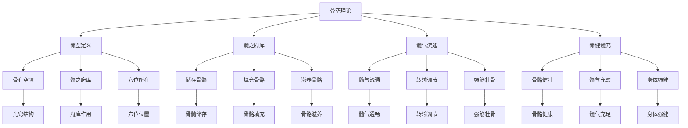

# 素问-骨空论篇第六十

> "黄帝问曰：愿闻骨空。岐伯曰：骨空者，髓之府也。" - 岐伯

---

## 📜 原文（节选）/ Original Text (Excerpt)

黄帝问曰：愿闻骨空。

岐伯曰：骨空者，髓之府也。髓者，骨之充也。

帝曰：其空何如？

岐伯曰：骨之有空，以通髓气。髓气通，则骨健。

　　黄帝问曰：余闻风者百病之始也，以针治之奈何？

　　岐伯对曰：风从外入，令人振寒，汗出头痛，身重恶寒，治在风府，调其阴阳，不足则补，有余则泻。大风颈项痛，刺风府，风府在上椎。大风汗出，灸譩譆，譩譆在背下侠脊傍三寸所，厌之，令病者呼譩譆，譩譆应手。

　　从风憎风，刺眉头。失枕，在肩上横骨间。折，使榆臂，齐肘正，灸脊中。

　　络季胁引少腹而痛胀，刺譩譆。

　　腰痛不可以转摇，急引阴卵，刺八髎与痛上，八髎在腰尻分间。

　　鼠瘻，寒热，还刺寒府，寒府在附膝外解营。取膝上外者使之拜，取足心者使之跪。

　　任脉者，起于中极之下，以上毛际，循腹里上关元，至咽喉，上颐循面入目。冲脉者，起于气街，并少阴之经，侠齐上行，至胸中而散。任脉为病，男子内结七疝，女子带下瘕聚。冲脉为病，逆气里急。督脉为病，脊强反折。督脉者，起于少腹以下骨中央，女子入系廷孔，其孔，溺孔之端也。其络循阴器合篡间，绕篡后，别绕臀，至少阴与巨阳中络者合，少阴上股内后廉，贯脊属肾，与太阳起于目内眦，上额交巅，上入络脑，还出别下项，循肩髆，内侠脊抵腰中，入循膂络肾。其男子循茎下至篡，与女子等。其少腹直上者，贯齐中央，上贯心入喉，上颐环唇，上系两目之下中央。此生病，从少腹上冲心而痛，不得前后，为冲疝；其女子不孕，癃痔遗溺嗌干。督脉生病治督脉，治在骨上，甚者在齐下营。其上气有音者，治其喉中央，在缺盆中者，其病上冲喉者治其渐，渐者，上侠颐也。

　　蹇，膝伸不屈，治其楗。坐而膝痛，治其机。立而暑解，治其骸关。膝痛，痛及拇指治其腘。坐而膝痛如物隐者，治其关。膝痛不可屈伸，治其背内。连䯒[héng]若折，治阳明中俞髎。若别，治巨阳少阴荥。淫泺胫痠，不能久立，治少阳之维，在外上五寸。

　　辅骨上，横骨下为楗，侠髋为机，膝解为骸关，侠膝之骨为连骸，骸下为辅，辅上为腘，腘上为关，头横骨为枕。

　　水俞五十七穴者，尻上[五行](https://www.guoxuemeng.com/guoxue/wuxing/)，行五；伏菟上两行，行五，左右各一行，行五；踝上各一行，行六穴，髓空在脑后三分，在颅际锐骨之下，一在齗基下，一在项后中复骨下，一在脊骨上空在风府上。脊骨下空，在尻骨下空。数髓空在面侠鼻，或骨空在口下当两肩。两髆骨空，在髆中之阳。臂骨空在臂阳，去踝四寸两骨空之间。股骨上空在股阳，出上膝四寸。䯒[héng]骨空在辅骨之上端，股际骨空在毛中动下。尻骨空在髀骨之后，相去四寸。扁骨有渗理凑，无髓孔，易髓无孔。

　　灸寒热之法，先灸项大椎，以年为壮数，次灸橛骨，以年为壮数，视背俞陷者灸之，举臂肩上陷者灸之，两季胁之间灸之，外踝上绝骨之端灸之，足小指次指间灸之，腨[shuàn]下陷脉灸之，外踝后灸之，缺盆骨上切之坚痛如筋者灸之，膺中陷骨间灸之，掌束骨下灸之，齐下关元三寸灸之，毛际动脉灸之，膝下三寸分间灸之，足阳明跗上动脉灸之，巅上一灸之。犬所啮之处灸之三壮，即以犬伤病法灸之。凡当灸二十九处，伤食灸之，不已者，必视其经之过于阳者，数刺其俞而药之。

---

## 📖 白话文翻译（节选）/ Modern Chinese Translation (Excerpt)

黄帝问道：我愿意听到骨空的理论。

岐伯回答说：骨空，是骨髓的府库。骨髓，是填充骨骼的。

黄帝说：它的孔窍如何？

岐伯说：骨有孔窍，用来流通髓气。髓气流通，骨骼就健壮。

　　黄帝问道：我听说风邪是许多疾病的起始原因，怎样用针法来治疗？岐伯回答说：风邪从外侵入，使人寒战、出汗、头痛、身体发重、怕冷。治疗用府穴，以调和其阴阳。正气不足就用补法，邪气有余就用泻法。

　　若感受风邪较重而颈项疼痛，刺风府穴。风府穴在椎骨第一节的上面。若感受风邪较重而汗出，灸一噫嘻穴。噫嘻穴在背部第六椎下两旁距脊各三寸之处，用手指按振，使病人感觉疼痛而呼出“噫嘻”之声，噫嘻穴应在手指下疼处。

　　见风就怕的病人，刺眉头攒竹穴。失枕而肩上和横骨之间的肌肉强痛，应当使病人曲臂，取两肘间相合在一处的姿势，然后在肩胛骨上端引一直线，正当脊部中央的部位，给以灸治。从络季胁牵引到少腹而痛胀的，刺噫嘻穴。腰痛而不可以转侧动摇，痛而筋脉挛急，下引睾丸，刺八髎穴与疼痛的地方。八髎穴在腰尻骨间空隙中。噫嘻发寒热，刺寒府穴。寒府在膝上外侧骨与骨之间的孔穴中。凡取膝上外侧的孔穴，使患者弯腰，成一种拜的体位；取足心涌泉穴时，使患者坐跪的体位。

　　任脉经起源于中极穴的下面，上行经过毛际再到腹部，再上行通过关元穴到咽喉，又上行至颐，循行于面部而入于目中。冲脉经起源于气街穴，与足少阴经相并，侠其左右上行，到胸中而散。任脉经发生病变，在男子则腹内结为七疝，在女子则有带下和瘕聚之类疾病。冲脉经发生病变，则气逆上冲，腹中拘急疼痛。

　　督脉发生病变，会引起脊柱强硬反折的症状。督脉起于小腹之下的横骨中央，在女子则入内系于廷孔。廷孔就是尿道的外端。从这里分出的络脉，循着阴户会合于阴部，再分绕于肛门的后面，再分歧别行绕臀部，到足少阴经与足太阳经中的络脉，与足少阴经相结合上行经骨内后面，，贯穿脊柱，连属于肾脏；与足太阳经共起于目内眦，上行至额部，左右交会于巅顶，内入联络与脑，复返还出脑，分别左右颈项下行，循行与脊膊内，侠脊抵达腰中，入内循膂络于肾。其在男子则循阴茎，下至会阴，与女子相同。其从少腹直上的，穿过脐中央，再上贯心脏，入于喉，上行到颐并环绕口唇，再上行系于两目中央之下。督脉发生病变，症状是气从少腹上冲心而痛，大小便不通，称为冲疝，其在女子则不能怀孕，或为小便不利、痔疾、遗尿、咽喉干燥等症。总之，督脉生病治督脉，轻者至横骨上的曲骨穴，重者则至在脐下的阴交穴。

　　病人气逆上而呼吸有声的，治疗取其喉部中央的天突穴，此穴在两缺盆的中间。病人气逆上充于咽喉的，治疗取其大迎穴，大迎穴在面部两旁夹颐之处。膝关节能伸不能屈，治疗取其股部的经穴。坐下而膝痛，治疗取其环跳穴。站立时膝关节热痛，治疗取其膝关节处经穴。膝痛，疼痛牵引到拇指，治疗取其膝弯处的委中穴。坐膝痛如有东西隐伏其中的，治疗取其承扶穴。膝痛而不能屈伸活动，治疗取其背部足太阳经的俞穴。如疼痛连及尻骨象折断似的，治疗取其阳明经中的俞髎三里穴；或者别取太阳经的荥穴通谷、少阴经的荥穴然谷。湿渍水湿之邪日久而胫骨酸痛无力，不能久立，治取少阳经的别络光明穴，穴在外踝上五寸。

　　辅骨之上，腰横骨之下叫“楗”。髋骨两侧环跳穴处叫“机”。膝部的骨缝叫“骸关”。侠膝两旁的高骨叫“连骸”。连骸下面叫“辅骨”。辅骨上面的膝弯叫“腘”。腘之上就是“骸关”。头后项部的横骨叫“枕骨”。

　　治疗水病的俞穴有五十七个：尻骨上有[五行](https://www.guoxuemeng.com/guoxue/wuxing/)，每行各五穴；伏兔上方有两行，每行各有五穴；其左右又各有一行，每行各五穴；足内踝上各一行，每行各六穴。髓穴在脑后分为三处，都在颅骨边际锐骨的下面，一处在龈基的下面，一处在项后正中的复骨下面，一处在脊骨上空的风府穴的上面，脊骨下空在尻骨下面孔穴中。又有几个髓空在面部侠鼻两旁，或有骨空在口唇下方与两肩相平的部位。两肩膊骨空在肩膊中的外侧。臂骨的骨空在臂骨的外侧，离开手腕四寸，在尺、桡两骨的空隙之间。股骨上面的骨空在股骨外侧膝上四寸的地方。尻骨的骨空在辅骨的上端。骨际的骨空在阴毛中的动脉下面。尻骨的骨空在尻骨的后面距离四寸的地方。扁骨有血脉尻灌的纹理聚合，没有直通骨髓的孔穴，骨髓通过灌的纹理内外交流，所以没有骨空。

　　灸寒热症的方法，先针灸项后的大椎穴，根据病人年龄决定艾灸的壮数；其次灸尾骨的尾闾穴，也是以年龄为艾灸的壮数。观察背部有凹陷的地方用灸法，上举手臂在肩上有凹陷的地方（肩髃）用灸法，两侧的季胁之间（京门）用灸法，足外踝上正取绝骨穴处用灸法，足小趾与次趾之间（肩髃）用灸法，凹陷处的经脉（承山）用灸法，外踝后方（昆仑）用灸法，缺盆骨上方按之坚硬如筋而疼痛的地方用灸法，胸膺中的骨间凹陷处（天突）用灸法，手腕部的横骨之下（大陵）用灸法，脐下三寸的关元穴用灸法，阴毛边缘的动脉跳处（气冲）用灸法，膝下三寸的两筋间（三里）用灸法，足阳明经所行足跗上的动脉（冲阳）处用灸法，头巅顶上（百会）亦用灸法。被犬咬伤的，先在被咬处灸三壮，再按常规的治伤病法灸治。以上针灸治寒热症的部位共二十九处。因于伤食而使用灸法，病仍不愈的，必须仔细观察其由于阳邪过盛，经脉移行到络脉的地方，多刺其俞穴，同时再用药物调治。

---

## 🔍 英文释义 / English Interpretation

Yellow Emperor asked: I would like to hear the theory of bone holes.

Qibo replied: Bone holes are the mansions of bone marrow. Bone marrow fills the bones.

Yellow Emperor said: What about the holes?

Qibo said: Bones have holes to circulate marrow qi. When marrow qi circulates, the bones become strong.

---

## 🔑 核心要点 / Core Concepts

### 1. 骨空概念 / Bone Hole Concept

| 概念 | 说明 | 作用 | 临床意义 |
|------|------|------|---------|
| 骨空 | 骨髓的府库 | 储存骨髓 | 调节髓气 |
| 髓 | 骨之充 | 填充骨骼 | 滋养骨骼 |
| 髓气 | 骨髓之气 | 流通转输 | 强筋壮骨 |
| 骨空穴 | 骨空上的穴位 | 特殊治疗 | 深部疾病 |

### 2. 主要骨空穴 / Main Bone Hole Points

| 骨空穴 | 位置 | 作用 | 适应症 |
|------|------|------|---------|
| 风府 | 后发际正中直上1寸 | 疏风解表 | 头痛、颈项强痛 |
| 哑门 | 后发际正中直上0.5寸 | 开窍醒神 | 失语、舌强不语 |
| 大椎 | 第七颈椎棘突下 | 疏风解表 | 发热、咳嗽 |
| 命门 | 第二腰椎棘突下 | 温肾壮阳 | 腰痛、阳痿 |
| 长强 | 尾骨尖端下0.5寸 | 调理肠道 | 腹泻、便秘 |

### 3. 骨空理论 / Bone Hole Theory

---

## 📚 理论解释 / Theoretical Analysis

### 骨空理论 / Bone Hole Theory

> [!info] 核心概念
- 骨空者，髓之府也
- 髓者，骨之充也
- 髓气通，则骨健

#### 骨空详解 / Detailed Bone Holes

**1. 骨空定义 / Bone Hole Definition**
- **概念**：骨中的空隙，骨髓的府库
- **特点**：储存骨髓，流通髓气
- **本质**：骨空是气血运行的通道
- **意义**：强筋壮骨、调节髓气

**2. 髓之府库 / Marrow Mansion**
- **髓者**：骨髓，骨之充也
- **府库**：储存骨髓的地方
- **作用**：储存、调节髓气
- **意义**：维持骨骼健康

**3. 髓气流通 / Marrow Qi Circulation**
- **髓气通**：髓气流通顺畅
- **骨健**：骨骼健壮有力
- **髓气阻**：髓气阻滞不畅
- **骨弱**：骨骼虚弱无力

### 髓气理论 / Marrow Qi Theory

> [!warning] 核心理念
- 髓充骨健
- 髓气流通
- 强筋壮骨

#### 髓气理论详解 / Detailed Marrow Qi Theory

**1. 髓气来源 / Marrow Qi Source**
- **先天之精**：先天之精化髓
- **后天之精**：后天之精养髓
- **精血同源**：精血互生，化髓
- **髓气充盈**：髓气充盈骨健

**2. 髓气流通 / Marrow Qi Circulation**
- **髓气通**：髓气流通顺畅
- **转输调节**：转输调节髓气
- **滋养骨骼**：滋养全身骨骼
- **强筋壮骨**：强筋壮骨有力

**3. 髓气阻滞 / Marrow Qi Blockage**
- **髓气不通**：髓气阻滞不畅
- **骨骼失养**：骨骼失养虚弱
- **骨质疏松**：骨质疏松易折
- **骨痛骨蒸**：骨痛骨蒸不适

---

## 🏥 中医实践应用 / TCM Practice Application

### 骨空治疗 / Bone Hole Treatment

#### 现代骨空治疗应用 / Modern Bone Hole Treatment Application

**1. 风府治疗 / Fengfu Treatment**
- 位置：后发际正中直上1寸
- 治疗方法：针刺、艾灸、按摩
- 适应症：头痛、颈项强痛、感冒
- 疗效：疏风解表，通络止痛

**2. 哑门治疗 / Yamen Treatment**
- 位置：后发际正中直上0.5寸
- 治疗方法：针刺、按摩
- 适应症：失语、舌强不语、中风后遗症
- 疗效：开窍醒神，利舌解语

**3. 大椎治疗 / Dazhui Treatment**
- 位置：第七颈椎棘突下
- 治疗方法：针刺、艾灸、拔罐
- 适应症：发热、咳嗽、感冒
- 疗效：疏风解表，清热止咳

**4. 命门治疗 / Mingmen Treatment**
- 位置：第二腰椎棘突下
- 治疗方法：针刺、艾灸、按摩
- 适应症：腰痛、阳痿、遗精
- 疗效：温肾壮阳，强腰膝

**5. 长强治疗 / Changqiang Treatment**
- 位置：尾骨尖端下0.5寸
- 治疗方法：针刺、艾灸、按摩
- 适应症：腹泻、便秘、脱肛
- 疗效：调理肠道，升提固脱

### 现代医学对应 / Modern Medicine Correspondence

| 中医概念 | 现代解剖 | 临床应用 |
|---------|---------|---------|
| 骨空 | 骨髓腔 | 骨髓疾病 |
| 髓 | 骨髓 | 骨髓功能 |
| 髓气 | 骨髓营养 | 骨骼营养 |
| 骨空穴 | 椎间孔、骨缝 | 脊柱疾病 |

---

## 🔗 相关链接 / Related Links

- [[MOC-黄帝内经知识库]] - 主索引
- [[黄帝内经-素问索引]] - 索引
- [[黄帝内经-核心理论]] - 核心理论体系
- [[素问59-气府论篇]] - 气府论
- [[素问61-水热穴论篇]] - 水热穴论
- [[灵枢-经脉第十]] - 经脉篇

### 易学关联 / Yi Jing Connection

- [[MOC-易经知识库]] - 易经索引
- [[20260201-0005 五行]] - 五行理论

**易学与骨空的联系:**
- 空者用之：易学的虚实观念与骨空理论相通
- 髓气流通：易学的流通观念与髓气流通相通

---

## 💡 学习要点 / Learning Points

### 掌握重点 / Key Points to Master

- [ ] 理解骨空的概念和作用
- [ ] 掌握主要骨空穴的位置
- [ ] 学会骨空的治疗方法
- [ ] 了解骨空的理论依据

### 思考问题 / Questions for Reflection

1. **为什么说"骨空者，髓之府也"？**
   - 髓之府库：骨空是骨髓的府库
   - 储存调节：储存调节髓气
   - 髓气流通：髓气流通骨健

2. **现代医学如何应用"骨空论"？**
   - 骨髓功能：基于现代骨髓生理学
   - 脊柱治疗：脊柱骨空穴位治疗
   - 综合治疗：针刺、艾灸、按摩

---

## 📊 学习进度 / Learning Progress

### 完成情况 / Completion Status

| 学习内容 | 状态 | 备注 |
|---------|------|------|
| 原文诵读 | 📝 进行中 | 建议每日诵读 |
| 白话文理解 | ✅ 已完成 | 理解主要含义 |
| 骨空理论 | ✅ 已完成 | 掌握理论 |
| 骨空穴 | 📝 进行中 | 需要记忆 |
| 理论分析 | ✅ 已完成 | 理解理论 |

---

## 🔄 更新日志 / Update Log

### 2026-02-03

- ✅ 创建骨空论篇第六十笔记
- ✅ 完成原文、白话文翻译（节选）
- 整理骨空概念和骨空穴对照表
- ✅ 编写骨空和髓气理论

---

**笔记创建日期**：2026年2月3日

**最后更新**：2026年2月3日
