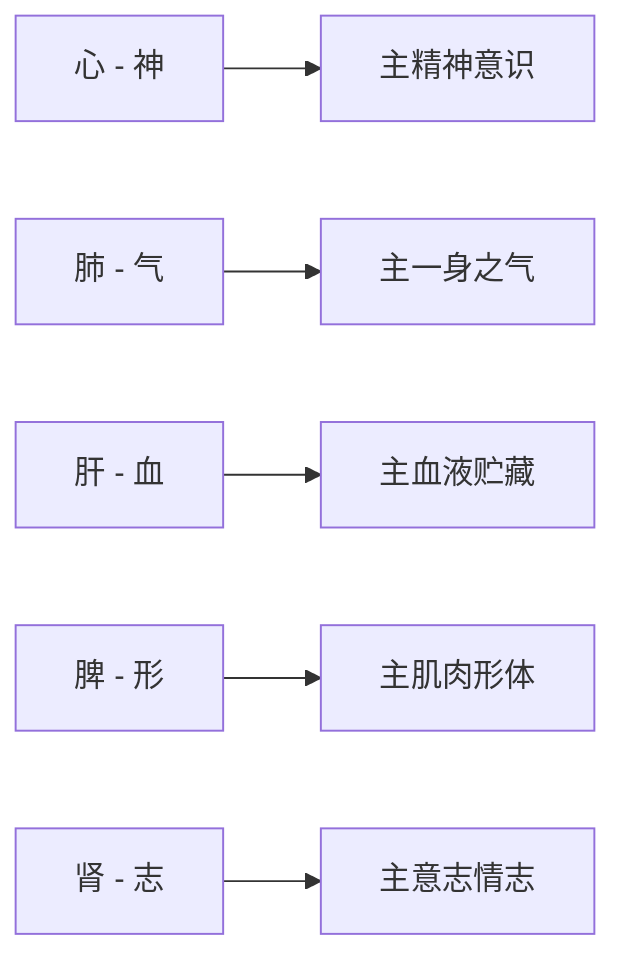

# 素问-调经论篇第六十二

> "经脉者，所以决死生，处百病，调虚实，不可不通。" - 岐伯

---

## 📜 原文（节选）/ Original Text (Excerpt)

黄帝问曰：余闻刺法言，有余泻之，不足补之，何谓有余？何谓不足？

岐伯对曰：有余有五，不足亦有五，帝欲何问？

黄帝曰：愿尽闻之。

岐伯曰：神有余有不足，气有余有不足，血有余有不足，形有余有不足，志有余有不足，凡此十者，其气不等也。

帝曰：人有精气津液，四肢九窍，五脏十六部，三百六十五节，乃生百病，百病之生，皆有虚实。今夫子乃言有余有五，不足亦有五，何以生之乎？

岐伯曰：皆生于五脏也。夫心藏神，肺藏气，肝藏血，脾藏形，肾藏志，而此成形，志意通，内连骨髓，而成身形五脏。五脏之道，皆出于经隧，以行血气，血气不和，百病乃变化而生，是故守经隧焉。

帝曰：神有余不足何如？

岐伯曰：神有余则笑不休，神不足则悲。血气未并，五脏安定，邪客于形，洒淅起于毫毛，未入于经络也，故命曰神之微。

帝曰：补泻奈何？

岐伯曰：神有余，则泻其小络之血，出血勿之深斥，无中其大经，神气乃平。神不足者，视其虚络，按而致之，刺而利之，无出其血，无泻其气，以通其经，神气乃平。


　　帝曰：刺微奈何？

　　岐伯曰：按摩勿释，着针勿斥，移气于不足，神气乃得复。

　　帝曰：善。有余不足奈何？

　　岐伯曰：气有余则喘咳上气，不足则息利少气。血气未并，五藏安定，皮肤微病，命曰白气微泄。

　　帝曰：补泻奈何？

　　岐伯曰：气有余，则泻其经隧，无伤其经，无出其血，无泄其气。不足，则补其经隧，无出其气。

　　帝曰：刺微奈何？

　　岐伯曰：按摩勿释，出针视之，曰我将深之，适人必革，精气自伏，邪气散乱，无所休息，气泄腠理，真气乃相得。

　　帝曰：善。血有余不足奈何？

　　岐伯曰：血有余则怒，不足则恐。血气未并，五藏安定，孙络水溢，则经有留血。

　　帝曰：补泻奈何？

　　岐伯曰：血有余，则泻其盛经出其血。不足，则视其虚经内针其脉中，久留而视；脉大，疾出其针，无令血泄。

　　帝曰：刺留血，奈何？

　　岐伯曰：视其血络，刺出其血，无令恶血得入于经，以成其疾。

　　帝曰：善。形有余不足奈何？

　　岐伯曰：形有余则腹胀、泾溲不利，不足则四支不用。血气未并，五藏安定，肌肉蠕动，命曰微风。

　　帝曰：补泻奈何？

　　岐伯曰：形有余则泻其阳经，不足则补其阳络。

　　帝曰：刺微奈何？

　　岐伯曰：取分肉间，无中其经，无伤其络，卫气得复，邪气乃索。

　　帝曰：善。志有余不足奈何？

　　岐伯曰：志有余则腹胀飧泄，不足则厥。血气未并，五藏安定，骨节有动。

　　帝曰：补泻奈何？

　　岐伯曰：志有余则泻然筋血者，不足则补其复溜。

　　帝曰：刺未并奈何？

　　岐伯曰：即取之，无中其经，邪所乃能立虚。

　　帝曰：善。余已闻虚之形，不知其何以生！

　　岐伯曰：气血以并，阴阳相顷，气乱于卫，血逆于经，血气离居，一实一虚。血并于阴，气并于阳，故为惊狂；血并于阳，气并于阴，乃为炅中；血并于上，气并于下，心烦惋善怒；血并于下，气并于上，乱而喜忘。

　　帝曰：血并于阴，气并于阳，如是血气离居，何者为实？何者为虚？

　　岐伯曰：血气者，喜温而恶寒，寒则泣不能流，温则消而去之，是故气之所并为血虚，血之所并为气虚。

　　帝曰：人之所有者，血与气耳。今夫子乃言血并为虚，气并为虚，是无实乎？

　　岐伯曰：有者为实，无者为虚，故气并则无血，血并则无气，今血与气相失，故为虚焉。络之与孙脉俱输于经，血与气并，则为实焉。血之与气并走于上，则为大厥，厥则暴死，气复反则生，不反则死。

　　帝曰：实者何道从来？虚者何道从去？虚实之要，愿闻其故。

　　岐伯曰：夫阴与阳，皆有俞会，阳注于阴，阴满之外，阴阳匀平，以充其形，九候若一，命曰平人。夫邪之生也，或生于阴，或生于阳。其生于阳者，得之风雨寒暑；其生于阴者，得之饮食居处，阴阳喜怒。

　　帝曰：风雨之伤人奈何？

　　岐伯曰：风雨之伤人也，先客于皮肤，传入于孙脉，孙脉满则传入于络脉，络脉满则输于大经脉，血气与邪并客于分腠之间，其脉坚大，故曰实。实者外坚充满，不可按之，按之则痛。

　　帝曰：寒湿之伤人奈何？

　　岐伯曰：寒湿之中人也，皮肤不收，肌肉坚紧，荣血泣，卫气去，故曰虚。虚者聂辟，气不足，按之则气足以温之，故快然而不痛。

　　帝曰：善。阴之生实奈何？

　　岐伯曰：喜怒不节，则阴气上逆，上逆则下虚，下虚则阳气走之，故曰实矣。

　　帝曰：阴之生虚奈何？

　　岐伯曰：喜则气下，悲则气消，消则脉虚空，因寒饮食，寒气熏满，则血泣气去，故曰虚矣。

　　帝曰：经言阳虚则外寒，阴虚则内热，阳盛则外热，阴盛则内寒，余已闻之矣，不知其所由然也。

　　岐伯曰：阳受气于上焦，以温皮肤分肉之间。令寒气在外，则上焦不通，上焦不通，则寒气独留于外，故寒慄。

　　帝曰：阴虚生内热奈何？

　　岐伯曰：有所劳倦，形气衰少，谷气不盛，上焦不行，下脘不通，胃气热，热气熏胸中，故内热。

　　帝曰：阳盛生外热奈何？

　　岐伯曰：上焦不通利，则皮肤致密，腠理闭塞，玄府不通，卫气不得泄越，故外热。

　　帝曰：阴盛生内寒奈何？

　　岐伯曰：厥气上逆，寒气积于胸中而不泻，不泻则温气去，寒独留，则血凝泣，凝则脉不通，其脉盛大以濇，故中寒。

　　帝曰：阴与阳并，血气以并，病形以成，刺之奈何？

　　岐伯曰：刺此者，取之经隧，取血于营，取气于卫，用形哉，因四时多少高下。

　　帝曰：血气以并，病形以成，阴阳相顷，补泻奈何？

　　岐伯曰：泻实者气盛乃内针，针与气俱内，以开其门，如利其户；针与气俱出，精气不伤，邪气乃下，外门不闭，以出其疾；摇大其道，如利其路，是谓大泻，必切而出，大气乃屈。

　　帝曰：补虚奈何？

　　岐伯曰：持针勿置，以定其意，候呼内针，气出针入，针空四塞，精无从去，方实而疾出针，气入针出，热不得还，闭塞其门，邪气布散，精气乃得存，动气候时，近气不失，远气乃来，是谓追之。

　　帝曰：夫子言虚实者有十，生于五藏，五藏五脉耳。夫十二经脉皆生其病，今夫子独言五藏，夫十二经脉者，皆络三百六十五节，节有病必被经脉，经脉之病，皆有虚实，何以合之？

　　岐伯曰：五藏者，故得六府与为表里，经络支节，各生虚实，其病所居，随而调之。病在脉，调之血；病在血，调之络；病在气，调之卫；病在肉，调之分肉；病在筋，调之筋；病在骨，调之骨；燔针劫刺其下及与急者；病在骨，焠[cuì]针药熨；病不知所痛，两蹻为上；身形有痛，九候莫病，则缪刺之；痛在于左而右脉病者，巨刺之。必谨察其九候，针道备矣。

---

## 📖 白话文翻译（节选）/ Modern Chinese Translation (Excerpt)

黄帝问道：我听到刺法上说，有余的就泻法治疗，不足的就补法治疗，什么叫做有余？什么叫做不足？

岐伯回答说：有余有五种情况，不足也有五种情况，陛下想问哪一种？

黄帝说：我希望全部听到。

岐伯说：神有余有不足，气有余有不足，血有余有不足，形有余有不足，志有余有不足，这十种情况，其气是不相等的。

黄帝说：人有精气津液，四肢九窍，五脏十六部，三百六十五节，而能产生百病，百病的发生，都有虚实之分。现在先生却说有余有五种，不足也有五种，这是怎样产生的呢？

岐伯说：都是产生于五脏。心藏神，肺藏气，肝藏血，脾藏形，肾藏志，而成此形体，志意通达，内连骨髓，而形成身形五脏。五脏的通道，都出于经隧，以运行血气，血气不调和，百病就会变化而生，所以要守护经隧。

黄帝问：神有余和神不足会怎样？

岐伯说：神有余则笑个不停，神不足则悲哀。血气尚未并伤，五脏安定，邪气侵袭于形体，洒淅恶寒起于毫毛，尚未进入经络，所以称为神之微病。

黄帝问：如何进行补泻？

岐伯说：神有余，就泻其小络的出血，但不要深刺，不要刺伤大经，神气就能平和。神不足的，观察其虚络，按压以使正气到达，针刺以使其通畅，不要出血，不要泻其气，以疏通其经络，神气就能平和。


　　黄帝说：怎样刺微邪呢？

　　岐伯说：按摩的时间要久一些，针刺时不要向里深推，使气移于不足之处，神气就可以平复。

　　黄帝说：好。气有余和气不足会出现什么症状呢？

　　岐伯说：气有余的则喘咳气上逆，气不足则呼吸虽然通利，但气息短少。若邪气尚未与气血相并，五脏安定之时，有邪气侵袭，则邪气仅客于皮肤，而发生皮肤微病，使肺气微泄，病情尚轻，所以叫做“白气微泄”。

　　黄帝说：怎样进行补泻呢？

　　岐伯说：气有余的应当泻其经髓，但不要伤其经脉，不要使之出血，不要使其气泄。气不足的则应补其经隧，不要使其出气。

　　黄帝说：怎样刺其微邪呢？

　　岐伯说：先用按摩，时间要久一些，然后拿出针来给病人看，并说：“我要深刺”，但在刺时还是适中病处即止，这样可使其精气深注于内，邪气散乱于外，而无所留，邪气从腠理外泄，则真气通达，恢复正常。

　　黄帝说：好。血有余和不足会出现什么症状呢？

　　岐伯说：自有余的则发怒，血不足的则恐惧。若邪气尚未与气血相并，五脏安定之时，有邪气侵袭，则邪气仅客于孙络，孙络盛满外溢，则流于经脉，经脉就会有血液留滞。

　　黄帝说：怎样进行补泻呢？

　　岐伯说：血有余的应泄其充盛的经脉，以出其血。血不足的应察其经脉之虚者补之，刺中其经脉后，久留其针而观察之，待气至而脉转大时，即迅速出针，但不要使其出血。

　　黄帝说：刺流血时应当怎样呢？

　　岐伯说：诊察血络有流血的，刺出其血，使恶血不得入于经脉而形成其他疾病。

　　黄帝说：好。形有余和形不足会出现什么症状呢？

　　岐伯说：形有余的则腹胀满，大小便不利，形不足的则四肢不能运动。若邪气尚未与气血相并，五脏安定之时，有邪气侵袭，则邪气仅客于肌肉，使肌肉有蠕动的感觉，这叫做“微风”。

　　黄帝说：怎样进行补泻呢？

　　岐伯说：形有余应当泻足阳明的经脉，使邪气从内外泻，形不足的应当补足阳明的络脉，使气血得以内聚。

　　黄帝说：怎样刺微风呢？

　　岐伯说：应当刺其分肉之间，不要刺中经脉，也不要伤其络脉，使卫气得以恢复，则邪气就可以消散。

　　黄帝说：好。志有余和志不足会出现什么症状呢？

　　岐伯说：志有余的则腹胀飧泄，志不足的则手足厥冷。若邪气尚未与气血相并，五脏安定之时，有邪气侵袭，则邪气仅客于骨，使骨节间如有物震动的感觉。

　　黄帝说：怎样进行补泻呢？

　　岐伯说：志有余的应泻然谷以出其血，志不足的则应补复溜穴。

　　黄帝说：当邪气尚未与气血相并，邪气仅客于骨时，应当怎样刺呢？

　　岐伯说：应当在骨节有鼓动处立即刺治，但不要中其经脉，邪气便会自然去了。

　　黄帝说：好。关于虚实的症状我已经知道了，但还不了解它是怎样发生的。

　　岐伯说：虚实的发生，是由于邪气与气血相并，阴阳间失去协调而有所偏倾，致气乱于卫，血逆于经，血气各离其所，便形成一虚一实的现象。如血并于阴，气并于阳，则发生惊狂。血并于阳，气并于阴，则发生热中。血并于上，气并于下，则发生心中烦闷而易怒。血并于下，气并于上，则发生精神散乱而善忘。

　　黄帝说：血并于阴，气并于阳，象这样血气各离其所的病证，怎样是实，怎样是虚呢？

　　岐伯说：血和气都是喜温暖而恶寒冷的，因为寒冷则气血滞涩而流行不畅，温暖则可使滞涩的气血消散流行。所以气所并之处则血少而为血虚，血所并之处则气少而气虚。  
黄帝说：人身的重要物质是血和气。现在先生说血并的是虚，气并的也是虚，难道没有实吗？  
岐伯说：多余的就是实，缺乏的就是虚。所以气并之处则血少，为气实血虚，血并之处则气少，血和气各离其所不能相济而为虚。人身络脉和孙脉的气血均输注于经脉，如果血与气相并，就成为实了。譬如血与气并，循经上逆，就会发生“大厥”病，使人突然昏厥如同暴死，这种病如果气血能得以及时下行，则可以生，如果气血壅于上而不能下行，就要死亡。

　　黄帝说：实是通过什么渠道来的？虚又是通过什么渠道去的？形成虚和实的道理，希望能听你讲一讲。

　　岐伯说：阴经和阳经都有俞有会，以互相沟通。如阳经的气血灌注于阴经，阴经的气血盛满则充溢于外，能这样运行不已，保持阴阳平调，形体得到充足的气血滋养，九候的脉象也表现一直，这就是正常的人。凡邪气伤人而发生病变，有发生于阴的内脏，或发生于阳的体表。病生于阳经在表的，都是感受了风雨寒暑邪气的侵袭；病生于阴经在里的，都是由于饮食不节、起居失常、房事过度、喜怒无常所致。

　　黄帝说：风雨之邪伤人是怎样的呢？

　　岐伯说：风雨之邪伤人，是先侵入皮肤，有皮肤而传入于孙脉，孙脉满则传入于络脉，络脉满则输注于大经脉。血气与邪气并聚于分肉腠理之间，其脉必坚实而大，所以叫做实证。实证受邪部的表面多坚实充满，不可触按，按之则痛。

　　黄帝说：寒湿之邪伤人是怎样的呢？

　　岐伯说：寒湿之邪气伤人，使人皮肤失却收缩功能，肌肉坚紧，营血滞涩，卫气离去，所以叫做虚证。虚证多见皮肤松弛而有皱折，卫气不足，营血滞涩等，按摩可以致气，使气足能温煦营血，故按摩则卫气充实，营血畅行，便觉得爽快而不疼痛了。

　　黄帝说：好。阴分所发生的实证是怎样的呢？

　　岐伯说：人若喜怒不加节制，则使阴气上逆，阴气上逆则必虚于下，阴虚者阳必凑之，所以叫做实证。

　　黄帝说；阴分所发生的虚证是怎样的呢？

　　岐伯说：人若过度喜乐则气易下陷，过度悲哀则气易消散，气消散则血行迟缓，脉道空虚；若再寒凉饮食，寒气充满于内，血气滞涩而气耗，所以叫做虚证。

　　黄帝说：医经上所说的阳虚则生外寒，阴虚则生内热，阳盛则生外热，阴盛则生内寒。我已听说过了，但不知是什么原因产生的。

　　岐伯说：诸阳之气，均承受于上焦，以温煦皮肤分肉之间，现寒气侵袭于外，使上焦不能宣通，阳气不能充分外达以温煦皮肤分肉，如此则寒气独留于肌表，因而发生恶寒战栗。

　　黄帝说：阴虚则生内热是怎样的呢？

　　岐伯说：过度劳倦则伤脾，脾虚不能运化，必形气衰少，也不能转输水谷的精微，这样上焦即不能宣发五谷气味，下脘也不能化水谷之精，胃气郁而生热，热气上熏于胸中，因而发生内热。

　　黄帝说：阳盛则生外热是怎样的呢？

　　岐伯说；若上焦不通利，可使皮肤致密，腠理闭塞，汗孔不通，如此则卫气不得发泄散越，郁而发热，所以发生外热。

　　黄帝说：阴盛则生内寒是怎样的呢？

　　岐伯说：若寒厥之气上逆，寒气积于胸中而不下泄，寒气不泻，则阳气必受耗伤，阳气耗伤，则寒气独留，寒性凝敛，营血滞涩，脉行不畅，其脉搏必见盛大而涩，所以成为内寒。

　　黄帝说：阴与阳相并，气与血相并，疾病已经形成时，怎样进行刺治呢？

　　岐伯说：刺治这种疾病，应取其经脉，病在营分的，刺治其血，病在卫分的，刺治其气，同时还要根据病人形体的肥瘦高矮，四时气候的寒热温凉，决定针刺次数的多少，取穴部位的高下。

　　黄帝说：血气和邪气已并，病已形成，阴阳失去平衡的，刺治应怎样用补法和泻法呢？

　　岐伯说：泻实证时，应在气盛的时候进针，即在病人吸气时进针，使针与气同时入内，刺其俞穴以开邪出之门户，并在病人呼气时出针，使针与气同时外出，这样可使精气不伤，邪气得以外泄；在针刺时还要使针孔不要闭塞，以排泄邪气，应摇大其针孔，而通利邪出之道路，这叫做“大泻”，出针时先以左手轻轻切按针孔周围，然后迅速出针，这样亢盛的邪气就可穷尽。

　　黄帝说：怎样补虚呢？

　　岐伯说；以手持针，不要立即刺入，先安定其神气，待病人呼气时进针，即气出针入，针刺入后不要摇动，使针孔周围紧密与针体连接，使精气无隙外泄，当气至而针下时，迅速出针，但要在病人吸气时出针，气入针出，使针下所至的热气不能内还，出针后立即按闭针孔使精气得以保存。针刺侯气时，要耐心等待，必俟其气至而充实，始可出针，这样可使以至之气不致散失，远处未至之气可以导来，这叫做补法。

　　黄帝说：先生说虚证和实证共有十种，都是发生于五脏，但五脏只有五条经脉，而十二经脉，每经都能发生疾病，先生为什么只单独谈了五脏？况且十二经脉又都联络三百六十五节，节有病也必然波及到经脉，经脉所发生的疾病，又都有虚有实，这些虚证和实证，又怎样和五脏的虚证和实证岐相结合呢？

　　岐伯说：五脏和六腑，本有其表里关系，经络和肢节，各有其所发生的虚证和实证，应根据其病变所在，随其病情的虚实变化，给予适当的调治。如病在脉，可以调治其血；病在血，可以调治其络脉；病在气分，可以调治其卫气；病在肌肉，可以调治其分肉间；病在筋，可以调治其筋；病在骨，可以调治其骨。病在筋，亦可用焠针劫刺其病处，与其筋脉挛急之处；病在骨，亦可用焠针和药烫病处；病不知疼痛，可以刺阳蹻阴蹻二脉；身有疼痛，而九侯之脉没有病象，则用缪刺法治之。如果疼痛在左侧，而右脉有病象，则用巨刺法辞之。总之，必须祥审地诊察酒侯的脉象，根据病情，运用针刺进行调治。只有这样，针刺的技术才算完备。

---

## 🌐 英文释义 / English Translation (Excerpt)

The Yellow Emperor asked: I have heard acupuncture methods state that when there is excess, one should use the draining method, and when there is deficiency, one should use the tonifying method. What is meant by excess, and what is meant by deficiency?

Qibo replied: There are five types of excess, and five types of deficiency. Which would Your Majesty like to ask about?

The Emperor said: I wish to hear about all of them.

Qibo said: There is excess and deficiency of Shen (Spirit), excess and deficiency of Qi, excess and deficiency of Blood, excess and deficiency of Form (Body), and excess and deficiency of Zhi (Will). These ten conditions have unequal qi.

The Emperor said: Humans have essence, qi, fluids, and humors, four limbs, nine orifices, five viscera, sixteen departments, and three hundred and sixty-five joints, and can produce a hundred diseases. The birth of all diseases involves excess and deficiency. Now Sir, you say there are five types of excess and five types of deficiency. How are they produced?

Qibo said: They are all produced by the five viscera. The Heart stores the Spirit, the Lung stores the Qi, the Liver stores the Blood, the Spleen stores the Form, and the Kidney stores the Will. This forms the physical body, the will and intention are connected, linked internally to the marrow, forming the body's five viscera. The pathways of the five viscera all emerge from the meridian tunnels to circulate blood and qi. When blood and qi are not harmonious, various diseases transform and arise. Therefore, one must guard the meridian tunnels.

The Emperor asked: What happens when there is excess or deficiency of Spirit?

Qibo said: When Spirit is in excess, one laughs incessantly. When Spirit is deficient, one feels sorrow. When blood and qi have not yet combined to cause harm, and the five viscera are stable, pathogenic qi invades the body form, causing shivering chills starting from the hair. It has not yet entered the meridians, so it is called "Micro-illness of Spirit."

The Emperor asked: How should one perform tonification and draining?

Qibo said: When Spirit is in excess, drain blood from the small collaterals. Do not insert deeply, and do not injure the great meridians, and the Spirit-qi will become harmonious. When Spirit is deficient, observe the deficient collaterals, press to bring the upright qi there, then needle to facilitate flow. Do not let blood out, and do not drain the qi. To unblock the meridian, and the Spirit-qi will become harmonious.

---

## 🔑 核心要点 / Core Concepts

### 1. 五脏五有余五不足 / Five Viscera: Five Excess and Five Deficiency

| 脏腑 | 藏 | 有余 | 不足 | 治疗 |
|------|------|------|------|------|
| 心 | 神 | 笑不休 | 悲 | 泻小络/补虚络 |
| 肺 | 气 | 喘咳 | 少气 | 肺气调治 |
| 肝 | 血 | 易怒 | 目视不明 | 肝血调治 |
| 脾 | 形 | 腹胀 | 四肢不用 | 脾形调治 |
| 肾 | 志 | 腹胀/喘 | 厥逆 | 肾志调治 |

### 2. 虚实病机 / Deficiency and Excess Pathogenesis

| 病机 | 特点 | 表现 |
|------|------|------|
| **有余** | 邪气盛 | 实证表现 |
| **不足** | 正气虚 | 虚证表现 |
| **血气未并** | 邪在形表 | 毫毛洒淅 |
| **血气并伤** | 病入脏腑 | 脏腑病变 |

### 3. 调经方法 / Meridian Regulation Methods

| 方法 | 适应证 | 操作 |
|------|--------|------|
| **泻法** | 有余 | 泻小络出血 |
| **补法** | 不足 | 按压致气，刺而利之 |
| **经隧** | 行血气通道 | 守经隧以调和气血 |

---

## 📚 理论解释 / Theoretical Analysis

### 五脏藏象与调经 / Viscera Storage and Meridian Regulation

> [!info] 核心理论
> 调经论阐述了通过调节经脉气血来治疗五脏虚实病变的方法。

#### 1. 五脏五神 / Five Viscera and Five Spirits

**五脏与五神的对应 / Correspondence of Five Viscera and Five Spirits:**



**五神病机 / Five Spirits Pathogenesis:**
- **神病**：心神失常，笑不休或悲哀
- **气病**：肺气失调，喘咳或少气
- **血病**：肝血失养，易怒或目视不明
- **形病**：脾形失调，腹胀或四肢不用
- **志病**：肾志失常，腹胀喘满或厥逆

#### 2. 经隧与血气 / Meridian Tunnels and Blood-Qi

**经隧的含义 / Meaning of Meridian Tunnels:**
- **通道**：五脏与形体之间的通道
- **血气运行**：运行血气的重要通道
- **调和枢纽**：调和气血的关键部位

**血气不和的后果 / Consequences of Disharmonious Blood and Qi:**
```
五脏之道 → 出于经隧 → 运行血气
                      ↓
                   血气不和
                      ↓
                   百病乃生
```

### 补泻治疗原则 / Tonification and Draining Treatment Principles

> [!warning] 补泻原则
> 根据病情虚实，采取不同的补泻方法，调和血气。

#### 1. 补法 / Tonification Method

**适应证 / Indications:**
- 五脏不足
- 正气虚弱
- 精神疲乏

**操作方法 / Operation Methods:**
| 步骤 | 操作 | 目的 |
|------|------|------|
| 1 | 视其虚络 | 找出虚弱的络脉 |
| 2 | 按而致之 | 按压使正气到达 |
| 3 | 刺而利之 | 针刺使其通畅 |
| 4 | 无出其血 | 不让出血 |
| 5 | 无泻其气 | 不泻其正气 |

#### 2. 泻法 / Draining Method

**适应证 / Indications:**
- 五脏有余
- 邪气盛实
- 气血壅滞

**操作方法 / Operation Methods:**
| 步骤 | 操作 | 目的 |
|------|------|------|
| 1 | 泻其小络 | 泻除小络的邪气 |
| 2 | 出血勿深 | 出血但不要深刺 |
| 3 | 无中大经 | 不刺伤大经 |
| 4 | 神气乃平 | 使神气平和 |

---

## 🏥 中医实践应用 / TCM Practice Application

### 五脏虚实的辨证治疗 / Syndrome Differentiation and Treatment of Five Viscera Deficiency and Excess

#### 心神病变 / Heart-Spirit Disorders

| 证型 | 症状 | 治法 | 主穴 |
|------|------|------|------|
| **心神有余** | 笑不休，狂躁 | 清心泻火 | 神门、内关、心俞 |
| **心神不足** | 悲伤，心悸 | 补心安神 | 心俞、神门、巨阙 |

#### 肺气病变 / Lung-Qi Disorders

| 证型 | 症状 | 治法 | 主穴 |
|------|------|------|------|
| **肺气有余** | 喘咳，胸满 | 宣肺降气 | 肺俞、尺泽、列缺 |
| **肺气不足** | 少气，自汗 | 补益肺气 | 肺俞、膏肓、太渊 |

#### 肝血病变 / Liver-Blood Disorders

| 证型 | 症状 | 治法 | 主穴 |
|------|------|------|------|
| **肝血有余** | 易怒，头痛 | 平肝泻火 | 肝俞、太冲、行间 |
| **肝血不足** | 目视不明，眩晕 | 养血柔肝 | 肝俞、三阴交、膈俞 |

### 经络调治方法 / Meridian Regulation Methods

#### 调经原则 / Meridian Regulation Principles

**原则一：守经隧 / Guarding Meridian Tunnels**
- 保护经脉通道
- 维持气血运行
- 调和血气不和

**原则二：辨虚实 / Differentiating Deficiency and Excess**
- 有余泻之
- 不足补之
- 血气未并，病在形表

**原则三：知补泻 / Knowing Tonification and Draining**
- 补法：按压致气，刺而利之
- 泻法：泻小络出血，勿中其大经

#### 临床应用 / Clinical Application

**神之微病 / Micro-illness of Spirit:**
- 病邪在形表
- 尚未入经络
- 早期干预，防止病深

---

## 🔗 相关链接 / Related Links

### 内部链接 / Internal Links

- [[MOC-黄帝内经知识库]] - 主索引
- [[黄帝内经-素问索引]] - 素问索引
- [[黄帝内经-核心理论]] - 核心理论体系
- [[素问27-离合真邪论篇]] - 真邪离合
- [[素问21-经脉别论篇]] - 经脉理论

### 外部链接 / External Links

- [中国哲学书电子化计划 - 调经论](https://ctext.org/wiki.pl?if=gb&remap=gb&chapter=351903)

---

## 💡 学习要点 / Learning Points

### 掌握重点 / Key Points to Master

- [ ] 理解五脏五神的理论
- [ ] 掌握五脏有余不足的表现
- [ ] 熟悉补泻治疗的原则
- [ ] 了解经隧的概念和作用
- [ ] 掌握调经的临床应用

### 思考问题 / Questions for Reflection

1. **为什么调经要守经隧？**
   - 经隧是五脏与形体之间的通道
   - 血气运行的关键枢纽
   - 调和血气的重要位置

2. **如何理解血气未并与血气并伤？**
   - 血气未并：病在形表，较轻
   - 血气并伤：病入脏腑，较重
   - 早期诊断，早期治疗

3. **补泻操作有何注意事项？**
   - 补法：按压致气，刺而利之，不出血
   - 泻法：泻小络出血，勿深刺，勿中大经
   - 根据病情选择适当的补泻方法

---

## 📊 学习进度 / Learning Progress

### 完成情况 / Completion Status

| 学习内容 | 状态 | 备注 |
|---------|------|------|
| 原文诵读 | 📝 进行中 | 建议每日诵读 |
| 白话文理解 | ✅ 已完成 | 理解主要含义 |
| 五脏五神 | ✅ 已完成 | 理解理论体系 |
| 补泻原则 | ✅ 已完成 | 掌握治疗方法 |
| 临床应用 | 📝 进行中 | 结合临床 |

---

## 🔄 更新日志 / Update Log

### 2026-02-03

- ✅ 创建调经论篇第六十二笔记
- ✅ 完成原文、白话文翻译（节选）
- ✅ 整理五脏五神理论
- ✅ 编写补泻治疗原则
- ✅ 添加调经应用指南

---

**笔记创建日期**：2026年2月3日

**最后更新**：2026年2月3日
