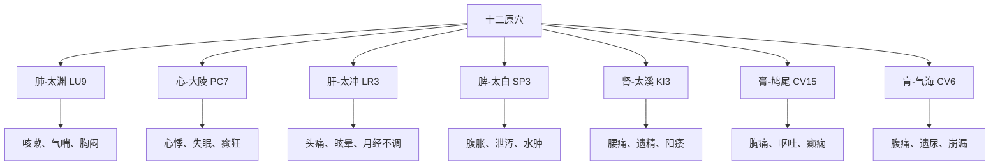

# 灵枢-九针十二原第一

> "小针之要，易陈而难入。粗守形，上守神。神乎神，客在门。" - 岐伯

---

## 📜 原文（节选）/ Original Text (Excerpt)

黄帝问于岐伯曰：余子万民，养百姓而收其租税；余哀其不给而属有疾病。余欲勿使被毒药，无用砭石，欲以微针通其经脉，调其血气，荣其逆顺出入之会。令可传于后世，必明为之法，令终而不灭，久而不绝，易用难忘，为之经纪，异其章，别其表里，为之终始。令各有形，先立针经。愿闻其情。

岐伯答曰：臣请推而次之，令有纲纪，始于一，终于九焉。请言其道！小针之要，易陈而难入。粗守形，上守神。神乎神，客在门。未睹其疾，恶知其原？刺之微，在速迟。粗守关，上守机，机之动，不离其空。空中之机，清静而微。其来不可逢，其往不可追。知机之道者，不可挂以发。不知机道，扣之不发。知其往来，要与之期。粗之闇乎，妙哉，工独有之。往者为逆，来者为顺，明知逆顺，正行无间。迎而夺之，恶得无虚？追而济之，恶得无实？迎之随之，以意和之，针道毕矣。

凡用针者，虚则实之，满则泄之，宛陈则除之，邪胜则虚之。《大要》曰：徐而疾则实，疾而徐则虚。言实与虚，若有若无。察后与先。若存若亡。为虚与实，若得若失。

---

## 📖 白话文翻译（节选）/ Modern Chinese Translation (Excerpt)

黄帝向岐伯问道：我抚爱万民，供养百官，而征收他们的租税，很哀怜他们不能终尽天年，还接连不断发生疾病。我想叫他们不服苦药，不用砭石，只是用细小之针，刺入肌肤，就可达到疏通经脉，调和血气，使气血的运行在经脉中起到逆顺往来的相合作用。为了使这种疗法传于后世，就必须制定出针经之法；为使针法永远不灭，历久而不失传，容易运用，而又难以忘记，这又必须制定出细针进退深浅的准则来。此外，还要分析篇目章句，辨别腑腧脏腧，制定出针的长短之数，使其各具形态，主要是先编成一部针经，我想听听实际内容。

岐伯答道：我想按照次序，有条有理地，从小针开始，直到九针，叙说一下其中的道理。小针的要诀，说起来好象容易，但是要达到精微的境界却是很难的。一般的医生拘守形体，只知道在病位上针刺；高明的医生却能根据病人神情气色的变化针治疾病，真神啊！人身的经脉，就象门户一样，邪疾可从门户侵入体内，如果看不出是什么病，又哪能了解发病的原因呢？针刺的微妙，在于如何运用疾徐手法，一般的医生拘守四肢关节的穴位治病，高明的医生却能把握经气的机动。经气的机动，是不会离开孔穴的。其中所蕴藏的道理，是极精而微妙的。当邪气正盛的时候，切不可迎其势而用补法；而当邪气已去时，则不宜再用泻法去追泻邪气。知道气机变化之理的医工，谨守着气的往来之际，及时运用补泻之法，不能差之毫发；不懂得气机运行之理的人，到了应该补泻的时候而不能及时地运用手法，就好像是箭扣在弦上，应当发射而不发射一样。用针的人必须知道气机的往来运行变化，并相应地严格由气机运行来把握针刺的时间，只有这样才能取得良好的疗效。粗率的医生对这一点，暗然不能明了；惟有高明的医生，才能体察到其中的妙用。至于气的逆顺，气已去的，脉气虚而小，为逆；气已来的，脉气平而和，为顺。清楚地了解气的往来逆顺变化，就可以毫无疑问地及时施行针法。根据经气的循行方向，朝着经气来的方向进针，和它的来势相逆，用泻法夺其有余，邪气怎么会不由实而虚呢？相应的，随着经气的去路进针，和它的去势相顺，用补法济其不足，正气怎么会不由虚转实呢？然而，迎而夺之的泻法，或是随而济之的补法，都应当在用心体察气机变化后，再灵活运用才能调和虚实。掌握了这个关键，针法的主要道理，就尽在其中了。

大凡用针治病，虚证要用补法使其充实，实证要用泻法使其排泄，气滞血瘀的要除去它，邪气盛的要泻掉它。《大要》说：慢慢进针快快出针的是补法，快快进针慢慢出针的是泻法。说到虚与实，要掌握得若有若无。观察气机的先与后。补虚与泻实，要像获得与失去一样感觉准确。

---

## 🌐 英文释义（节选）/ English Translation (Excerpt)

The Yellow Emperor asked Qibo: I love the people and support my officials, collecting taxes from them. I pity them for not being able to live out their natural lifespan and for constantly suffering from diseases. I wish for them not to use bitter medicines or stone tools, but only use fine needles to pierce the skin, which can unblock the meridians, harmonize qi and blood, and regulate the flow of qi and blood in the meridians in their reversed and forward movements. To pass this method down to future generations, we must establish clear rules for it. To make acupuncture theory never be extinguished, endure for a long time without being lost, be easy to use and hard to forget, we must establish standards for the depth of needle insertion. Additionally, we must analyze chapters and sentences, distinguish between yu and shu acupoints, and establish the lengths and numbers of needles so that each has its own form. Primarily, we should first compile a book on acupuncture. I wish to hear the details.

Qibo replied: I will present it in order with clear structure, starting from one and ending with nine. Let me explain the theory! The essentials of small needles are easy to state but difficult to master. Inferior doctors observe the form, while superior doctors observe the spirit. Spirit, oh spirit! The pathogen is at the door. If you don't see the disease, how can you know its origin? The subtlety of acupuncture lies in the speed and slowness of manipulation. Inferior doctors observe the barriers, while superior doctors observe the mechanism. The movement of the mechanism never leaves the acupoint. The mechanism within the acupoint is clear, quiet, and subtle. When it comes, you cannot meet it head-on; when it goes, you cannot chase it. Those who know the mechanism should not be delayed even by a hair. Those who do not know the mechanism cannot fire even when it's time. Know its coming and going, and you must keep pace with it. Inferior doctors are in darkness about this, but marvelous, only skilled doctors possess this knowledge. The past is contrary, the coming is harmonious. Clearly know the contrary and harmonious, and practice correctly without doubt. Meet it and deprive it, how can it not become empty? Follow it and assist it, how can it not become substantial? Meet it and follow it, harmonize with intent, and the way of acupuncture is complete.

All who use needles should tonify deficiency, drain excess, remove stagnation, and drain pathogen excess. The "Great Essentials" say: Slow insertion and fast withdrawal is tonification; fast insertion and slow withdrawal is drainage. Speaking of deficiency and excess, it should seem to exist or not exist. Observe the later and earlier. Tonifying deficiency and draining excess should feel like gaining or losing.

---

## 🔑 核心要点 / Core Concepts

### 1. 九针 / Nine Needles

| 序号 | 针名 | 英文名 | 长度 | 形状 | 用途 |
|------|------|--------|------|------|------|
| 1 | 镵针 | Chisel Needle | 1寸6分 | 头大末锐 | 浅刺，泻阳气 |
| 2 | 员针 | Round Needle | 1寸6分 | 针如卵形 | 按摩分间，泻分气 |
| 3 | 鍉针 | Spoon Needle | 3寸5分 | 头如黍粟 | 按脉勿陷，以致气 |
| 4 | 锋针 | Lance Needle | 1寸6分 | 刃三隅 | 发痼疾，排脓 |
| 5 | 铍针 | Sword Needle | 4寸 | 末如剑锋 | 取大脓 |
| 6 | 员利针 | Round Sharp Needle | 1寸6分 | 尖如卵，中身微大 | 取暴气 |
| 7 | 毫针 | Filiform Needle | 3寸6分 | 尖如蚊虻喙 | 取痛痹，养正 |
| 8 | 长针 | Long Needle | 7寸 | 锋利身薄 | 取远痹 |
| 9 | 大针 | Large Needle | 4寸 | 尖如梃，锋微圆 | 泻机关之水 |

### 2. 十二原穴 / Twelve Yuan Points

| 脏腑 | 原穴名称 | 英文名 | 位置 | 主治 |
|------|---------|--------|------|------|
| 肺 | 太渊 | Taiyuan (LU9) | 手腕 | 肺系疾病 |
| 心 | 大陵 | Daling (PC7) | 手腕 | 心系疾病 |
| 肝 | 太冲 | Taichong (LR3) | 足部 | 肝系疾病 |
| 脾 | 太白 | Taibai (SP3) | 足部 | 脾系疾病 |
| 肾 | 太溪 | Taixi (KI3) | 足部 | 肾系疾病 |
| 膏 | 鸠尾 | Jiuwei (CV15) | 胸部 | 膏之疾病 |
| 肓 | 脖胦 | Qihai (CV6) | 腹部 | 肓之疾病 |

### 3. 针刺基本手法 / Basic Acupuncture Techniques

**徐疾补泻 / Slow-Fast Tonification-Drainage:**
- **补法（Tonification）**：徐而疾 - 慢慢进针，快快出针
- **泻法（Drainage）**：疾而徐 - 快快进针，慢慢出针

**迎随补泻 / Following-Against Tonification-Drainage:**
- **补法（Tonification）**：随而济 - 顺经气方向进针
- **泻法（Drainage）**：迎而夺 - 逆经气方向进针

### 4. 针刺要领 / Essentials of Acupuncture

| 古文 | 英文 | 含义 |
|------|------|------|
| **粗守形** | Inferior doctors observe the form | 粗浅医生拘守形体 |
| **上守神** | Superior doctors observe the spirit | 高明医生守持精神 |
| **粗守关** | Inferior doctors observe the barriers | 粗浅医生守持关节 |
| **上守机** | Superior doctors observe the mechanism | 高明医生把握气机 |

---

## 📚 理论解释 / Theoretical Analysis

### 针刺理论的核心 / Core of Acupuncture Theory

> [!info] 理论核心
> 本篇提出了针灸理论的核心：九针器具、十二原穴、针刺手法、气机把握。

#### 1. 九针的辨证应用 / Differential Application of Nine Needles

- **辨证施针**：根据不同病证选择不同针具
- **因势利导**：根据邪气性质选择针刺方法
- **浅深适宜**：根据病位深浅选择针刺深度

#### 2. 十二原穴的重要性 / Importance of Twelve Yuan Points

- **原穴概念**：脏腑原气经过和留止的部位
- **原穴主治**：主治相应脏腑的疾病
- **诊断价值**：原穴的变化反映脏腑病变

#### 3. 气机理论 / Theory of Qi Mechanism

- **气机的概念**：经气的运行变化
- **气机的把握**：高明医生能够把握气机变化
- **气机的运用**：根据气机变化选择针刺时机

#### 4. 补泻理论 / Theory of Tonification and Drainage

- **虚则补之**：虚证用补法
- **实则泻之**：实证用泻法
- **宛陈则除之**：气滞血瘀用刺血法
- **邪胜则虚之**：邪气盛用泻法

---

## 🏥 中医实践应用 / TCM Practice Application

### 现代针灸指南 / Modern Acupuncture Guide

> [!tip] 实践建议
> 将《灵枢》的针刺理论应用于现代针灸实践。

#### 1. 九针的现代应用 / Modern Application of Nine Needles

| 古代九针 | 现代对应 | 临床应用 |
|---------|---------|---------|
| 镵针 | 皮肤针、梅花针 | 浅刺、叩刺 |
| 员针 | 按摩工具 | 按摩、推拿 |
| 鍉针 | 毫针 | 轻度刺、调气 |
| 锋针 | 三棱针 | 刺络放血 |
| 铍针 | 手术刀 | 排脓、切开 |
| 员利针 | 圆利针 | 深刺、暴气 |
| 毫针 | 毫针 | 最常用的针灸针 |
| 长针 | 长针、芒针 | 深刺、远痹 |
| 大针 | 大针 | 泻积水 |

#### 2. 十二原穴的临床应用 / Clinical Application of Twelve Yuan Points

**具体应用 / Specific Applications:**

| 原穴 | 常见病证 | 治疗方法 |
|------|---------|---------|
| 太渊（肺） | 咳嗽、气喘、胸闷 | 补肺益气 |
| 大陵（心） | 心悸、失眠、癫狂 | 宁心安神 |
| 太冲（肝） | 头痛、眩晕、月经不调 | 疏肝理气 |
| 太白（脾） | 腹胀、泄泻、水肿 | 健脾益气 |
| 太溪（肾） | 腰痛、遗精、阳痿 | 补肾固精 |

#### 3. 针刺补泻手法 / Acupuncture Tonification-Drainage Techniques

**徐疾补泻法 / Slow-Fast Method:**

| 手法 | 操作 | 适应证 |
|------|------|--------|
| **补法** | 慢慢进针（吸气），快快出针（呼气） | 虚证 |
| **泻法** | 快快进针（呼气），慢慢出针（吸气） | 实证 |

**迎随补泻法 / Following-Against Method:**

| 手法 | 操作 | 适应证 |
|------|------|--------|
| **补法** | 顺经气方向进针，顺着经气去路 | 虚证 |
| **泻法** | 逆经气方向进针，迎着经气来路 | 实证 |

#### 4. 气机的把握 / Mastering Qi Mechanism

> [!warning] 技术要求
> 把握气机需要丰富的临床经验和敏锐的感知能力。

**气机变化的感知 / Perceiving Qi Mechanism Changes:**

| 气机表现 | 感受 | 应对 |
|---------|------|------|
| **气来如水之流** | 针下有水波感 | 顺势补法 |
| **气去如风之去** | 针下空虚感 | 等待气复 |
| **气滞如绳之结** | 针下紧涩感 | 泻法松解 |
| **气乱如云之散** | 针下纷乱感 | 调和气机 |

**把握气机的要点 / Key Points of Mastering Qi Mechanism:**

1. **守神（Guarding the Spirit）**：全神贯注，感知气机
2. **辨气（Distinguishing Qi）**：辨别气来的顺逆、虚实
3. **得气（Obtaining Qi）**：针刺后针下有得气感
4. **候气（Waiting for Qi）**：等待气机变化，把握时机

#### 5. 临床注意事项 / Clinical Precautions

| 注意事项 | 说明 | 后果 |
|---------|------|------|
| **先诊脉** | 针刺前必须诊脉，了解病情 | 辨证准确 |
| **明深浅** | 根据病位决定针刺深浅 | 避免误伤 |
| **知禁忌** | 了解针刺禁忌症 | 防止事故 |
| **慎操作** | 针刺操作要谨慎细致 | 避免意外 |

---

## 🔗 相关链接 / Related Links

### 内部链接 / Internal Links

- [[MOC-黄帝内经知识库]] - 黄帝内经主索引
- [[黄帝内经-灵枢索引]] - 灵枢篇章索引
- [[黄帝内经-核心理论]] - 核心理论体系
- [[黄帝内经-实践应用]] - 针灸实践应用
- [[灵枢-本输第二]] - 下一篇：本输

### 外部链接 / External Links

- [中国哲学书电子化计划 - 灵枢九针十二原](https://ctext.org/wiki.pl?if=gb&remap=gb&chapter=351843)
- [WHO - Acupuncture](https://www.who.int/health-topics/traditional-complementary-and-integrative-medicine)

---

## 💡 学习要点 / Learning Points

### 掌握重点 / Key Points to Master

> [!important] 必须掌握
> 以下内容是理解本篇的核心要点。

- [ ] **理解九针的名称、形状和用途**
- [ ] **掌握十二原穴的名称和位置**
- [ ] **理解针刺补泻的基本手法**
- [ ] **掌握气机理论的核心概念**
- [ ] **学会在临床中应用原穴治疗**

### 思考问题 / Questions for Reflection

1. **为什么说"粗守形，上守神"？**
   - 粗浅医生只关注病变部位
   - 高明医生重视整体气机变化
   - 针刺要形神兼治

2. **十二原穴为什么能治疗脏腑疾病？**
   - 原穴是脏腑原气经过和留止的部位
   - 原穴与脏腑有直接联系
   - 刺激原穴可以调节脏腑功能

3. **如何在现代针灸实践中应用九针理论？**
   - 九针发展为现代多种针具
   - 根据病证选择合适的针具
   - 灵活运用古人的智慧

---

## 📊 学习进度 / Learning Progress

### 完成情况 / Completion Status

| 学习内容 | 状态 | 备注 |
|---------|------|------|
| 原文诵读 | 📝 进行中 | 建议每日诵读 |
| 白话文理解 | ✅ 已完成 | 理解主要含义 |
| 英文术语 | ✅ 已完成 | 掌握关键术语 |
| 核心要点 | ✅ 已完成 | 理解九针原穴 |
| 理论分析 | ✅ 已完成 | 理解针刺理论 |
| 实践应用 | 📝 进行中 | 需要临床实践 |

---

## 🔄 更新日志 / Update Log

### 2026-02-02

- ✅ 创建九针十二原篇笔记
- ✅ 完成原文、白话文翻译、英文释义
- ✅ 整理九针和十二原穴要点
- ✅ 编写针刺理论分析
- ✅ 添加实践应用指南

---

**笔记创建日期**：2026年2月2日

**最后更新**：2026年2月2日

**建议下次复习**：2026年2月9日
