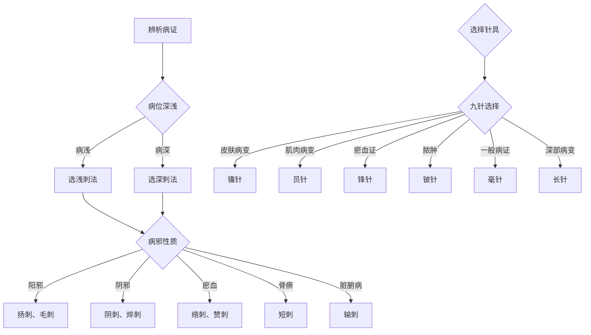

# 灵枢-官针第七

> "凡刺之要，官针最妙。九针之宜，各有所为。" - 岐伯

---

## 📜 原文 / Original Text

黄帝问曰：愿闻官针奈何？岐伯对曰：凡刺之要，官针最妙。九针之宜，各有所为。长短大小，各有所施。不得其用，病弗能移。疾浅针深，内伤良肉；病深针浅，病气不泻。反为大贼，反伤良肉。皮肉筋脉，各有所处。病各有所宜，各不同形。

九针之名，各不同形。一曰镵针，长一寸六分。二曰员针，长一寸六分。三曰鍉针，长三寸五分。四曰锋针，长一寸六分。五曰铍针，长四寸。六曰员利针，长一寸六分。七曰毫针，长三寸六分。八曰长针，长七寸。九曰大针，长四寸。

九针之用，各有所为。镵针者，头大末锐，去泻阳气。员针者，针如卵形，指摩分间，无得伤肉，以泻分气。鍉针者，锋如黍粟之锐，主按脉，勿陷，以致其气。锋针者，刃三隅，以发痼疾。铍针者，末如剑锋，以取大脓。员利针者，尖如卵，大而身微圆，以取暴气。毫针者，尖如蚊虻喙，静以徐往，以取痛痹。长针者，锋利身薄，以取远痹。大针者，尖如梃，以泻机关之水。

九刺之名，各有所为。一曰输刺，输刺者，刺诸经荥输脏输也。二曰远道刺，远道刺者，病在上取之下，病在下取之上。三曰经刺，经刺者，刺大经之结络经分也。四曰络刺，络刺者，刺小络血脉也。五曰分刺，分刺者，刺分肉之间也。六曰大写刺，大写刺者，刺大经以泻之也。七曰毛刺，毛刺者，刺浮痹皮肤也。八曰巨刺，巨刺者，刺大经之旁也。九曰焠刺，焠刺者，刺大络之出血也。

十二刺之名，各有所为。一曰偶刺，偶刺者，以左右手足相刺也。二曰报刺，报刺者，刺病无常处也。三曰恢刺，恢刺者，直刺旁刺，复下针也。四曰齐刺，齐刺者，直入直出，深内之也。五曰扬刺，扬刺者，内针浅出，以取阳气也。六曰直针刺，直针刺者，直入直出，深内之也。七曰输刺，输刺者，刺诸经荥输脏输也。八曰短刺，短刺者，刺骨痹，摇而深之也。九曰浮刺，浮刺者，刺浮痹皮肤也。十曰阴刺，阴刺者，刺大络之出血也。十一曰傍针刺，傍针刺者，刺大经之旁也。十二曰赞刺，赞刺者，刺大络之出血也。

---

## 📖 白话文翻译 / Modern Chinese Translation

黄帝问道：希望听听官针的方法是怎样的呢？岐伯回答说：大凡针刺的要领，官针的运用最为精妙。九针的适用，各自有其用途。长短大小，各有其施用。如果不能得其用法，疾病就不能转移。病浅而针深，就会内伤好肉；病深而针浅，病气就不能泻出。反为大害，反而伤害好肉。皮肉筋脉，各有其所处。疾病各有其所宜，各有不同形态。

九针的名称，各有不同形状。第一叫镵针，长一寸六分。第二叫员针，长一寸六分。第三叫鍉针，长三寸五分。第四叫锋针，长一寸六分。第五叫铍针，长四寸。第六叫员利针，长一寸六分。第七叫毫针，长三寸六分。第八叫长针，长七寸。第九叫大针，长四寸。

九针的用途，各有其作为。镵针，头部大末端锐利，用来泻除阳气。员针，针如卵形，用来按摩分肉之间，不得损伤肌肉，用来泻除分肉之气。鍉针，针尖如黍粟般锐利，主治按压脉道，不令陷入，以致其气。锋针，针刃有三个棱角，用来发作顽固疾病。铍针，针末如剑锋，用来采取大脓。员利针，针尖如卵，粗大而针身微圆，用来采取暴烈之气。毫针，针尖如蚊虻喙，安静而徐缓前往，用来采取痛痹。长针，针尖锋利针身薄，用来采取远处的痹证。大针，针尖如梃，用来泻除关节的水液。

九刺的名称，各有其作为。第一叫输刺，输刺，是针刺各经的荥穴、输穴和脏输穴。第二叫远道刺，远道刺，是病在上取下部的穴位，病在下取上部的穴位。第三叫经刺，经刺，是针刺大经的结络和经分的部位。第四叫络刺，络刺，是针刺小络和血脉。第五叫分刺，分刺，是针刺分肉之间的部位。第六叫大泻刺，大泻刺，是针刺大经来泻除病邪。第七叫毛刺，毛刺，是针刺浮在皮表的痹证。第八叫巨刺，巨刺，是针刺大经旁边的部位。第九叫焠刺，焠刺，是针刺大络来出血。

十二刺的名称，各有其作为。第一叫偶刺，偶刺，是用左右手足相互针刺。第二叫报刺，报刺，是针刺病邪没有固定之处。第三叫恢刺，恢刺，是直刺和旁刺，再次下针。第四叫齐刺，齐刺，是直入直出，深深进针。第五叫扬刺，扬刺，是进针浅出，用来采取阳气。第六叫直针刺，直针刺，是直入直出，深深进针。第七叫输刺，输刺，是针刺各经的荥穴、输穴和脏输穴。第八叫短刺，短刺，是针刺骨痹，摇动而深刺。第九叫浮刺，浮刺，是针刺浮在皮表的痹证。第十叫阴刺，阴刺，是针刺大络来出血。第十一叫傍针刺，傍针刺，是针刺大经旁边的部位。第十二叫赞刺，赞刺，是针刺大络来出血。

---

## 🌐 英文释义 / English Translation

The Yellow Emperor asked: I hope to hear about the method of official needles. Qibo replied: The essentials of acupuncture are most exquisitely demonstrated by the use of official needles. The applications of the nine needles each have their uses. Their lengths and sizes each have their applications. If one cannot master their usage, diseases cannot be transformed. If the disease is shallow but needling is deep, it will injure good flesh internally; if the disease is deep but needling is shallow, the disease qi cannot be drained. This becomes a great harm, instead injuring good flesh. Skin, flesh, tendons, and vessels each have their locations. Diseases each have their appropriate applications, each with different forms.

The names of the nine needles each have different shapes. The first is called the Chisel Needle, one cun and six fen long. The second is called the Round Needle, one cun and six fen long. The third is called the Spoon Needle, three cun and five fen long. The fourth is called the Lance Needle, one cun and six fen long. The fifth is called the Sword Needle, four cun long. The sixth is called the Round Sharp Needle, one cun and six fen long. The seventh is called the Filiform Needle, three cun and six fen long. The eighth is called the Long Needle, seven cun long. The ninth is called the Large Needle, four cun long.

The uses of the nine needles each have their functions. The Chisel Needle has a large head and sharp tip, used to drain yang qi. The Round Needle is egg-shaped, used to massage between the flesh divisions without injuring the muscles, used to drain the qi of the flesh divisions. The Spoon Needle has a tip as sharp as a millet grain, mainly for pressing on vessels without sinking in, to induce qi. The Lance Needle has three edges on the blade, used to trigger stubborn diseases. The Sword Needle has a tip like a sword edge, used to extract large abscesses. The Round Sharp Needle has a tip like an egg, large and with a slightly round body, used to extract violent qi. The Filiform Needle has a tip like a mosquito's proboscis, quiet and slow in approach, used to extract painful bi syndromes. The Long Needle has a sharp tip and thin body, used to extract distant bi syndromes. The Large Needle has a tip like a pestle, used to drain water from the joints.

The names of the nine needling methods each have their functions. The first is called Shu Needling, Shu needling is needling the ying, shu, and zang shu points of the meridians. The second is called Distant Channel Needling, Distant Channel needling is taking lower points when disease is above, and taking upper points when disease is below. The third is called Meridian Needling, Meridian needling is needling the knot points and meridian divisions of the great meridians. The fourth is called Collateral Needling, Collateral needling is needling the small collaterals and blood vessels. The fifth is called Division Needling, Division needling is needling between the flesh divisions. The sixth is called Great Drainage Needling, Great Drainage needling is needling the great meridians to drain the pathogens. The seventh is called Skin Needling, Skin needling is needling the bi syndrome floating on the skin surface. The eighth is called Great Needling, Great needling is needling the areas beside the great meridians. The ninth is called Bleeding Needling, Bleeding needling is needling the great collaterals to cause bleeding.

The names of the twelve needling methods each have their functions. The first is called Paired Needling, Paired needling is using the left and right hands and feet to needle each other. The second is called Return Needling, Return needling is needling when the disease has no fixed location. The third is called Expanded Needling, Expanded needling is straight needling and side needling, again inserting the needle. The fourth is called Aligned Needling, Aligned needling is straight in and straight out, inserting deeply. The fifth is called Raising Needling, Raising needling is inserting shallowly and withdrawing quickly, to take yang qi. The sixth is called Straight Needling, Straight needling is straight in and straight out, inserting deeply. The seventh is called Shu Needling, Shu needling is needling the ying, shu, and zang shu points of the meridians. The eighth is called Short Needling, Short needling is needling bone bi, shaking and inserting deeply. The ninth is called Floating Needling, Floating needling is needling the bi syndrome floating on the skin surface. The tenth is called Yin Needling, Yin needling is needling the great collaterals to cause bleeding. The eleventh is called Side Needling, Side needling is needling the areas beside the great meridians. The twelfth is called Praise Needling, Praise needling is needling the great collaterals to cause bleeding.

---

## 🔑 核心要点 / Core Concepts

### 1. 九针名称与形状 / Nine Needle Names and Shapes

| 序号 | 针名 | 长度 | 形状 | 用途 |
|------|------|------|------|------|
| 1 | 镵针 | 1寸6分 | 头大末锐 | 去泻阳气 |
| 2 | 员针 | 1寸6分 | 针如卵形 | 指摩分间，泻分气 |
| 3 | 鍉针 | 3寸5分 | 锋如黍粟 | 按脉致气 |
| 4 | 锋针 | 1寸6分 | 刃三隅 | 发痼疾 |
| 5 | 铍针 | 4寸 | 末如剑锋 | 取大脓 |
| 6 | 员利针 | 1寸6分 | 尖如卵，大而身微圆 | 取暴气 |
| 7 | 毫针 | 3寸6分 | 尖如蚊虻喙 | 取痛痹 |
| 8 | 长针 | 7寸 | 锋利身薄 | 取远痹 |
| 9 | 大针 | 4寸 | 尖如梃 | 泻机关之水 |

### 2. 九刺方法 / Nine Needling Methods

| 序号 | 刺法 | 说明 | 应用 |
|------|------|------|------|
| 1 | 输刺 | 刺诸经荥输脏输 | 五输穴治疗 |
| 2 | 远道刺 | 病在上取下，病在下取上 | 远端取穴 |
| 3 | 经刺 | 刺大经之结络经分 | 经络取穴 |
| 4 | 络刺 | 刺小络血脉 | 络脉刺血 |
| 5 | 分刺 | 刺分肉之间 | 分肉间取穴 |
| 6 | 大泻刺 | 刺大经以泻之 | 泻除病邪 |
| 7 | 毛刺 | 刺浮痹皮肤 | 皮表痹证 |
| 8 | 巨刺 | 刺大经之旁 | 经旁取穴 |
| 9 | 焠刺 | 刺大络之出血 | 刺络放血 |

### 3. 十二刺方法 / Twelve Needling Methods

| 序号 | 刺法 | 说明 | 应用 |
|------|------|------|------|
| 1 | 偶刺 | 左右手足相刺 | 左右配穴 |
| 2 | 报刺 | 刺病无常处 | 移动取穴 |
| 3 | 恢刺 | 直刺旁刺，复下针 | 多向刺法 |
| 4 | 齐刺 | 直入直出，深内 | 深刺法 |
| 5 | 扬刺 | 内针浅出，取阳气 | 浅刺补阳 |
| 6 | 直针刺 | 直入直出，深内 | 深刺法 |
| 7 | 输刺 | 刺诸经荥输脏输 | 五输穴治疗 |
| 8 | 短刺 | 刺骨痹，摇而深之 | 骨痹治疗 |
| 9 | 浮刺 | 刺浮痹皮肤 | 皮表痹证 |
| 10 | 阴刺 | 刺大络之出血 | 刺络放血 |
| 11 | 傍针刺 | 刺大经之旁 | 经旁取穴 |
| 12 | 赞刺 | 刺大络之出血 | 刺络放血 |

### 4. 针刺深浅原则 / Principles of Needling Depth

| 情况 | 针法 | 后果 |
|------|------|------|
| **病浅针深** | 针刺过深 | 内伤良肉 |
| **病深针浅** | 针刺过浅 | 病气不泻 |
| **病浅针浅** | 针刺恰当 | 治疗有效 |
| **病深针深** | 针刺恰当 | 治疗有效 |

---

## 📚 理论解释 / Theoretical Analysis

### 官针理论的核心 / Core of Official Needle Theory

> [!info] 理论核心
> 本篇系统阐述了九针、九刺、十二刺等针刺理论。

#### 1. 九针的辨证应用 / Differential Application of Nine Needles

**辨证施针原则：**
- 根据病证选择针具
- 根据病位决定深浅
- 根据病性选择刺法

**九针现代对应：**

| 古代九针 | 现代对应 | 临床应用 |
|---------|---------|---------|
| 镵针 | 皮肤针、梅花针 | 浅刺、叩刺 |
| 员针 | 按摩工具 | 按摩、推拿 |
| 鍉针 | 毫针 | 轻度刺、调气 |
| 锋针 | 三棱针 | 刺络放血 |
| 铍针 | 手术刀 | 排脓、切开 |
| 员利针 | 圆利针 | 深刺、暴气 |
| 毫针 | 毫针 | 最常用的针灸针 |
| 长针 | 长针、芒针 | 深刺、远痹 |
| 大针 | 大针 | 泻积水 |

#### 2. 九刺理论 / Theory of Nine Needling Methods

**九刺特点：**
- 输刺：五输穴应用
- 远道刺：上下取穴
- 经刺：大经取穴
- 络刺：小络刺血
- 分刺：分肉间取穴
- 大泻刺：大经泻邪
- 毛刺：皮表痹证
- 巨刺：经旁取穴
- 焠刺：刺络放血

#### 3. 十二刺理论 / Theory of Twelve Needling Methods

**十二刺特点：**
- 偶刺：左右配穴
- 报刺：移动取穴
- 恢刺：多向刺法
- 齐刺：深刺法
- 扬刺：浅刺补阳
- 直针刺：深刺法
- 输刺：五输穴治疗
- 短刺：骨痹治疗
- 浮刺：皮表痹证
- 阴刺：刺络放血
- 傍针刺：经旁取穴
- 赞刺：刺络放血

#### 4. 针刺深浅理论 / Theory of Needling Depth

**深浅原则：**
- 病浅针浅
- 病深针深
- 避免误伤
- 恰当治疗

---

## 🏥 中医实践应用 / TCM Practice Application

### 临床针刺指南 / Clinical Acupuncture Guide

> [!tip] 实践建议
> 将官针理论应用于现代针灸临床。

#### 1. 九针现代应用 / Modern Application of Nine Needles

| 古代九针 | 现代工具 | 临床适应证 |
|---------|---------|-----------|
| 镵针 | 皮肤针、梅花针 | 皮肤病、局部麻木 |
| 员针 | 按摩球、推拿工具 | 肌肉疲劳、软组织损伤 |
| 鍉针 | 毫针（轻度） | 轻度疼痛、调理气机 |
| 锋针 | 三棱针 | 瘀血证、急性疼痛 |
| 铍针 | 手术刀、注射器 | 脓肿、囊肿切开 |
| 员利针 | 圆利针 | 急性扭伤、暴痛 |
| 毫针 | 毫针 | 各种疾病，最常用 |
| 长针 | 芒针、长针 | 深部病变、远端痹证 |
| 大针 | 粗针、大针 | 关节积液、水肿 |

#### 2. 九刺临床应用 / Clinical Application of Nine Needling Methods

| 刺法 | 适应证 | 选穴 | 方法 |
|------|--------|------|------|
| 输刺 | 脏腑病 | 五输穴 | 针刺五输穴 |
| 远道刺 | 远端病变 | 远端取穴 | 上下取穴 |
| 经刺 | 经络病 | 大经穴位 | 经络取穴 |
| 络刺 | 瘀血证 | 络穴 | 刺络放血 |
| 分刺 | 肌肉病 | 分肉间穴 | 分肉间取穴 |
| 大泻刺 | 实证 | 大经穴 | 泻除病邪 |
| 毛刺 | 皮痹 | 皮表穴位 | 浅刺皮表 |
| 巨刺 | 经络阻滞 | 经旁穴位 | 经旁取穴 |
| 焠刺 | 瘀血证 | 络穴 | 刺络放血 |

#### 3. 十二刺临床应用 / Clinical Application of Twelve Needling Methods

| 刺法 | 适应证 | 操作要点 |
|------|--------|---------|
| 偶刺 | 左右对称病变 | 左右配穴 |
| 报刺 | 病邪游走 | 追逐取穴 |
| 恢刺 | 局部病变 | 多向刺法 |
| 齐刺 | 深部病变 | 深刺直进直出 |
| 扬刺 | 阳虚证 | 浅刺补阳 |
| 直针刺 | 深部病变 | 深刺直进直出 |
| 输刺 | 脏腑病 | 五输穴治疗 |
| 短刺 | 骨痹 | 摇而深刺 |
| 浮刺 | 皮表痹证 | 浅刺皮表 |
| 阴刺 | 瘀血证 | 刺络放血 |
| 傍针刺 | 经络阻滞 | 经旁取穴 |
| 赞刺 | 瘀血证 | 刺络放血 |

#### 4. 临床辨证流程 / Clinical Differentiation Process

#### 5. 临床注意事项 / Clinical Precautions

| 注意事项 | 说明 | 后果 |
|---------|------|------|
| **辨深浅** | 先辨病位深浅 | 避免误伤 |
| **选针具** | 根据病证选择针具 | 治疗有效 |
| **明刺法** | 明确刺法操作 | 疗效确切 |
| **慎操作** | 针刺操作要谨慎 | 防止事故 |

---

## 🔗 相关链接 / Related Links

### 内部链接 / Internal Links

- [[MOC-黄帝内经知识库]] - 黄帝内经主索引
- [[黄帝内经-灵枢索引]] - 灵枢篇章索引
- [[黄帝内经-核心理论]] - 核心理论体系
- [[灵枢01-九针十二原第一]] - 参考篇：九针十二原
- [[灵枢-寿夭刚柔第六]] - 上一篇：寿夭刚柔

### 外部链接 / External Links

- [中国哲学书电子化计划 - 灵枢官针](https://ctext.org/wiki.pl?if=gb&remap=gb&chapter=351843)
- [古诗文网 - 灵枢官针](https://www.gushiwen.cn/guji/10276.aspx)

---

## 💡 学习要点 / Learning Points

### 掌握重点 / Key Points to Master

> [!important] 必须掌握
> 以下内容是理解本篇的核心要点。

- [ ] **掌握九针的名称、形状和用途**
- [ ] **理解九刺的方法和应用**
- [ ] **了解十二刺的方法和应用**
- [ ] **掌握针刺深浅的原则**
- [ ] **学会在临床中选择合适的针具和刺法**

### 思考问题 / Questions for Reflection

1. **为什么说"九针之宜，各有所为"？**
   - 不同针具有不同形状和用途
   - 根据病证选择合适针具
   - 辨证施针是针刺的基本原则

2. **九刺与十二刺有何区别？**
   - 九刺：主要针对经络、五输穴、络脉
   - 十二刺：包括左右配穴、移动取穴、多向刺法等
   - 二者互补，丰富针刺治疗方法

3. **如何在现代针灸中应用九针理论？**
   - 九针发展为现代多种针具
   - 根据病证选择合适工具
   - 灵活运用古人的智慧

---

## 📊 学习进度 / Learning Progress

### 完成情况 / Completion Status

| 学习内容 | 状态 | 备注 |
|---------|------|------|
| 原文诵读 | 📝 进行中 | 建议每日诵读 |
| 白话文理解 | ✅ 已完成 | 理解主要含义 |
| 英文术语 | ✅ 已完成 | 掌握关键术语 |
| 核心要点 | ✅ 已完成 | 掌握九刺十二刺 |
| 理论分析 | ✅ 已完成 | 理解官针理论 |
| 实践应用 | 📝 进行中 | 需要临床实践 |

---

## 🔄 更新日志 / Update Log

### 2026-02-07

- ✅ 创建官针第七篇笔记
- ✅ 完成原文、白话文翻译、英文释义
- ✅ 整理九针、九刺、十二刺要点
- ✅ 编写官针理论分析
- ✅ 添加临床针刺应用指南

---

**笔记创建日期**：2026年2月7日

**最后更新**：2026年2月7日

**建议下次复习**：2026年2月14日
