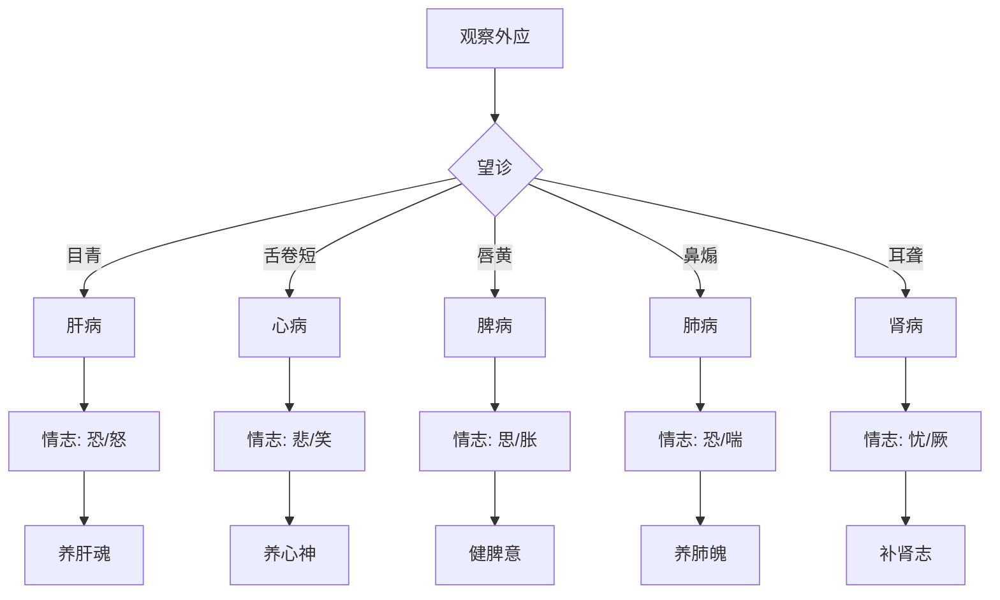

# 灵枢-本神第八

> "凡刺之法，先必本于神。" - 岐伯

---

## 📜 原文 / Original Text

黄帝问于岐伯曰：凡刺之法，先必本于神。血脉营气精神，此五脏之所藏也。肝藏血，血舍神；脾藏营，营舍意；心藏脉，脉舍神；肺藏气，气舍魄；肾藏精，精舍志。五脏已伤，神魂魄意志皆散，五脏已伤，神魂魄意志皆散。

黄帝曰：何谓德、气、生、精、神、魂、魄、心、意、志、思、智、虑？岐伯曰：天之在我者，德也；地之在我者，气也；德流气薄而生者也，故谓之生。两神相搏，合而成形，常先身生，是谓精。并精出入，是谓神。随神往来者，谓之魂。并精出入者，谓之魄。所以任物者，谓之心。心有所忆，谓之意。意之所存，谓之志。因志而存变，谓之思。因思而远慕，谓之虑。因虑而处物，谓之智。

黄帝曰：何谓德、气？岐伯曰：德者，天之在我者也；气者，地之在我者也。德气相合，而后生精，精生而后有形，形生而后有神，神生而后有魂魄，魂魄生而后有心，心生而后有意，意生而后有志，志生而后有思，思生而后有虑，虑生而后有智。

黄帝曰：何谓喜怒思忧恐？岐伯曰：肝藏血，血舍魂，肝气虚则恐，实则怒。脾藏营，营舍意，脾气虚则四肢不用，五脏不安，实则腹胀，经溲不利。心藏脉，脉舍神，心气虚则悲，实则笑不休。肺藏气，气舍魄，肺气虚则鼻塞不利，少气，实则喘喝，胸盈仰息。肾藏精，精舍志，肾气虚则厥，实则胀。

黄帝曰：何谓悲？岐伯曰：悲者，气消也。何谓恐？恐者，气下也。何谓思？思者，气结也。何谓忧？忧者，气闭也。何谓怒？怒者，气上也。

黄帝曰：何以知五脏之伤？岐伯曰：视其外应，以知五脏之伤。肝应目，目青则肝伤。心应舌，舌卷短则心伤。脾应口，唇黄则脾伤。肺应鼻，鼻煽则肺伤。肾应耳，耳聋不聪则肾伤。

黄帝曰：何以治之？岐伯曰：肝藏血，血舍魂，肝伤则魂散，魂散则善怒。脾藏营，营舍意，脾伤则意散，意散则善思。心藏脉，脉舍神，心伤则神散，神散则善悲。肺藏气，气舍魄，肺伤则魄散，魄散则善恐。肾藏精，精舍志，肾伤则志散，志散则善忧。

黄帝曰：愿闻治法。岐伯曰：五脏各有所伤，治之各有所宜。肝伤者，治之以肝，取其血，养其魂。脾伤者，治之以脾，取其营，养其意。心伤者，治之以心，取其脉，养其神。肺伤者，治之以肺，取其气，养其魄。肾伤者，治之以肾，取其精，养其志。

---

## 📖 白话文翻译 / Modern Chinese Translation

黄帝向岐伯问道：大凡针刺的方法，首先必须以神为本。血脉营气精神，这是五脏所藏藏的内容。肝藏血，血中居住着魂；脾藏营，营中居住着意；心藏脉，脉中居住着神；肺藏气，气中居住着魄；肾藏精，精中居住着志。五脏已经受伤，神魂魄意志都消散了；五脏已经受伤，神魂魄意志都消散了。

黄帝说：什么叫做德、气、生、精、神、魂、魄、心、意、志、思、智、虑？岐伯说：天在我身上的，叫做德；地在我身上的，叫做气；德流气薄而产生，所以叫做生。两种神相互搏击，结合而成形，常先生成身体，这叫做精。与精同时出入的，叫做神。随着神往来的，叫做魂。与精同时出入的，叫做魄。所以能够任受事物的，叫做心。心有所记忆的，叫做意。意所保存的，叫做志。因志而保存变化的，叫做思。因思而长远思慕的，叫做虑。因虑而处理事物的，叫做智。

黄帝说：什么叫做德、气？岐伯说：德，是天在我身上的；气，是地在我身上的。德气相合，然后产生精，精产生然后有形，形产生然后有神，神产生然后有魂魄，魂魄产生然后有心，心产生然后有意，意产生然后有志，志产生然后有思，思产生然后有虑，虑产生然后有智。

黄帝说：什么叫做喜、怒、思、忧、恐？岐伯说：肝藏血，血中居住魂，肝气虚则恐惧，实则发怒。脾藏营，营中居住意，脾气虚则四肢不能运用，五脏不安宁，实则腹胀，大小便不利。心藏脉，脉中居住神，心气虚则悲伤，实则笑个不停。肺藏气，气中居住魄，肺气虚则鼻塞不通，气短，实则喘息喝喝，胸部盈满仰面呼吸。肾藏精，精中居住志，肾气虚则厥逆，实则胀满。

黄帝说：什么叫做悲？岐伯说：悲，是气消散。什么叫做恐？恐，是气下陷。什么叫做思？思，是气结聚。什么叫做忧？忧，是气闭塞。什么叫做怒？怒，是气上逆。

黄帝说：怎么知道五脏受伤呢？岐伯说：观察它的外部反应，来知道五脏的损伤。肝对应目，目色青则肝受伤。心对应舌，舌卷曲短缩则心受伤。脾对应口，唇色黄则脾受伤。肺对应鼻，鼻翼煽动则肺受伤。肾对应耳，耳聋听不聪则肾受伤。

黄帝说：怎么治疗呢？岐伯说：五脏各有各的损伤，治疗各有各的适宜方法。肝受伤的，用肝的方法治疗，取其血，养其魂。脾受伤的，用脾的方法治疗，取其营，养其意。心受伤的，用心脉方法治疗，取其脉，养其神。肺受伤的，用肺的方法治疗，取其气，养其魄。肾受伤的，用肾的方法治疗，取其精，养其志。

---

## 🌐 英文释义 / English Translation

The Yellow Emperor asked Qibo: In all methods of acupuncture, one must first base it on spirit. Blood vessels, camp qi, and spirit are what the five zang organs store. The liver stores blood, and within blood resides the hun (ethereal soul). The spleen stores camp (nutrition), and within camp resides the yi (thought/intent). The heart stores vessels, and within vessels resides the shen (spirit). The lung stores qi, and within qi resides the po (corporeal soul). The kidney stores essence, and within essence resides the zhi (will). When the five zang organs are injured, the hun, po, yi, and zhi all scatter; when the five zang organs are injured, the shen, hun, po, yi, and zhi all scatter.

The Yellow Emperor said: What are called de (virtue), qi, sheng (life), jing (essence), shen (spirit), hun (ethereal soul), po (corporeal soul), xin (heart), yi (intent), zhi (will), si (thought), zhi (wisdom), and lü (deliberation)? Qibo said: What is from heaven in me is called de; what is from earth in me is called qi. De flows and qi arrives thin to produce, so it is called sheng (life). Two spirits interact and combine to form, always first generating the body, this is called jing (essence). What comes in and goes out together with essence is called shen (spirit). What comes and goes following the spirit is called hun (ethereal soul). What comes in and goes out together with essence is called po (corporeal soul). What can receive things is called xin (heart). What the heart can remember is called yi (intent). What the intent preserves is called zhi (will). What changes are preserved because of will is called si (thought). What long-term aspiration exists because of thought is called lü (deliberation). What deals with things because of deliberation is called zhi (wisdom).

The Yellow Emperor said: What are called de (virtue) and qi? Qibo said: De is what is from heaven in me; qi is what is from earth in me. De and qi combine, then produce jing (essence); jing produces then there is form; form produces then there is shen (spirit); shen produces then there are hun and po; hun and po produce then there is xin (heart); xin produces then there is yi (intent); yi produces then there is zhi (will); zhi produces then there is si (thought); si produces then there is lü (deliberation); lü produces then there is zhi (wisdom).

The Yellow Emperor said: What are called joy, anger, thought, worry, and fear? Qibo said: The liver stores blood, and within blood resides the hun (ethereal soul). When liver qi is deficient, there is fear; when in excess, there is anger. The spleen stores camp (nutrition), and within camp resides the yi (intent). When spleen qi is deficient, the four limbs cannot function, and the five zang organs are not peaceful; when in excess, there is abdominal distention and difficulty in urination and defecation. The heart stores vessels, and within vessels resides the shen (spirit). When heart qi is deficient, there is sadness; when in excess, there is continuous laughter. The lung stores qi, and within qi resides the po (corporeal soul). When lung qi is deficient, there is nasal congestion and shortness of breath; when in excess, there is panting and wheezing, and the chest is full with breathing upturned. The kidney stores essence, and within essence resides the zhi (will). When kidney qi is deficient, there is reversal (cold limbs); when in excess, there is distention.

The Yellow Emperor said: What is called sadness? Qibo said: Sadness is the scattering of qi. What is called fear? Fear is the sinking of qi. What is called thought? Thought is the knotting of qi. What is called worry? Worry is the blocking of qi. What is called anger? Anger is the uprising of qi.

The Yellow Emperor said: How does one know the injury of the five zang organs? Qibo said: Observe its external responses to know the injury of the five zang organs. The liver corresponds to the eyes; if the eyes are green (cyanotic), the liver is injured. The heart corresponds to the tongue; if the tongue is curled and shortened, the heart is injured. The spleen corresponds to the mouth; if the lips are yellow, the spleen is injured. The lung corresponds to the nose; if the nose wings flap, the lung is injured. The kidney corresponds to the ears; if there is deafness and inability to hear, the kidney is injured.

The Yellow Emperor said: How does one treat it? Qibo said: The five zang organs each have their injuries, and treatment each has its appropriate method. For liver injury, treat using the liver method, take its blood, and nourish its hun (ethereal soul). For spleen injury, treat using the spleen method, take its camp (nutrition), and nourish its yi (intent). For heart injury, treat using the heart method, take its vessels, and nourish its shen (spirit). For lung injury, treat using the lung method, take its qi, and nourish its po (corporeal soul). For kidney injury, treat using the kidney method, take its essence, and nourish its zhi (will).

---

## 🔑 核心要点 / Core Concepts

### 1. 五脏所藏 / What the Five Zang Store

| 脏腑 | 所藏 | 舍（居住） | 精神活动 |
|------|------|-----------|---------|
| **肝** | 血 | 魂 | 意志、谋略 |
| **脾** | 营 | 意 | 思考、记忆 |
| **心** | 脉 | 神 | 意识、知觉 |
| **肺** | 气 | 魄 | 感觉、运动 |
| **肾** | 精 | 志 | 意志、意志 |

### 2. 精神活动层次 / Levels of Mental Activities

| 层次 | 名称 | 英文 | 含义 |
|------|------|------|------|
| 1 | 德 | De | 天之在我 |
| 2 | 气 | Qi | 地之在我 |
| 3 | 生 | Sheng | 德流气薄而生 |
| 4 | 精 | Jing | 两神相搏而成形 |
| 5 | 神 | Shen | 并精出入 |
| 6 | 魂 | Hun | 随神往来 |
| 7 | 魄 | Po | 并精出入 |
| 8 | 心 | Xin | 所以任物 |
| 9 | 意 | Yi | 心有所忆 |
| 10 | 志 | Zhi | 意之所存 |
| 11 | 思 | Si | 因志而存变 |
| 12 | 虑 | Lü | 因思而远慕 |
| 13 | 智 | Zhi | 因虑而处物 |

### 3. 五脏虚实症状 / Deficiency and Excess Symptoms of Five Zang

| 脏腑 | 虚证症状 | 实证症状 |
|------|----------|----------|
| **肝** | 恐 | 怒 |
| **脾** | 四肢不用，五脏不安 | 腹胀，经溲不利 |
| **心** | 悲 | 笑不休 |
| **肺** | 鼻塞不利，少气 | 喘喝，胸盈仰息 |
| **肾** | 厥 | 胀 |

### 4. 情志与气机 / Emotions and Qi Mechanism

| 情志 | 英文 | 气机表现 |
|------|------|---------|
| **悲** | Sadness | 气消 |
| **恐** | Fear | 气下 |
| **思** | Thought | 气结 |
| **忧** | Worry | 气闭 |
| **怒** | Anger | 气上 |

### 5. 五脏外应 / External Responses of Five Zang

| 脏腑 | 外应器官 | 损伤表现 |
|------|----------|---------|
| **肝** | 目 | 目青 |
| **心** | 舌 | 舌卷短 |
| **脾** | 口 | 唇黄 |
| **肺** | 鼻 | 鼻煽 |
| **肾** | 耳 | 耳聋不聪 |

### 6. 五脏伤治原则 / Principles for Treating Five Zang Injuries

| 脏腑 | 损伤表现 | 治疗方法 | 治则 |
|------|----------|---------|------|
| **肝** | 魂散，善怒 | 取其血，养其魂 | 养肝魂 |
| **脾** | 意散，善思 | 取其营，养其意 | 健脾意 |
| **心** | 神散，善悲 | 取其脉，养其神 | 养心神 |
| **肺** | 魄散，善恐 | 取其气，养其魄 | 养肺魄 |
| **肾** | 志散，善忧 | 取其精，养其志 | 补肾志 |

---

## 📚 理论解释 / Theoretical Analysis

### 本神理论的核心 / Core of Root of Spirit Theory

> [!info] 理论核心
> 本篇论述了针刺以"神"为本的理论，阐述了五脏与精神活动的关系。

#### 1. 本神的概念 / Concept of Root of Spirit

**本神的含义：**
- 针刺先必本于神
- 血脉营气精神是五脏所藏
- 五脏伤则神志散

**本神的重要性：**
- 神是生命的根本
- 神志活动与五脏密切相关
- 治病必须调神

#### 2. 五脏所藏 / What the Five Zang Store

**肝藏血舍魂：**
- 肝主疏泄
- 魂主谋略
- 肝伤则魂散

**脾藏营舍意：**
- 脾主运化
- 意主思考
- 脾伤则意散

**心藏脉舍神：**
- 心主血脉
- 神主知觉
- 心伤则神散

**肺藏气舍魄：**
- 肺主气机
- 魄主感觉运动
- 肺伤则魄散

**肾藏精舍志：**
- 肾主藏精
- 志主意志
- 肾伤则志散

#### 3. 精神活动层次 / Levels of Mental Activities

**从德到智的生成过程：**
1. 德气相合→生精
2. 精生有形
3. 形生有神
4. 神生有魂魄
5. 魂魄生有心
6. 心生有意
7. 意生有志
8. 志生有思
9. 思生有虑
10. 虑生有智

#### 4. 情志与气机 / Emotions and Qi Mechanism

**情志对气机的影响：**
- 悲：气消散
- 恐：气下陷
- 思：气结聚
- 忧：气闭塞
- 怒：气上逆

**调节情志的方法：**
- 调节五脏功能
- 疏导气机
- 平衡阴阳

#### 5. 五脏外应与诊断 / External Responses and Diagnosis of Five Zang

**望诊要点：**
- 肝应目，目青则肝伤
- 心应舌，舌卷短则心伤
- 脾应口，唇黄则脾伤
- 肺应鼻，鼻煽则肺伤
- 肾应耳，耳聋则肾伤

---

## 🏥 中医实践应用 / TCM Practice Application

### 临床诊疗指南 / Clinical Diagnosis and Treatment Guide

> [!tip] 实践建议
> 将本神理论应用于临床诊断和治疗。

#### 1. 五脏情志病证诊断 / Diagnosis of Five Zang Emotional Diseases

**肝病诊断 / Liver Disease Diagnosis:**

| 症状 | 虚证 | 实证 | 治则 |
|------|------|------|------|
| 情志 | 恐惧 | 易怒 | 疏肝解郁 |
| 外应 | 目色青 | 目赤 | 清肝明目 |
| 脉象 | 脉弱 | 脉弦 | 平肝息风 |

**心病诊断 / Heart Disease Diagnosis:**

| 症状 | 虚证 | 实证 | 治则 |
|------|------|------|------|
| 情志 | 悲伤 | 狂笑不休 | 养心安神 |
| 外应 | 舌卷短 | 舌红绛 | 清心开窍 |
| 脉象 | 脉弱 | 脉数 | 宁心除烦 |

**脾病诊断 / Spleen Disease Diagnosis:**

| 症状 | 虚证 | 实证 | 治则 |
|------|------|------|------|
| 情志 | 多思 | 腹胀 | 健脾益气 |
| 外应 | 唇黄 | 唇红 | 健脾化湿 |
| 脉象 | 脉弱 | 脉缓 | 健脾运湿 |

**肺病诊断 / Lung Disease Diagnosis:**

| 症状 | 虚证 | 实证 | 治则 |
|------|------|------|------|
| 情志 | 恐惧 | 喘喝 | 宣肺止咳 |
| 外应 | 鼻塞 | 鼻煽 | 宣肺通窍 |
| 脉象 | 脉弱 | 脉浮 | 宣肺降气 |

**肾病诊断 / Kidney Disease Diagnosis:**

| 症状 | 虚证 | 实证 | 治则 |
|------|------|------|------|
| 情志 | 忧虑 | 胀满 | 补肾固精 |
| 外应 | 耳聋 | 耳鸣 | 补肾开窍 |
| 脉象 | 脉弱 | 脉沉 | 补肾纳气 |

#### 2. 五脏神志失调治疗 / Treatment of Five Zang Mental Disorders

| 脏腑 | 神志失调 | 主要症状 | 治疗方法 | 常用穴位 |
|------|----------|---------|---------|---------|
| **肝** | 魂散 | 易怒、善恐 | 养肝魂 | 太冲、行间、肝俞 |
| **脾** | 意散 | 多思、健忘 | 健脾意 | 太白、三阴交、脾俞 |
| **心** | 神散 | 善悲、失眠 | 养心神 | 神门、内关、心俞 |
| **肺** | 魄散 | 善恐、气短 | 养肺魄 | 太渊、肺俞、尺泽 |
| **肾** | 志散 | 善忧、健忘 | 补肾志 | 太溪、肾俞、命门 |

#### 3. 情志病针刺处方 / Acupuncture Prescriptions for Emotional Diseases

| 病证 | 症状 | 治则 | 选穴 | 方法 |
|------|------|------|------|------|
| **怒证** | 易怒、头痛 | 疏肝解郁 | 太冲、行间、合谷 | 平肝息风 |
| **恐证** | 恐惧、易惊 | 补肾安神 | 太溪、神门、内关 | 补肾安神 |
| **思证** | 多思、失眠 | 健脾益气 | 太白、三阴交、神门 | 健脾益气 |
| **忧证** | 忧郁、善太息 | 疏肝解郁 | 太冲、内关、膻中 | 疏肝解郁 |
| **悲证** | 悲伤、喜哭 | 养心安神 | 神门、内关、心俞 | 养心安神 |

#### 4. 临床辨证流程 / Clinical Differentiation Process

#### 5. 临床注意事项 / Clinical Precautions

| 注意事项 | 说明 | 后果 |
|---------|------|------|
| **观察外应** | 观察五脏外应器官 | 辨证准确 |
| **调神为先** | 治病先调神志 | 治本求源 |
| **辨情志** | 分清情志虚实 | 治法恰当 |
| **养五脏** | 调养五脏功能 | 神志自和 |

---

## 🔗 相关链接 / Related Links

### 内部链接 / Internal Links

- [[MOC-黄帝内经知识库]] - 黄帝内经主索引
- [[黄帝内经-灵枢索引]] - 灵枢篇章索引
- [[黄帝内经-核心理论]] - 核心理论体系
- [[灵枢-官针第七]] - 上一篇：官针

### 外部链接 / External Links

- [中国哲学书电子化计划 - 灵枢本神](https://ctext.org/wiki.pl?if=gb&remap=gb&chapter=351843)

---

## 💡 学习要点 / Learning Points

### 掌握重点 / Key Points to Master

> [!important] 必须掌握
> 以下内容是理解本篇的核心要点。

- [ ] **理解"凡刺之法，先必本于神"的含义**
- [ ] **掌握五脏所藏的精神活动**
- [ ] **理解精神活动的层次关系**
- [ ] **掌握五脏虚实情志症状**
- [ ] **学会根据五脏外应诊断疾病**
- [ ] **掌握五脏神志失调的治疗方法**

### 思考问题 / Questions for Reflection

1. **为什么说"凡刺之法，先必本于神"？**
   - 神是生命的根本
   - 五脏伤则神志散
   - 治病必须调神为本

2. **五脏所藏的精神活动有什么区别？**
   - 肝藏魂：谋略、意志
   - 脾藏意：思考、记忆
   - 心藏神：意识、知觉
   - 肺藏魄：感觉、运动
   - 肾藏志：意志、决心

3. **如何在临床中应用本神理论？**
   - 观察五脏外应器官
   - 辨析情志虚实症状
   - 调养五脏功能
   - 养五脏所藏之神志

---

## 📊 学习进度 / Learning Progress

### 完成情况 / Completion Status

| 学习内容 | 状态 | 备注 |
|---------|------|------|
| 原文诵读 | 📝 进行中 | 建议每日诵读 |
| 白话文理解 | ✅ 已完成 | 理解主要含义 |
| 英文术语 | ✅ 已完成 | 掌握关键术语 |
| 核心要点 | ✅ 已完成 | 理解本神理论 |
| 理论分析 | ✅ 已完成 | 理解神志学说 |
| 实践应用 | 📝 进行中 | 需要临床实践 |

---

## 🔄 更新日志 / Update Log

### 2026-02-07

- ✅ 创建本神第八篇笔记
- ✅ 完成原文、白话文翻译、英文释义
- ✅ 整理五脏神志要点
- ✅ 编写本神理论分析
- ✅ 添加临床诊疗应用指南

---

**笔记创建日期**：2026年2月7日

**最后更新**：2026年2月7日

**建议下次复习**：2026年2月14日
