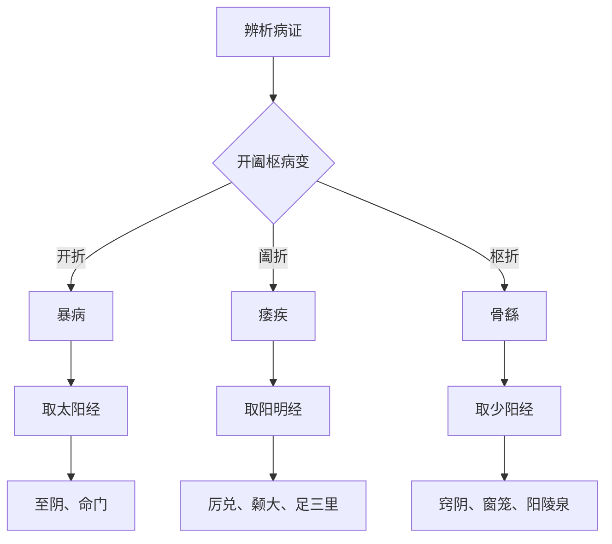

# 灵枢-根结第五

> "太阳根于至阴，结于命门。阳明根于厉兑，结于颡大。少阳根于窍阴，结于窗笼。" - 岐伯

---

## 📜 原文 / Original Text

岐伯曰：天地相感，寒暖相移，阴阳之道，孰少孰多？阴道偶，阳道奇。发于春夏，阴气少而阳气多；发于秋冬，阳气少而阴气多。发于春夏者，至其病时，阴气少而阳气多，阳为阴根；发于秋冬者，至其病时，阳气少而阴气多，阴为阳根。

黄帝曰：愿闻根结。岐伯曰：太阳根于至阴，结于命门。阳明根于厉兑，结于颡大。少阳根于窍阴，结于窗笼。太阴根于隐白，结于太仓。少阴根于涌泉，结于廉泉。厥阴根于大敦，结于玉英。此所谓十二经脉之根结也。

黄帝曰：愿闻三阴三阳之开阖枢。岐伯曰：太阳为开，阳明为阖，少阳为枢。太阴为开，厥阴为阖，少阴为枢。三阳者，主外而为开；三阴者，主内而为阖。开者，所以司外也；阖者，所以守内也；枢者，所以主出入也。

黄帝曰：愿闻其病。岐伯曰：开折则肉节渎而暴病起矣，故暴病者，取之太阳，视有余不足，读者皮肉宛焦而弱也。阖折则气无所止息而痿疾起矣，故痿疾者，取之阳明，视有余不足，无所止息者，气无所止息也。枢折即骨繇而不安于地，故骨繇者，取之少阳，视有余不足，骨繇者，节缓而不收也。

黄帝曰：三阴三阳之病，其气逆顺，其治奈何？岐伯曰：气之逆也，必先治其标；气之顺也，必先治其本。逆者正之，顺者从之。所谓顺者，气之来也；所谓逆者，气之去也。

黄帝曰：愿闻取穴之法。岐伯曰：取穴之法，必先明知根结所在，然后取之。根结者，经脉之气所起所止也。故治痿疾者，独取阳明。治暴病者，独取太阳。治骨繇者，独取少阳。此所谓根结之治也。

黄帝曰：善。愿闻其治。岐伯曰：治痿疾者，独取阳明，阳明者，五脏六腑之海，主润宗筋，宗筋主束骨而利机关也。治暴病者，独取太阳，太阳者，诸阳之属也，主一身之表，为开也，故暴病者取之。治骨繇者，独取少阳，少阳者，少阳之枢也，主骨节，故骨繇者取之。

---

## 📖 白话文翻译 / Modern Chinese Translation

岐伯说：天地之气互相感应，寒暖之气互相推移，阴阳之道中，哪个少哪个多呢？阴的道数是偶数，阳的道数是奇数。发病于春夏季节，阴气少而阳气多；发病于秋冬季节，阳气少而阴气多。发病于春夏的，到了发病的时候，阴气少而阳气多，阳气是阴气之根；发病于秋冬的，到了发病的时候，阳气少而阴气多，阴气是阳气之根。

黄帝说：希望听听根结的理论。岐伯说：足太阳经根于至阴穴，结于命门穴。足阳明经根于厉兑穴，结于颡大穴（头维穴）。足少阳经根于窍阴穴，结于窗笼穴（听宫穴）。足太阴经根于隐白穴，结于太仓穴（中脘穴）。足少阴经根于涌泉穴，结于廉泉穴。足厥阴经根于大敦穴，结于玉英穴（玉堂穴）。这就是所谓十二经脉的根结。

黄帝说：希望听听三阴三阳的开阖枢理论。岐伯说：太阳主开，阳明主阖，少阳主枢。太阴主开，厥阴主阖，少阴主枢。三阳经，主外部而主开；三阴经，主内部而主阖。开，是主管外部；阖，是守持内部；枢，是主管出入。

黄帝说：希望听听病变的情况。岐伯说：开的功能失常，则皮肉关节败坏而突然发病，所以突然发病的，取足太阳经治疗，观察是有余还是不足，所谓败坏，就是皮肉干枯而软弱。阖的功能失常，则气无处停留而痿病发作，所以痿病的，取足阳明经治疗，观察是有余还是不足，所谓无处停留，就是气无处停留。枢的功能失常，则骨节动摇而不能安稳着地，所以骨节动摇的，取足少阳经治疗，观察是有余还是不足，所谓骨节动摇，就是关节松缓而不能收摄。

黄帝说：三阴三经的病变，气机的逆顺，治疗的方法是怎样的呢？岐伯说：气机逆乱的，必须先治其标；气机顺和的，必须先治其本。逆乱的用正法治疗，顺和的用从法治疗。所谓顺，是指气的到来；所谓逆，是指气的离去。

黄帝说：希望听听取穴的方法。岐伯说：取穴的方法，必须先明白根结所在的部位，然后再取穴。根结，就是经脉之气起始和终止的部位。所以治疗痿病的，独取阳明经。治疗突然发病的，独取太阳经。治疗骨节动摇的，独取少阳经。这就是所谓根结的治疗方法。

黄帝说：好。希望听听治疗方法。岐伯说：治疗痿病的，独取阳明经，阳明经是五脏六腑之海，主管润泽宗筋，宗筋主管束骨而利机关。治疗突然发病的，独取太阳经，太阳经是诸阳经的归属，主管一身之表，主开，所以突然发病的取它。治疗骨节动摇的，独取少阳经，少阳经是少阳之枢，主管骨节，所以骨节动摇的取它。

---

## 🌐 英文释义 / English Translation

Qibo said: The qi of heaven and earth mutually affect each other, cold and warm qi mutually shift. In the way of yin and yang, which is less and which is more? The way of yin is even, the way of yang is odd. Diseases that occur in spring and summer have less yin qi and more yang qi; diseases that occur in autumn and winter have less yang qi and more yin qi. For diseases that occur in spring and summer, when the disease manifests, there is less yin qi and more yang qi, and yang qi is the root of yin qi. For diseases that occur in autumn and winter, when the disease manifests, there is less yang qi and more yin qi, and yin qi is the root of yang qi.

The Yellow Emperor said: I hope to hear about the theory of roots and knots. Qibo said: The Foot Taiyang meridian roots at Zhiyin (BL67) and knots at Mingmen (GV4). The Foot Yangming meridian roots at Lidui (ST45) and knots at Sangda (ST8, Touwei). The Foot Shaoyang meridian roots at Qiiaoyin (GB44) and knots at Chuanglong (SI19, Tinggong). The Foot Taiyin meridian roots at Yinbai (SP1) and knots at Taicang (CV12, Zhongwan). The Foot Shaoyin meridian roots at Yongquan (KI1) and knots at Lianquan (CV23). The Foot Jueyin meridian roots at Dadun (LR1) and knots at Yuying (CV18, Yutang). This is what is called the roots and knots of the twelve meridians.

The Yellow Emperor said: I hope to hear about the opening, closing, and pivoting of the three yin and three yang. Qibo said: Taiyang governs opening, Yangming governs closing, and Shaoyang governs pivoting. Taiyin governs opening, Jueyin governs closing, and Shaoyin governs pivoting. The three yang meridians govern the exterior and function as opening; the three yin meridians govern the interior and function as closing. Opening is responsible for the exterior; closing is responsible for the interior; pivoting is responsible for entry and exit.

The Yellow Emperor said: I hope to hear about the disease manifestations. Qibo said: When the function of opening fails, the flesh and joints become damaged and sudden diseases arise. Therefore, for sudden diseases, treat with the Foot Taiyang meridian, observing whether there is excess or deficiency. What is called "damaged" means the flesh and skin are withered and weak. When the function of closing fails, qi has nowhere to rest and flaccidity diseases arise. Therefore, for flaccidity diseases, treat with the Foot Yangming meridian, observing whether there is excess or deficiency. What is called "nowhere to rest" means qi has nowhere to stay. When the function of pivoting fails, the bones and joints become unstable and cannot stand firmly on the ground. Therefore, for unstable bones and joints, treat with the Foot Shaoyang meridian, observing whether there is excess or deficiency. What is called "unstable bones and joints" means the joints are loose and cannot be controlled.

The Yellow Emperor said: For diseases of the three yin and three yang, regarding the reverse and flow of qi mechanism, what is the treatment method? Qibo said: When the qi mechanism is chaotic, one must first treat the branch; when the qi mechanism is harmonious, one must first treat the root. For chaos, use the straightening method; for harmony, use the following method. What is called "flow" refers to the arrival of qi; what is called "reverse" refers to the departure of qi.

The Yellow Emperor said: I hope to hear about the method of selecting acupoints. Qibo said: The method of selecting acupoints requires first knowing where the roots and knots are located, and then selecting the points. Roots and knots are where the qi of the meridians originates and ends. Therefore, for treating flaccidity diseases, select the Yangming meridian alone. For treating sudden diseases, select the Taiyang meridian alone. For treating unstable bones and joints, select the Shaoyang meridian alone. This is what is called the treatment method of roots and knots.

The Yellow Emperor said: Good. I hope to hear about the treatment methods. Qibo said: For treating flaccidity diseases, select the Yangming meridian alone. The Yangming meridian is the sea of the five zang and six fu organs, it governs nourishing the zong jin, and the zong jin governs binding the bones and facilitating the joints. For treating sudden diseases, select the Taiyang meridian alone. The Taiyang meridian is the归属 of all yang meridians, it governs the exterior of the entire body and functions as opening, so sudden diseases are treated by selecting it. For treating unstable bones and joints, select the Shaoyang meridian alone. The Shaoyang meridian is the pivot of Shaoyang, it governs the bones and joints, so unstable bones and joints are treated by selecting it.

---

## 🔑 核心要点 / Core Concepts

### 1. 三阳根结 / Roots and Knots of Three Yang

| 经脉 | 根穴 | 结穴 | 位置 |
|------|------|------|------|
| **太阳** | 至阴 | 命门 | 足小趾端、腰部 |
| **阳明** | 厉兑 | 颡大 | 足次趾端、额部 |
| **少阳** | 窍阴 | 窗笼 | 足四趾端、耳部 |

### 2. 三阴根结 / Roots and Knots of Three Yin

| 经脉 | 根穴 | 结穴 | 位置 |
|------|------|------|------|
| **太阴** | 隐白 | 太仓 | 足大趾端、上腹部 |
| **少阴** | 涌泉 | 廉泉 | 足心、颈部 |
| **厥阴** | 大敦 | 玉英 | 足大趾端、胸部 |

### 3. 三阳开阖枢 / Opening, Closing, Pivoting of Three Yang

| 经脉 | 功能 | 作用 | 病变表现 |
|------|------|------|---------|
| **太阳** | 开 | 司外、主一身之表 | 肉节渎、暴病 |
| **阳明** | 阖 | 守内、气所止息 | 痿疾 |
| **少阳** | 枢 | 主出入、主骨节 | 骨繇不安 |

### 4. 三阴开阖枢 / Opening, Closing, Pivoting of Three Yin

| 经脉 | 功能 | 作用 |
|------|------|------|
| **太阴** | 开 | 主内之开 |
| **厥阴** | 阖 | 主内之阖 |
| **少阴** | 枢 | 主内之枢 |

### 5. 四季阴阳盛衰 / Yin-Yang Abundance in Four Seasons

| 季节 | 发病特点 | 阴阳关系 | 根的关系 |
|------|---------|---------|---------|
| **春夏** | 阴气少而阳气多 | 阳为阴根 | 阳气是阴气之根 |
| **秋冬** | 阳气少而阴气多 | 阴为阳根 | 阴气是阳气之根 |

### 6. 根结病变治疗 / Treatment of Root-Knot Diseases

| 病变 | 主治经脉 | 治疗方法 | 穴位选择 |
|------|---------|---------|---------|
| **暴病** | 太阳 | 独取太阳 | 至阴、命门 |
| **痿疾** | 阳明 | 独取阳明 | 厉兑、颡大 |
| **骨繇** | 少阳 | 独取少阳 | 窍阴、窗笼 |

---

## 📚 理论解释 / Theoretical Analysis

### 根结理论的核心 / Core of Root-Knot Theory

> [!info] 理论核心
> 根结理论是经络学说的重要组成部分，阐述了经脉的起止部位和功能特点。

#### 1. 根结的概念 / Concept of Root and Knot

**根（Root）：**
- 经脉之气起始的部位
- 多位于四肢末端
- 是经气生发之源

**结（Knot）：**
- 经脉之气终止的部位
- 多位于头面胸腹
- 是经气汇聚之处

#### 2. 三阳开阖枢 / Opening, Closing, Pivoting of Three Yang

**太阳为开（Taiyang as Opening）：**
- 主司外
- 主一身之表
- 为诸阳之属

**阳明为阖（Yangming as Closing）：**
- 主守内
- 气所止息
- 五脏六腑之海

**少阳为枢（Shaoyang as Pivoting）：**
- 主出入
- 主骨节
- 少阳之枢

#### 3. 三阴开阖枢 / Opening, Closing, Pivoting of Three Yin

**太阴为开（Taiyin as Opening）：**
- 主内之开
- 脾为后天之本

**厥阴为阖（Jueyin as Closing）：**
- 主内之阖
- 肝为将军之官

**少阴为枢（Shaoyin as Pivoting）：**
- 主内之枢
- 心肾水火既济

#### 4. 四季阴阳 / Yin and Yang in Four Seasons

**春夏之病（Diseases in Spring and Summer）：**
- 阴气少，阳气多
- 阳为阴根
- 治宜养阴

**秋冬之病（Diseases in Autumn and Winter）：**
- 阳气少，阴气多
- 阴为阳根
- 治宜养阳

---

## 🏥 中医实践应用 / TCM Practice Application

### 临床应用指南 / Clinical Application Guide

> [!tip] 实践建议
> 将根结理论应用于临床针灸治疗。

#### 1. 根结穴的临床应用 / Clinical Application of Root-Knot Points

**太阳根结穴 / Taiyang Root-Knot Points:**

| 穴位 | 位置 | 功效 | 主治 |
|------|------|------|------|
| 至阴 | 足小趾外侧 | 通阳利水 | 头痛、胎位不正 |
| 命门 | 腰部 | 温肾壮阳 | 腰痛、遗精 |

**阳明根结穴 / Yangming Root-Knot Points:**

| 穴位 | 位置 | 功效 | 主治 |
|------|------|------|------|
| 厉兑 | 足次趾端 | 清热和胃 | 胃痛、鼻衄 |
| 颡大（头维） | 额角 | 清头明目 | 头痛、目眩 |

**少阳根结穴 / Shaoyang Root-Knot Points:**

| 穴位 | 位置 | 功效 | 主治 |
|------|------|------|------|
| 窍阴 | 足四趾端 | 清热开窍 | 偏头痛、目赤 |
| 窗笼（听宫） | 耳部 | 聪耳开窍 | 耳鸣、耳聋 |

#### 2. 开阖枢病变治疗 / Treatment of Opening-Closing-Pivoting Diseases

**开折（Opening Failure）- 暴病：**

| 症状 | 选穴 | 方法 |
|------|------|------|
| 肉节渎、暴病 | 至阴、命门 | 针灸并用 |

**阖折（Closing Failure）- 痿疾：**

| 症状 | 选穴 | 方法 |
|------|------|------|
| 痿疾、无力 | 厉兑、颡大、足三里 | 针灸并用 |

**枢折（Pivoting Failure）- 骨繇：**

| 症状 | 选穴 | 方法 |
|------|------|------|
| 骨繇不安 | 窍阴、窗笼、阳陵泉 | 针灸并用 |

#### 3. 独取阳明的临床应用 / Clinical Application of "Treating Yangming Alone"

**痿证治疗 / Treatment of Flaccidity：**

| 类型 | 症状 | 取穴 | 方法 |
|------|------|------|------|
| 肺痿 | 咳喘、乏力 | 足三里、中脘 | 针灸 |
| 心痿 | 心悸、失眠 | 足三里、内关 | 针灸 |
| 肝痿 | 筋痿、拘急 | 足三里、太冲 | 针灸 |
| 脾痿 | 肌痿、无力 | 足三里、三阴交 | 针灸 |
| 肾痿 | 骨痿、骨软 | 足三里、太溪 | 针灸 |

#### 4. 临床辨证流程 / Clinical Differentiation Process

#### 5. 临床注意事项 / Clinical Precautions

| 注意事项 | 说明 | 后果 |
|---------|------|------|
| **明根结** | 必须先明根结所在 | 取穴准确 |
| **分开阖枢** | 区分开阖枢功能 | 治法恰当 |
| **辨虚实** | 观察有余不足 | 补泻得当 |
| **因时制宜** | 根据季节治疗 | 效果更好 |

---

## 🔗 相关链接 / Related Links

### 内部链接 / Internal Links

- [[MOC-黄帝内经知识库]] - 黄帝内经主索引
- [[黄帝内经-灵枢索引]] - 灵枢篇章索引
- [[黄帝内经-核心理论]] - 核心理论体系
- [[灵枢-邪气脏腑病形第四]] - 上一篇：邪气脏腑病形

### 外部链接 / External Links

- [中国哲学书电子化计划 - 灵枢根结](https://ctext.org/wiki.pl?if=gb&remap=gb&chapter=351843)

---

## 💡 学习要点 / Learning Points

### 掌握重点 / Key Points to Master

> [!important] 必须掌握
> 以下内容是理解本篇的核心要点。

- [ ] **掌握三阳三阴的根结部位**
- [ ] **理解开阖枢的功能特点**
- [ ] **理解四季阴阳盛衰规律**
- [ ] **掌握根结病变的治疗方法**
- [ ] **学会在临床中应用根结理论**

### 思考问题 / Questions for Reflection

1. **什么是根和结？**
   - 根是经脉之气起始的部位
   - 结是经脉之气终止的部位
   - 根结理论是经络学说的重要组成部分

2. **三阳开阖枢的功能是什么？**
   - 太阳为开：司外，主一身之表
   - 阳明为阖：守内，气所止息
   - 少阳为枢：主出入，主骨节

3. **为什么治疗痿疾要独取阳明？**
   - 阳明是五脏六腑之海
   - 阳明主润宗筋
   - 宗筋主束骨而利机关

---

## 📊 学习进度 / Learning Progress

### 完成情况 / Completion Status

| 学习内容 | 状态 | 备注 |
|---------|------|------|
| 原文诵读 | 📝 进行中 | 建议每日诵读 |
| 白话文理解 | ✅ 已完成 | 理解主要含义 |
| 英文术语 | ✅ 已完成 | 掌握关键术语 |
| 核心要点 | ✅ 已完成 | 理解根结理论 |
| 理论分析 | ✅ 已完成 | 理解开阖枢理论 |
| 实践应用 | 📝 进行中 | 需要临床实践 |

---

## 🔄 更新日志 / Update Log

### 2026-02-07

- ✅ 创建根结第五篇笔记
- ✅ 完成原文、白话文翻译、英文释义
- ✅ 整理三阳三阴根结要点
- ✅ 编写开阖枢理论分析
- ✅ 添加临床应用指南

---

**笔记创建日期**：2026年2月7日

**最后更新**：2026年2月7日

**建议下次复习**：2026年2月14日
