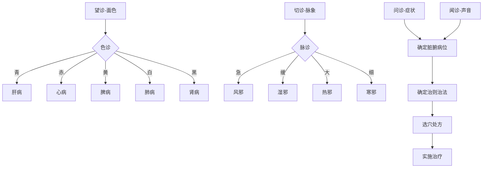

# 灵枢-邪气脏腑病形第四

> "邪之中人也，无常也。" - 岐伯

---

## 📜 原文（节选）/ Original Text (Excerpt)

黄帝问于岐伯曰：邪气之中人也奈何？岐伯答曰：邪气之中人也高也。

黄帝曰：高下有度乎？岐伯曰：身半已上者，邪中之也高；身半已下者，邪中之也下。故曰：高者邪之中也高，下者邪之中也下。

黄帝曰：高下有内外乎？岐伯曰：身半已上者，其邪中之也高；身半已下者，其邪中之也下。故高者邪之中于上也，下者邪之中于下也。

黄帝曰：其于人也，奈何？岐伯曰：风之中人也，无定处也。

黄帝曰：愿闻其详。岐伯曰：风气之中人也，或中于面，或中于项，或中于肩背，或中于手臂，或中于胫足，其邪气所中，无常处也。

黄帝曰：善。愿闻其病。岐伯曰：邪之中人，五脏之病也。

黄帝曰：五脏之中，何脏为病？岐伯曰：五脏之中，五脏皆为病也。

黄帝曰：五脏之中，何脏独先受邪？岐伯曰：五脏之中，心肺独先受邪也。

黄帝曰：何也？岐伯曰：心肺者，居膈上，阳中之阳也。心者，五脏六腑之大主也，精神之所舍也。其脏坚固，邪弗能留也。留之则伤，心伤则神去，神去则死矣。

肺者，五脏六腑之盖也，肺者，心之盖也。心者，君主之官，神明出焉。肺者，相傅之官，治节出焉。肺者，五脏之长也，心之盖也。

故曰：邪之中人也，无常也。或中于阳，或中于阴。中于阳则溜于经，中于阴则溜于腑。

黄帝曰：病之在脏奈何？岐伯曰：病之在脏，其状奈何？肺之病，喘咳上气。心之病，嗌干心痛。肝之病，胁下痛引少腹，善怒。脾之病，腹胀善呕。肾之病，腰脊痛，不能久立。

黄帝曰：其病之状何如？岐伯曰：病之在脏，其状奈何？

黄帝曰：请言其诊。岐伯曰：五脏六腑之病，各有所候。色青者，肝病也。色赤者，心病也。色黄者，脾病也。色白者，肺病也。色黑者，肾病也。

黄帝曰：其脉何如？岐伯曰：脉急者，风也。脉缓者，湿也。脉大者，热也。脉细者，寒也。

黄帝曰：六腑之病何如？岐伯曰：六腑之病，亦各有候。胃病者，腹胀不欲食。胆病者，口苦、善太息。小肠病者，心下痛、腹鸣。大肠病者，肠鸣、泄泻。膀胱病者，小便不利。三焦病者，腹气满，小腹坚。

---

## 📖 白话文翻译（节选）/ Modern Chinese Translation (Excerpt)

黄帝向岐伯问道：邪气伤人的情况是怎样的呢？岐伯回答说：邪气伤人的部位是高的。

黄帝问：高低有一定的标准吗？岐伯说：上半身受到邪气侵袭，部位就高；下半身受到邪气侵袭，部位就低。所以说：高的部位受邪气侵袭就高，低的部位受邪气侵袭就低。

黄帝问：高下还有内外之分吗？岐伯说：上半身受邪气侵袭，部位就高；下半身受邪气侵袭，部位就低。所以说高的部位邪气侵袭在上，低的部位邪气侵袭在下。

黄帝问：邪气伤人，具体情况是怎样的呢？岐伯说：风邪伤人，没有固定的部位。

黄帝说：希望听您详细说明。岐伯说：风邪伤人，有时侵袭面部，有时侵袭颈部，有时侵袭肩背，有时侵袭手臂，有时侵袭小腿和足部，风邪侵袭的部位，没有固定之处。

黄帝说：好。希望听听各种病的情况。岐伯说：邪气伤人，引起五脏的病变。

黄帝问：五脏受邪，哪个脏腑发病呢？岐伯说：五脏受邪，五脏都可能发病。

黄帝问：五脏受邪，哪个脏腑最先受邪呢？岐伯说：五脏受邪，心肺最先受邪。

黄帝问：为什么呢？岐伯说：心肺位于膈肌之上，是阳中之阳。心是五脏六腑的主宰，是精神所舍之处。心脏坚固，邪气不能停留。如果邪气停留就会损伤心脏，心伤则神气离去，神气离去就会死亡。

肺是五脏六腑的华盖，肺是心的华盖。心是君主之官，神明由此而出。肺是相傅之官，治理节律由此而出。肺是五脏之长，是心的华盖。

所以说：邪气伤人，没有固定之处。有时伤及阳经，有时伤及阴经。伤及阳经则流注于经脉，伤及阴经则流注于脏腑。

黄帝问：病在脏的情况是怎样的呢？岐伯说：病在脏，其症状是怎样的呢？肺的病变，表现为气喘、咳嗽、气逆。心的病变，表现为咽喉干燥、心痛。肝的病变，表现为胁下疼痛牵引少腹，容易发怒。脾的病变，表现为腹胀、经常呕吐。肾的病变，表现为腰脊疼痛，不能久立。

黄帝问：病的症状是怎样的呢？岐伯说：病在脏，症状是怎样的呢？

黄帝说：请讲讲诊断方法。岐伯说：五脏六腑的病变，各有相应的征候。面色发青，是肝病。面色发红，是心病。面色发黄，是脾病。面色发白，是肺病。面色发黑，是肾病。

黄帝问：脉象是怎样的呢？岐伯说：脉象急促，是风邪。脉象缓慢，是湿邪。脉象大而有力，是热邪。脉象细小，是寒邪。

黄帝问：六腑的病变是怎样的呢？岐伯说：六腑的病变，也各有相应的征候。胃病，表现为腹胀、不想进食。胆病，表现为口苦、经常叹气。小肠病，表现为心下疼痛、腹中肠鸣。大肠病，表现为肠鸣、泄泻。膀胱病，表现为小便不利。三焦病，表现为腹部胀满、小腹部坚硬。

---

## 🌐 英文释义（节选）/ English Translation (Excerpt)

The Yellow Emperor asked Qibo: How do pathogenic factors attack humans? Qibo replied: The location where pathogenic factors attack humans is high.

The Yellow Emperor asked: Is there a standard for high and low? Qibo said: When the upper half of the body is attacked by pathogenic factors, the location is high; when the lower half is attacked, the location is low. Therefore it is said: when the location is high, pathogenic factors attack the upper part; when the location is low, pathogenic factors attack the lower part.

The Yellow Emperor asked: Is there a distinction between internal and external for high and low? Qibo said: When the upper half is attacked by pathogenic factors, the location is high; when the lower half is attacked, the location is low. Therefore, when the location is high, pathogenic factors attack above; when the location is low, pathogenic factors attack below.

The Yellow Emperor asked: What is the specific situation when pathogenic factors attack humans? Qibo said: Wind pathogen attacking humans has no fixed location.

The Yellow Emperor said: I hope to hear your detailed explanation. Qibo said: Wind pathogen attacking humans sometimes attacks the face, sometimes the neck, sometimes the shoulder and back, sometimes the arms, sometimes the shanks and feet. The location attacked by wind pathogen has no fixed place.

The Yellow Emperor said: Good. I hope to hear about the various diseases. Qibo said: Pathogenic factors attacking humans cause diseases of the five zang organs.

The Yellow Emperor asked: When the five zang organs are attacked, which organ gets sick? Qibo said: When the five zang organs are attacked, all five zang organs can get sick.

The Yellow Emperor asked: When the five zang organs are attacked, which organ is attacked first? Qibo said: When the five zang organs are attacked, the heart and lung are attacked first.

The Yellow Emperor asked: Why? Qibo said: The heart and lung are located above the diaphragm, they are yang within yang. The heart is the great master of the five zang and six fu organs, it is where the spirit resides. The organ is solid, and pathogenic factors cannot stay there. If they stay, it damages the heart. When the heart is damaged, the spirit leaves, and when the spirit leaves, death occurs.

The lung is the canopy of the five zang and six fu organs, the lung is the canopy of the heart. The heart is the official of the monarch, from which spiritual clarity emerges. The lung is the official of the prime minister, from which governance and regulation emerge. The lung is the leader of the five zang organs, it is the canopy of the heart.

Therefore it is said: Pathogenic factors attacking humans have no fixed place. Sometimes they attack yang meridians, sometimes yin meridians. When attacking yang meridians, they flow into the meridians; when attacking yin meridians, they flow into the fu organs.

The Yellow Emperor asked: What is the situation when disease is in the zang organs? Qibo said: When disease is in the zang organs, what are the symptoms? For lung disease, it manifests as panting, coughing, and adverse qi rising. For heart disease, it manifests as dry throat and heart pain. For liver disease, it manifests as pain in the flank region radiating to the lower abdomen, and a tendency to get angry. For spleen disease, it manifests as abdominal distention and frequent vomiting. For kidney disease, it manifests as pain in the waist and spine, and inability to stand for long.

The Yellow Emperor asked: What are the symptoms of the disease? Qibo said: When disease is in the zang organs, what are the symptoms?

The Yellow Emperor said: Please tell me about the diagnostic methods. Qibo said: Diseases of the five zang and six fu organs each have their corresponding manifestations. A greenish complexion indicates liver disease. A reddish complexion indicates heart disease. A yellowish complexion indicates spleen disease. A whitish complexion indicates lung disease. A blackish complexion indicates kidney disease.

The Yellow Emperor asked: What about the pulse? Qibo said: A rapid pulse indicates wind pathogen. A slow pulse indicates dampness pathogen. A large pulse indicates heat pathogen. A fine pulse indicates cold pathogen.

The Yellow Emperor asked: What are the diseases of the six fu organs? Qibo said: Diseases of the six fu organs also each have their corresponding manifestations. For stomach disease, it manifests as abdominal distention and lack of appetite. For gallbladder disease, it manifests as bitter taste in the mouth and frequent sighing. For small intestine disease, it manifests as pain below the heart and abdominal rumbling. For large intestine disease, it manifests as abdominal rumbling and diarrhea. For bladder disease, it manifests as difficulty urinating. For triple burner disease, it manifests as abdominal distention and hardness in the lower abdomen.

---

## 🔑 核心要点 / Core Concepts

### 1. 邪气伤人的高度 / Height of Pathogenic Factor Attack

| 部位 | 邪气侵袭 | 特点 |
|------|---------|------|
| **身半以上** | 邪中之高 | 上半身受邪 |
| **身半以下** | 邪之中下 | 下半身受邪 |

### 2. 风邪的特性 / Characteristics of Wind Pathogen

| 特性 | 表现 | 影响 |
|------|------|------|
| **无常处** | 没有固定部位 | 可伤全身 |
| **中于面** | 面部受邪 | 头面症状 |
| **中于项** | 颈部受邪 | 颈项症状 |
| **中于肩背** | 肩背受邪 | 肩背症状 |
| **中于手臂** | 手臂受邪 | 上肢症状 |
| **中于胫足** | 胫足受邪 | 下肢症状 |

### 3. 五脏先受邪 / Which Zang Organs Are Attacked First

| 脏腑 | 先受邪原因 | 位置 |
|------|-----------|------|
| **心** | 五脏六腑之大主，阳中之阳 | 膈上 |
| **肺** | 五脏六腑之盖，心之盖 | 膈上 |

### 4. 五脏病形 / Disease Patterns of Five Zang

| 脏腑 | 主要症状 | 病机 |
|------|---------|------|
| **肺** | 喘咳上气 | 肺失宣降 |
| **心** | 嗌干心痛 | 心火上炎 |
| **肝** | 胁下痛引少腹，善怒 | 肝气郁结 |
| **脾** | 腹胀善呕 | 脾失健运 |
| **肾** | 腰脊痛，不能久立 | 肾精亏虚 |

### 5. 六腑病形 / Disease Patterns of Six Fu

| 脏腑 | 主要症状 | 病机 |
|------|---------|------|
| **胃** | 腹胀不欲食 | 胃失和降 |
| **胆** | 口苦、善太息 | 胆火上炎 |
| **小肠** | 心下痛、腹鸣 | 小肠气滞 |
| **大肠** | 肠鸣、泄泻 | 大肠湿热 |
| **膀胱** | 小便不利 | 膀胱气化不利 |
| **三焦** | 腹气满，小腹坚 | 三焦气滞 |

### 6. 色诊 / Color Diagnosis

| 颜色 | 脏腑 | 病机 |
|------|------|------|
| **青** | 肝病 | 肝气郁结或肝火上炎 |
| **赤** | 心病 | 心火上炎或心血不足 |
| **黄** | 脾病 | 脾虚湿盛或湿热困脾 |
| **白** | 肺病 | 肺气虚或肺阴虚 |
| **黑** | 肾病 | 肾阳虚或肾阴虚 |

### 7. 脉诊 / Pulse Diagnosis

| 脉象 | 病邪 | 特点 |
|------|------|------|
| **急** | 风 | 来去急促 |
| **缓** | 湿 | 来去缓慢 |
| **大** | 热 | 大而有力 |
| **细** | 寒 | 细小无力 |

---

## 📚 理论解释 / Theoretical Analysis

### 邪气脏腑病形理论 / Theory of Pathogenic Factors and Organ Pathology

> [!info] 理论核心
> 本篇论述了邪气伤人的规律、五脏六腑的病变形态以及四诊方法。

#### 1. 邪气伤人的规律 / Laws of Pathogenic Factor Attack

**高度规律 / Height Rules:**
- 身半以上：邪气从上侵袭
- 身半以下：邪气从下侵袭

**性质规律 / Nature Rules:**
- 中于阳：溜于经
- 中于阴：溜于腑

#### 2. 心肺先受邪的原因 / Why Heart and Lung Are Attacked First

**心（Heart）：**
- 五脏六腑之大主
- 阳中之阳
- 精神之所舍
- 居膈上，先受邪

**肺（Lung）：**
- 五脏六腑之盖
- 心之盖
- 相傅之官
- 居膈上，先受邪

#### 3. 五脏病机 / Pathogenesis of Five Zang

| 脏腑 | 病机 | 表现 |
|------|------|------|
| **肺** | 肺失宣降 | 喘咳上气 |
| **心** | 心火上炎/心血不足 | 嗌干心痛 |
| **肝** | 肝气郁结 | 胁痛引少腹，善怒 |
| **脾** | 脾失健运 | 腹胀善呕 |
| **肾** | 肾精亏虚 | 腰脊痛，不能久立 |

#### 4. 四诊方法 / Four Diagnostic Methods

**望诊 / Observation：**
- 色诊：青-肝、赤-心、黄-脾、白-肺、黑-肾

**闻诊 / Listening：**
- 听声音、嗅气味

**问诊 / Inquiry：**
- 询问症状、病史

**切诊 / Palpation：**
- 脉诊：急-风、缓-湿、大-热、细-寒

---

## 🏥 中医实践应用 / TCM Practice Application

### 临床诊疗指南 / Clinical Diagnosis and Treatment Guide

> [!tip] 实践建议
> 将邪气脏腑病形理论应用于临床诊断和治疗。

#### 1. 五脏病证诊断 / Diagnosis of Five Zang Diseases

**肝病诊断 / Liver Disease Diagnosis:**

| 症状 | 舌象 | 脉象 | 治则 |
|------|------|------|------|
| 青色、胁痛、善怒 | 舌边红，苔薄黄 | 弦 | 疏肝理气 |

**心病诊断 / Heart Disease Diagnosis:**

| 症状 | 舌象 | 脉象 | 治则 |
|------|------|------|------|
| 赤色、嗌干、心痛 | 舌尖红，少苔 | 数 | 清心泻火/养心安神 |

**肺病诊断 / Lung Disease Diagnosis:**

| 症状 | 舌象 | 脉象 | 治则 |
|------|------|------|------|
| 白色、喘咳、气逆 | 舌淡，苔白 | 浮/细 | 宣肺止咳/补肺益气 |

**脾病诊断 / Spleen Disease Diagnosis:**

| 症状 | 舌象 | 脉象 | 治则 |
|------|------|------|------|
| 黄色、腹胀、善呕 | 舌淡，苔白腻 | 缓 | 健脾益气/健脾化湿 |

**肾病诊断 / Kidney Disease Diagnosis:**

| 症状 | 舌象 | 脉象 | 治则 |
|------|------|------|------|
| 黑色、腰痛、不能久立 | 舌淡，苔白 | 沉 | 补肾固精/温补肾阳 |

#### 2. 六腑病证诊断 / Diagnosis of Six Fu Diseases

| 脏腑 | 主要症状 | 舌象 | 脉象 | 治则 |
|------|---------|------|------|------|
| **胃** | 腹胀、不欲食 | 舌淡，苔白腻 | 缓 | 和胃降逆 |
| **胆** | 口苦、善太息 | 舌边红，苔黄 | 弦 | 清利湿热 |
| **小肠** | 心下痛、腹鸣 | 舌红，苔黄 | 数 | 清热通腑 |
| **大肠** | 肠鸣、泄泻 | 舌红，苔黄腻 | 滑 | 清热利湿 |
| **膀胱** | 小便不利 | 舌红，苔黄 | 滑 | 利尿通淋 |
| **三焦** | 腹满、小腹坚 | 舌淡，苔白 | 滑 | 通利三焦 |

#### 3. 风邪治疗 / Treatment of Wind Pathogen

**风邪侵袭部位与治疗 / Wind Pathogen Attack Locations and Treatment:**

| 侵袭部位 | 症状 | 取穴 | 方法 |
|---------|------|------|------|
| **面** | 口眼歪斜 | 地仓、颊车、合谷 | 针灸并用 |
| **项** | 颈项强痛 | 风池、大椎、列缺 | 针灸 |
| **肩背** | 肩背痛 | 肩髃、曲池、合谷 | 针灸 |
| **手臂** | 上肢麻木 | 曲池、外关、合谷 | 针灸 |
| **胫足** | 下肢疼痛 | 足三里、阳陵泉、悬钟 | 针灸 |

#### 4. 临床辨证流程 / Clinical Differentiation Process

#### 5. 临床注意事项 / Clinical Precautions

| 注意事项 | 说明 | 后果 |
|---------|------|------|
| **四诊合参** | 望闻问切综合判断 | 辨证准确 |
| **分清病位** | 确定病变脏腑经络 | 治疗有的放矢 |
| **辨别病性** | 区分寒热虚实 | 治法恰当 |
| **注意病势** | 了解疾病发展趋势 | 预后判断准确 |

---

## 🔗 相关链接 / Related Links

### 内部链接 / Internal Links

- [[MOC-黄帝内经知识库]] - 黄帝内经主索引
- [[黄帝内经-灵枢索引]] - 灵枢篇章索引
- [[黄帝内经-核心理论]] - 核心理论体系
- [[灵枢-小针解第三]] - 上一篇：小针解

### 外部链接 / External Links

- [中国哲学书电子化计划 - 灵枢邪气脏腑病形](https://ctext.org/wiki.pl?if=gb&remap=gb&chapter=351843)
- [中医世家 - 灵枢邪气脏腑病形](http://www.zysj.com.cn/lilunshu/lingshu/s4.html)

---

## 💡 学习要点 / Learning Points

### 掌握重点 / Key Points to Master

> [!important] 必须掌握
> 以下内容是理解本篇的核心要点。

- [ ] **理解邪气伤人的高度规律**
- [ ] **掌握风邪无常处的特性**
- [ ] **理解心肺先受邪的原因**
- [ ] **掌握五脏病形的症状特点**
- [ ] **掌握六腑病形的症状特点**
- [ ] **学会色诊和脉诊的基本方法**

### 思考问题 / Questions for Reflection

1. **为什么心肺最先受邪？**
   - 心肺位于膈上，阳中之阳
   - 风邪从上侵袭，先伤心肺
   - 心肺是五脏六腑的重要器官

2. **色诊中五行与颜色的对应关系是什么？**
   - 青-木-肝
   - 赤-火-心
   - 黄-土-脾
   - 白-金-肺
   - 黑-水-肾

3. **如何在临床中四诊合参？**
   - 望诊观察面色、舌象
   - 闻诊听声音、嗅气味
   - 问诊了解症状、病史
   - 切诊诊脉、按腹部

---

## 📊 学习进度 / Learning Progress

### 完成情况 / Completion Status

| 学习内容 | 状态 | 备注 |
|---------|------|------|
| 原文诵读 | 📝 进行中 | 建议每日诵读 |
| 白话文理解 | ✅ 已完成 | 理解主要含义 |
| 英文术语 | ✅ 已完成 | 掌握关键术语 |
| 核心要点 | ✅ 已完成 | 理解邪气病形 |
| 理论分析 | ✅ 已完成 | 理解病因病机 |
| 实践应用 | 📝 进行中 | 需要临床实践 |

---

## 🔄 更新日志 / Update Log

### 2026-02-07

- ✅ 创建邪气脏腑病形第四篇笔记
- ✅ 完成原文、白话文翻译（节选）、英文释义
- ✅ 整理邪气伤人规律和脏腑病形要点
- ✅ 编写病因病机理论分析
- ✅ 添加临床诊疗应用指南

---

**笔记创建日期**：2026年2月7日

**最后更新**：2026年2月7日

**建议下次复习**：2026年2月14日
