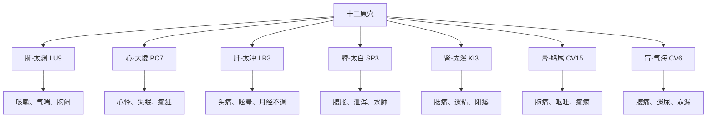

# 灵枢-九针十二原第一

> "小针之要，易陈而难入。粗守形，上守神。神乎神，客在门。" - 岐伯

---

## 📜 原文（节选）/ Original Text (Excerpt)

黄帝问于岐伯曰：余子万民，养百姓而收其租税；余哀其不给而属有疾病。余欲勿使被毒药，无用砭石，欲以微针通其经脉，调其血气，荣其逆顺出入之会。令可传于后世，必明为之法，令终而不灭，久而不绝，易用难忘，为之经纪，异其章，别其表里，为之终始。令各有形，先立针经。愿闻其情。

岐伯答曰：臣请推而次之，令有纲纪，始于一，终于九焉。请言其道！小针之要，易陈而难入。粗守形，上守神。神乎神，客在门。未睹其疾，恶知其原？刺之微，在速迟。粗守关，上守机，机之动，不离其空。空中之机，清静而微。其来不可逢，其往不可追。知机之道者，不可挂以发。不知机道，扣之不发。知其往来，要与之期。粗之闇乎，妙哉，工独有之。往者为逆，来者为顺，明知逆顺，正行无间。迎而夺之，恶得无虚？追而济之，恶得无实？迎之随之，以意和之，针道毕矣。

凡用针者，虚则实之，满则泄之，宛陈则除之，邪胜则虚之。《大要》曰：徐而疾则实，疾而徐则虚。言实与虚，若有若无。察后与先。若存若亡。为虚与实，若得若失。

　　黄帝问于岐伯曰：余子万民，养百姓而收其租税；余哀其不给而属有疾病。余欲勿使被毒药，无用砭石，欲以微针通其经脉，调其血气，荣其逆顺出入之会。令可传于后世，必明为之法，令终而不灭，久而不绝，易用难忘，为之经纪，异其章，别其表里，为之终始。令各有形，先立针经。愿闻其情。

　　歧伯答曰：臣请推而次之，令有纲纪，始于一，终于九焉。请言其道！小针之要，易陈而难入。粗守形，上守神。神乎神，客在门。未睹其疾，恶知其原？刺之微，在速迟。粗守关，上守机，机之动，不离其空。空中之机，清静而微。其来不可逢，其往不可追。知机之道者，不可挂以发。不知机道，扣之不发。知其往来，要与之期。粗之闇乎，妙哉，工独有之。往者为逆，来者为顺，明知逆顺，正行无间。迎而夺之，恶得无虚？追而济之，恶得无实？迎之随之，以意和之，针道毕矣。

　　凡用针者，虚则实之，满则泄之，宛陈则除之，邪胜则虚之。大要曰：徐而疾则实，疾而徐则虚。言实与虚，若有若无。察后与先。若存若亡。为虚与实，若得若失。

　　虚实之要，九针最妙，补泻之时，以针为之。泻曰，必持内之，放而出之，排阳得针，邪气得泄。按而引针，是谓内温，血不得散，气不得出也。补曰，随之随之，意若妄之。若行若按，如蚊虻止，如留如还，去如弦绝，令左属右，其气故止，外门已闭，中气乃实，必无留血，急取诛之。

　　持针之道，坚者为宝。正指直刺，无针左右。神在秋毫，属意病者。审视血脉者，刺之无殆。方刺之时，必在悬阳，及与两卫。神属勿去，知病存亡。血脉者在俞横居，视之独澄，切之独坚。

　　九针之名，各不同形。一曰镵针，长一寸六分；二曰员针，长一寸六分；三曰鍉针，长三寸半；四曰锋针，长一寸六分；五曰铍针，长四寸，广二分半；六曰员利针，长一寸六分；七曰毫针，长三寸六分；八曰长针，长七寸；九曰大针，长四寸。镵针者，头大末锐，去泻阳气；员针者，针如卵形，揩摩分间，不得伤肌肉者，以泻分气；鍉针者，锋如黍粟之锐，主按脉，勿陷以致其气；锋针者，刃三隅以发痼疾，铍针者，末如剑锋，以取大脓；员利针者，大如厘，且员且锐，中身微大，以取暴气；毫针者，尖如蚊虻喙，静以徐往，微以久留之而养，以取痛痹；长针者，锋利身薄，可以取远痹；大针者，尖如梃，其锋微员，以泻机关之水也。九针毕矣。夫气之在脉也，邪气在上，浊气在中，清气在下。故针陷脉则邪气出，针中脉则浊气出，针太深则邪气反沉、病益。故曰：皮肉筋脉，各有所处。病各有所宜。各不同形，各以任其所宜，无实无虚。损不足而益有余，是谓甚病。病益甚，取五脉者死，取三脉者恇；夺阴者死，夺阳者狂，针害毕矣。

　　刺之而气不至，无问其数。刺之而气至，乃去之，勿复针。针各有所宜，各不同形，各任其所。为刺之要，气至而有效，效之信，若风之吹云，明乎若见苍天，刺之道毕矣。

　　黄帝曰：愿闻五藏六府所出之处。

　　歧伯曰：五脏五俞，五五二十五俞，六腑六俞，六六三十六俞，经脉十二，络脉十五，凡二十七气，以上下。所出为井，所溜为荥，所注为俞，所行为经，所入为合，二十七气所行，皆在五俞也。

　　节之交，三百六十五会，知其要者，一言而终，不知其要，流散无穷。所言节者，神气之所游行出入也。非皮肉筋骨也。

　　观其色，察其目，知其散复。一其形，听其动静，知其邪正，右主推之，左持而御之，气至而去之。

　　凡将用针，必先诊脉，视气之剧易，乃可以治也。五脏之气，已绝于内，而用针者反实其外，是谓重竭。重竭必死，其死也静。治之者辄反其气，取腋与膺。五脏之气，已绝于外，而用针者反实其内，是谓逆厥。逆厥则必死，其死也躁。治之者反取四末。

　　刺之害中而不去，则精泄；害中而去，则致气。精泄则病益甚而恇，致气则生为痈疡。

　　五脏有六腑，六腑有十二原，十二原出于四关，四关主治五脏。五脏有疾，当取之十二原。十二原者，五脏之所以禀三百六十五节气味也。五脏有疾也，应出十二原。十二原各有所出。明知其原，睹其应，而知五脏之害矣。阳中之少阴，肺也，其原出于太渊，太渊二。阳中之太阳，心也，其原出于大陵，大陵二。阴中之少阳，肝也，其原出于太冲，太冲二。阴中之至阴，脾也，其原出于太白，太白二。阴中之太阴，肾也，其原出于太溪，太溪二。膏之原，出于鸠尾，鸠尾一。肓之原，出于脖胦，脖胦一。凡此十二原者，主治五藏六府之有疾者也。

　　胀取三阳，飧泄取三阴。

　　禀，今夫五脏之有疾也，譬犹刺也，犹污也，犹结也，犹闭也。刺虽久犹可拔也，污虽久犹可雪也，结虽久犹可解也，闭虽久犹可决也。或言久疾之不可取者，非其说也。夫善用针者，取其疾也，犹拔刺也，犹雪污也，犹解结也，犹决闭也。疾虽久，犹可毕也。言不可治者，未得其术也。

　　刺诸热者，如以手探汤；刺寒清者，如人不欲行。阴有阳疾者，取之下陵三里，正往无殆，气下乃止，不下复始也。疾高而内者，取之阴之陵泉；疾高而外者，取之阳之陵泉也。

---

## 📖 白话文翻译（节选）/ Modern Chinese Translation (Excerpt)

黄帝向岐伯问道：我抚爱万民，供养百官，而征收他们的租税，很哀怜他们不能终尽天年，还接连不断发生疾病。我想叫他们不服苦药，不用砭石，只是用细小之针，刺入肌肤，就可达到疏通经脉，调和血气，使气血的运行在经脉中起到逆顺往来的相合作用。为了使这种疗法传于后世，就必须制定出针经之法；为使针法永远不灭，历久而不失传，容易运用，而又难以忘记，这又必须制定出细针进退深浅的准则来。此外，还要分析篇目章句，辨别腑腧脏腧，制定出针的长短之数，使其各具形态，主要是先编成一部针经，我想听听实际内容。

岐伯答道：我想按照次序，有条有理地，从小针开始，直到九针，叙说一下其中的道理。小针的要诀，说起来好象容易，但是要达到精微的境界却是很难的。一般的医生拘守形体，只知道在病位上针刺；高明的医生却能根据病人神情气色的变化针治疾病，真神啊！人身的经脉，就象门户一样，邪疾可从门户侵入体内，如果看不出是什么病，又哪能了解发病的原因呢？针刺的微妙，在于如何运用疾徐手法，一般的医生拘守四肢关节的穴位治病，高明的医生却能把握经气的机动。经气的机动，是不会离开孔穴的。其中所蕴藏的道理，是极精而微妙的。当邪气正盛的时候，切不可迎其势而用补法；而当邪气已去时，则不宜再用泻法去追泻邪气。知道气机变化之理的医工，谨守着气的往来之际，及时运用补泻之法，不能差之毫发；不懂得气机运行之理的人，到了应该补泻的时候而不能及时地运用手法，就好像是箭扣在弦上，应当发射而不发射一样。用针的人必须知道气机的往来运行变化，并相应地严格由气机运行来把握针刺的时间，只有这样才能取得良好的疗效。粗率的医生对这一点，暗然不能明了；惟有高明的医生，才能体察到其中的妙用。至于气的逆顺，气已去的，脉气虚而小，为逆；气已来的，脉气平而和，为顺。清楚地了解气的往来逆顺变化，就可以毫无疑问地及时施行针法。根据经气的循行方向，朝着经气来的方向进针，和它的来势相逆，用泻法夺其有余，邪气怎么会不由实而虚呢？相应的，随着经气的去路进针，和它的去势相顺，用补法济其不足，正气怎么会不由虚转实呢？然而，迎而夺之的泻法，或是随而济之的补法，都应当在用心体察气机变化后，再灵活运用才能调和虚实。掌握了这个关键，针法的主要道理，就尽在其中了。

大凡用针治病，虚证要用补法使其充实，实证要用泻法使其排泄，气滞血瘀的要除去它，邪气盛的要泻掉它。《大要》说：慢慢进针快快出针的是补法，快快进针慢慢出针的是泻法。说到虚与实，要掌握得若有若无。观察气机的先与后。补虚与泻实，要像获得与失去一样感觉准确。

　　黄帝向岐伯问道：我抚爱万民，供养百官，而征收他们的租税，很哀怜他们不能终尽天年，还接连不断发生疾病。我想叫他们不服苦药，不用砭石，只是用细小之针，刺入肌肤，就可达到疏通经脉，调和血气，使气血的运行在经脉中起到逆顺往来的相合作用。为了使这种疗法传于后世，就必须制定出针经之法；为使针法永远不灭，历久而不失传，容易运用，而又难以忘记，这又必须制定出细针进退深浅的准则来。此外，还要分析篇目章句，辨别腑腧脏腧，制定出针的长短之数，使其各具形态，主要是先编成一部针经，我想听听实际内容。

　　岐伯答道：我想按照次序，有条有理地，从小针开始，直到九针，叙说一下其中的道理。小针的要诀，说起来好象容易，但是要达到精微的境界却是很难的。一般的医生拘守形体，只知道在病位上针刺；高明的医生却能根据病人神情气色的变化针治疾病，真神啊！人身的经脉，就象门户一样，邪疾可从门户侵入体内，如果看不出是什么病，又哪能了解发病的原因呢？针刺的微妙，在于如何运用疾徐手法，一般的医生拘守四肢关节的穴位治病，高明的医生却能把握经气的机动。经气的机动，是不会离开孔穴的。其中所蕴藏的道理，是极精而微妙的。当邪气盛时，不可迎而补之；邪气衰时，不可追而泻之。懂得气机变化的道理，就不会有丝毫的差误；不懂得气机变化的道理，就会针不应手，如同弓弩扣之不发。因此，针刺必须掌握气的往来顺逆盛衰之机，才能真正起到治疗的作用。一般的医生对此昏昧不知，只有高明的医生才能知其妙处。正气之去叫做逆，正气之来叫做顺，明白了逆顺之理，就可以大胆直刺，不用再问了。如果正气已虚，反而用泻法，怎能不更虚呢？如果邪气正盛，而用补法，怎能不更实呢？所以，必须迎其邪而泻，随其去而补，对于泻补之法，要用头脑仔细分析使用，那样，针刺之道就比较详尽了。

　　大凡用针时，正气虚则用补法，邪气满则用泻法，有长久淤血的用破除法，邪气胜的用攻下法。大概是慢进针而快出针，急按针孔的为补法；快进针而慢出针，不按针孔的为泻法。这种补和泻的作用，似有感觉又无感觉。要细察气的后来与先至，决定去针或留针。总之，不管是用补法还是用泻法，要使病人感到补之若有所得，泻之若有所失。补泻的要点，在九针有不同之妙。需要补或泻时，用针刺手法就可以了。如用泻法，根据时日将针纳入，得气之后，摇大针孔，转而出针，可使邪气随针而出。假如出针后马上按闭针孔，邪气就会蕴积于内，淤血不散，起不到泻的作用。施用补法，不拘时日，可随时用针，意念中若无其事，如行如止，象有蚊虻叮在皮肤上一样，针刺入皮中，候气之际，如同停留徘徊：得气之后，急速出针，象离弦之箭。右手拔针，左手紧闭针孔，经气因而留止，针孔已闭，中气就会充实了。如果皮下出血，不可任其淤留，一定要作速除去。持针的准则，精神坚定至为重要，对准穴位，垂直而刺，针要不偏左右，还要注意观察病人，仔细审视其血脉，进针时避开它，这样就不会发生危险了。将刺之时，一定要看病人的鼻头和眉目之间，针者也必须全神贯注，毫不疏忽，由此预知病情的良恶。那血脉横布在腧穴周围，看起来显得很清楚，按摸就会感到坚实。

　　九针之名，各有不同的形状。第一种叫做镵针，长一寸六分；第二种叫做员针，长一寸六分，第三种叫做针；长三寸半；第四种叫做锋针，长一寸六分；第五种叫做铍针，长四寸，宽二分半；第六种叫做员利针，长一寸六分；第七种叫做毫针，长三寸六分；第八种叫做长针，长七寸；第九种叫做大针，长四寸。镵针，针头大而针尖锐利，适于浅刺以泻皮肤之热。员针，针尖如卵，适于磨擦分肉之间，既不会损伤肌肉，又能够疏泄分肉的邪气。针，针尖象黍粟之粒，适于按压经脉，以导引正气，从而排除邪气。锋针，三面有刃，用来治疗积久难治的疾病。铍针，针尖锐如剑锋，用来刺痛排脓。员利针，针尖如同长毛，圆而锐利，针身略粗，用以治疗暴痹。毫针，针尖形如蚊虻之嘴，徐缓地刺入皮肉，留针养神，以治疗痛痹。长针，针尖锐利，针体较长，可以治疗日久不愈的痹症。大针，象折竹一样锐利，针尖稍圆，可用来泻去关节郁积的滞水。九针的情况，大体如此。

　　气在人体经脉之内，阳邪之气常在上部，糟粕之气常在中部，寒湿之气常留下部。这就使针刺的部位不同了。如果针刺头部骨陷孔穴，就会使阳邪得以泄出；针刺阳明之脉，就会使浊气得以外出。病在浅表而针刺太深，会引邪入里，加重病情。所以说，皮肉筋脉各有自己的部位，病症各有自己所适应的孔穴，情况不同，就要相应用针。不能实症用补法，虚症用泻法，那样损不足而益有余，只能加重病情。精亏气虚的病人，取了五脏腧穴，就可能致人于死；阳气不足的病人，取了三阳经的腧穴，可导致怯弱。耗伤了阴经，会发厥症；损伤了阳经，会发狂症，这都是用针不当的危害。针刺之时，需要候气，如刺后没有得气，不问息数多少，必须等待经气到来；如果针刺已经得气，就可去针不用再刺了。九针各有不同的功能，形状也各不相同，要根据病情分别选用。针刺的关键，是要得气，得气即必有疗效，疗效的可靠，就象风吹乌云消散，很明朗地看到苍天一样。这些都是针刺的道理。

　　黄帝说：我想听听五藏六府脉气所出之处的情况。

　　岐伯说：五脏经脉，各有井、荥、输、经、合五个腧穴，五五共二十五个腧穴；六腑经脉，各有井、荥、输、原、经、合六个腧穴，六六共三十六个腧穴。人体脏腑有十二经脉，每经各有一络脉，加上任脉之络、督脉之络、脾之大络，共计十五路。这二十七脉之气周行全身，出入于上下手足之间，所出为井，所流为荥，所注为输，所行为经，所入为合。二十七气流注于五腧，昼夜不息。人体关节等部位的相交，共有三百六十五个会合处，都是络脉之气聚结的地方，即气穴。知道这些要妙所在，一句话就可说明白，否则就无法说了。这里所说的节，是血气游行出入的部位，而不是指皮肉筋骨。

　　在实施针刺之时，注意察看病人的气色和眼神，可以知道血气的耗散与还复；分别病人身体的强弱，听他的声音动静，可以掌握其邪正虚实。而后，右手主推而进针，左手佐助而护针身，当针下得气时，就可以出针了。凡是要用针之前，一定要先诊脉，观察脉气的和与不和，然后才可治疗。如果五脏之气已绝于内，是阴虚，而用针反补在外的阳经，造成阳过盛而阴更虚，这叫重竭，重竭必死，其死时是安静的，这是因为医生违[反经](https://www.guoxuemeng.com/guoxue/fanjing/)气，误取腋和胸的腧穴，促使脏气愈趋虚竭所致。如果五脏之气已绝于外，是阳虚，而用针反补在内的阴经，造成阴气过盛而阳气更加虚竭，引起四肢厥冷，这叫逆厥，逆厥必死，其死时烦躁不堪，这是由于医生误取四肢末端穴位，促使阳气彻底告竭所导致的。针刺的要害，刺已中病而不出针就会伤气，不中病而出针，就会使邪气留滞不去。伤气会使病势加重而使人虚弱，邪气滞则容易发生痈疡。

　　五脏有在外的六腑，六腑之外有十二原，十二原穴出于四关(即两肘两膝)，四关原穴主治五脏病变。所以五脏有病，就应该取十二原穴。因为十二原穴是五脏聚三百六十五节经气而集中的地方。五脏发生病变，就反应到十二原，而十二原各有所属的内脏，明了各原穴的特性，透察它的反应，就可知道五脏受病的情况。心、肺位于膈上，属于阳位。肺是阳部的阴脏，为阳中之少阴，它的原穴是太渊左右二穴。心是阳部的阳脏，是阳中之太阳，它的原穴，是大陵左右二穴。肝、睥、肾位于胸膈以下，属于阴位。肝是阴部的阳脏，为阴中之少阳，它的原穴，是太冲左右二穴。脾是阴部的阴脏，为阴中之至阴，它的原穴是太白左右二穴。肾是阴部的阴脏，为阴中之太阴，它的原穴，是太溪左右二穴。膈的原穴是鸠尾，属任脉，只有一穴。肓的原穴是气海，属任脉，只有一穴。这十二原穴，是脏腑经络之气运行交通的关键所在，能够治疗五藏六府的各种疾病。

　　凡患腹胀疾病，应取足三阳经(即胃、胆、膀胱)；凡患飧泄疾病，应取足三阴经(即脾、肝、肾)。

　　五脏发生病变，就好比肌肉上扎了刺，物体被污染，绳索打了结，河流发生淤塞一样。但是，刺虽然扎了好多天，还可以拔掉；物体污染虽久，还可以洗净；绳结虽然拴了许久，还可以解开；河流淤塞时间虽长，还可以疏通。有人认为久病痼疾不可针治而愈，这种说法是不正确的。善于用针的医生，治病就象拔刺、涤污、解结、浚淤一样。得病时日虽久，还是可以达到治愈效果的。那些说久病不可治愈的，是因为没有掌握针刺的技术。

　　针刺治疗热病，如同以手试沸汤；针治寒病，好象人不愿出行的样子。阴分里发生了阳邪热象，应当取足三里穴，准确用针，不能懈怠，邪气退下，就应停针，如果邪气不退，还需再刺。病发于上部，而属于内脏的，可取阴陵泉；病发于上部，而属于外腑的，可取阳陵泉。

---

## 🌐 英文释义（节选）/ English Translation (Excerpt)

The Yellow Emperor asked Qibo: I love the people and support my officials, collecting taxes from them. I pity them for not being able to live out their natural lifespan and for constantly suffering from diseases. I wish for them not to use bitter medicines or stone tools, but only use fine needles to pierce the skin, which can unblock the meridians, harmonize qi and blood, and regulate the flow of qi and blood in the meridians in their reversed and forward movements. To pass this method down to future generations, we must establish clear rules for it. To make acupuncture theory never be extinguished, endure for a long time without being lost, be easy to use and hard to forget, we must establish standards for the depth of needle insertion. Additionally, we must analyze chapters and sentences, distinguish between yu and shu acupoints, and establish the lengths and numbers of needles so that each has its own form. Primarily, we should first compile a book on acupuncture. I wish to hear the details.

Qibo replied: I will present it in order with clear structure, starting from one and ending with nine. Let me explain the theory! The essentials of small needles are easy to state but difficult to master. Inferior doctors observe the form, while superior doctors observe the spirit. Spirit, oh spirit! The pathogen is at the door. If you don't see the disease, how can you know its origin? The subtlety of acupuncture lies in the speed and slowness of manipulation. Inferior doctors observe the barriers, while superior doctors observe the mechanism. The movement of the mechanism never leaves the acupoint. The mechanism within the acupoint is clear, quiet, and subtle. When it comes, you cannot meet it head-on; when it goes, you cannot chase it. Those who know the mechanism should not be delayed even by a hair. Those who do not know the mechanism cannot fire even when it's time. Know its coming and going, and you must keep pace with it. Inferior doctors are in darkness about this, but marvelous, only skilled doctors possess this knowledge. The past is contrary, the coming is harmonious. Clearly know the contrary and harmonious, and practice correctly without doubt. Meet it and deprive it, how can it not become empty? Follow it and assist it, how can it not become substantial? Meet it and follow it, harmonize with intent, and the way of acupuncture is complete.

All who use needles should tonify deficiency, drain excess, remove stagnation, and drain pathogen excess. The "Great Essentials" say: Slow insertion and fast withdrawal is tonification; fast insertion and slow withdrawal is drainage. Speaking of deficiency and excess, it should seem to exist or not exist. Observe the later and earlier. Tonifying deficiency and draining excess should feel like gaining or losing.

---

## 🔑 核心要点 / Core Concepts

### 1. 九针 / Nine Needles

| 序号 | 针名 | 英文名 | 长度 | 形状 | 用途 |
|------|------|--------|------|------|------|
| 1 | 镵针 | Chisel Needle | 1寸6分 | 头大末锐 | 浅刺，泻阳气 |
| 2 | 员针 | Round Needle | 1寸6分 | 针如卵形 | 按摩分间，泻分气 |
| 3 | 鍉针 | Spoon Needle | 3寸5分 | 头如黍粟 | 按脉勿陷，以致气 |
| 4 | 锋针 | Lance Needle | 1寸6分 | 刃三隅 | 发痼疾，排脓 |
| 5 | 铍针 | Sword Needle | 4寸 | 末如剑锋 | 取大脓 |
| 6 | 员利针 | Round Sharp Needle | 1寸6分 | 尖如卵，中身微大 | 取暴气 |
| 7 | 毫针 | Filiform Needle | 3寸6分 | 尖如蚊虻喙 | 取痛痹，养正 |
| 8 | 长针 | Long Needle | 7寸 | 锋利身薄 | 取远痹 |
| 9 | 大针 | Large Needle | 4寸 | 尖如梃，锋微圆 | 泻机关之水 |

### 2. 十二原穴 / Twelve Yuan Points

| 脏腑 | 原穴名称 | 英文名 | 位置 | 主治 |
|------|---------|--------|------|------|
| 肺 | 太渊 | Taiyuan (LU9) | 手腕 | 肺系疾病 |
| 心 | 大陵 | Daling (PC7) | 手腕 | 心系疾病 |
| 肝 | 太冲 | Taichong (LR3) | 足部 | 肝系疾病 |
| 脾 | 太白 | Taibai (SP3) | 足部 | 脾系疾病 |
| 肾 | 太溪 | Taixi (KI3) | 足部 | 肾系疾病 |
| 膏 | 鸠尾 | Jiuwei (CV15) | 胸部 | 膏之疾病 |
| 肓 | 脖胦 | Qihai (CV6) | 腹部 | 肓之疾病 |

### 3. 针刺基本手法 / Basic Acupuncture Techniques

**徐疾补泻 / Slow-Fast Tonification-Drainage:**
- **补法（Tonification）**：徐而疾 - 慢慢进针，快快出针
- **泻法（Drainage）**：疾而徐 - 快快进针，慢慢出针

**迎随补泻 / Following-Against Tonification-Drainage:**
- **补法（Tonification）**：随而济 - 顺经气方向进针
- **泻法（Drainage）**：迎而夺 - 逆经气方向进针

### 4. 针刺要领 / Essentials of Acupuncture

| 古文 | 英文 | 含义 |
|------|------|------|
| **粗守形** | Inferior doctors observe the form | 粗浅医生拘守形体 |
| **上守神** | Superior doctors observe the spirit | 高明医生守持精神 |
| **粗守关** | Inferior doctors observe the barriers | 粗浅医生守持关节 |
| **上守机** | Superior doctors observe the mechanism | 高明医生把握气机 |

---

## 📚 理论解释 / Theoretical Analysis

### 针刺理论的核心 / Core of Acupuncture Theory

> [!info] 理论核心
> 本篇提出了针灸理论的核心：九针器具、十二原穴、针刺手法、气机把握。

#### 1. 九针的辨证应用 / Differential Application of Nine Needles

- **辨证施针**：根据不同病证选择不同针具
- **因势利导**：根据邪气性质选择针刺方法
- **浅深适宜**：根据病位深浅选择针刺深度

#### 2. 十二原穴的重要性 / Importance of Twelve Yuan Points

- **原穴概念**：脏腑原气经过和留止的部位
- **原穴主治**：主治相应脏腑的疾病
- **诊断价值**：原穴的变化反映脏腑病变

#### 3. 气机理论 / Theory of Qi Mechanism

- **气机的概念**：经气的运行变化
- **气机的把握**：高明医生能够把握气机变化
- **气机的运用**：根据气机变化选择针刺时机

#### 4. 补泻理论 / Theory of Tonification and Drainage

- **虚则补之**：虚证用补法
- **实则泻之**：实证用泻法
- **宛陈则除之**：气滞血瘀用刺血法
- **邪胜则虚之**：邪气盛用泻法

---

## 🏥 中医实践应用 / TCM Practice Application

### 现代针灸指南 / Modern Acupuncture Guide

> [!tip] 实践建议
> 将《灵枢》的针刺理论应用于现代针灸实践。

#### 1. 九针的现代应用 / Modern Application of Nine Needles

| 古代九针 | 现代对应 | 临床应用 |
|---------|---------|---------|
| 镵针 | 皮肤针、梅花针 | 浅刺、叩刺 |
| 员针 | 按摩工具 | 按摩、推拿 |
| 鍉针 | 毫针 | 轻度刺、调气 |
| 锋针 | 三棱针 | 刺络放血 |
| 铍针 | 手术刀 | 排脓、切开 |
| 员利针 | 圆利针 | 深刺、暴气 |
| 毫针 | 毫针 | 最常用的针灸针 |
| 长针 | 长针、芒针 | 深刺、远痹 |
| 大针 | 大针 | 泻积水 |

#### 2. 十二原穴的临床应用 / Clinical Application of Twelve Yuan Points

**具体应用 / Specific Applications:**

| 原穴 | 常见病证 | 治疗方法 |
|------|---------|---------|
| 太渊（肺） | 咳嗽、气喘、胸闷 | 补肺益气 |
| 大陵（心） | 心悸、失眠、癫狂 | 宁心安神 |
| 太冲（肝） | 头痛、眩晕、月经不调 | 疏肝理气 |
| 太白（脾） | 腹胀、泄泻、水肿 | 健脾益气 |
| 太溪（肾） | 腰痛、遗精、阳痿 | 补肾固精 |

#### 3. 针刺补泻手法 / Acupuncture Tonification-Drainage Techniques

**徐疾补泻法 / Slow-Fast Method:**

| 手法 | 操作 | 适应证 |
|------|------|--------|
| **补法** | 慢慢进针（吸气），快快出针（呼气） | 虚证 |
| **泻法** | 快快进针（呼气），慢慢出针（吸气） | 实证 |

**迎随补泻法 / Following-Against Method:**

| 手法 | 操作 | 适应证 |
|------|------|--------|
| **补法** | 顺经气方向进针，顺着经气去路 | 虚证 |
| **泻法** | 逆经气方向进针，迎着经气来路 | 实证 |

#### 4. 气机的把握 / Mastering Qi Mechanism

> [!warning] 技术要求
> 把握气机需要丰富的临床经验和敏锐的感知能力。

**气机变化的感知 / Perceiving Qi Mechanism Changes:**

| 气机表现 | 感受 | 应对 |
|---------|------|------|
| **气来如水之流** | 针下有水波感 | 顺势补法 |
| **气去如风之去** | 针下空虚感 | 等待气复 |
| **气滞如绳之结** | 针下紧涩感 | 泻法松解 |
| **气乱如云之散** | 针下纷乱感 | 调和气机 |

**把握气机的要点 / Key Points of Mastering Qi Mechanism:**

1. **守神（Guarding the Spirit）**：全神贯注，感知气机
2. **辨气（Distinguishing Qi）**：辨别气来的顺逆、虚实
3. **得气（Obtaining Qi）**：针刺后针下有得气感
4. **候气（Waiting for Qi）**：等待气机变化，把握时机

#### 5. 临床注意事项 / Clinical Precautions

| 注意事项 | 说明 | 后果 |
|---------|------|------|
| **先诊脉** | 针刺前必须诊脉，了解病情 | 辨证准确 |
| **明深浅** | 根据病位决定针刺深浅 | 避免误伤 |
| **知禁忌** | 了解针刺禁忌症 | 防止事故 |
| **慎操作** | 针刺操作要谨慎细致 | 避免意外 |

---

## 🔗 相关链接 / Related Links

### 内部链接 / Internal Links

- [[MOC-黄帝内经知识库]] - 黄帝内经主索引
- [[黄帝内经-灵枢索引]] - 灵枢篇章索引
- [[黄帝内经-核心理论]] - 核心理论体系
- [[黄帝内经-实践应用]] - 针灸实践应用
- [[灵枢02-本输第二]] - 下一篇：本输

### 外部链接 / External Links

- [中国哲学书电子化计划 - 灵枢九针十二原](https://ctext.org/wiki.pl?if=gb&remap=gb&chapter=351843)
- [WHO - Acupuncture](https://www.who.int/health-topics/traditional-complementary-and-integrative-medicine)

---

## 💡 学习要点 / Learning Points

### 掌握重点 / Key Points to Master

> [!important] 必须掌握
> 以下内容是理解本篇的核心要点。

- [ ] **理解九针的名称、形状和用途**
- [ ] **掌握十二原穴的名称和位置**
- [ ] **理解针刺补泻的基本手法**
- [ ] **掌握气机理论的核心概念**
- [ ] **学会在临床中应用原穴治疗**

### 思考问题 / Questions for Reflection

1. **为什么说"粗守形，上守神"？**
   - 粗浅医生只关注病变部位
   - 高明医生重视整体气机变化
   - 针刺要形神兼治

2. **十二原穴为什么能治疗脏腑疾病？**
   - 原穴是脏腑原气经过和留止的部位
   - 原穴与脏腑有直接联系
   - 刺激原穴可以调节脏腑功能

3. **如何在现代针灸实践中应用九针理论？**
   - 九针发展为现代多种针具
   - 根据病证选择合适的针具
   - 灵活运用古人的智慧

---

## 📊 学习进度 / Learning Progress

### 完成情况 / Completion Status

| 学习内容 | 状态 | 备注 |
|---------|------|------|
| 原文诵读 | 📝 进行中 | 建议每日诵读 |
| 白话文理解 | ✅ 已完成 | 理解主要含义 |
| 英文术语 | ✅ 已完成 | 掌握关键术语 |
| 核心要点 | ✅ 已完成 | 理解九针原穴 |
| 理论分析 | ✅ 已完成 | 理解针刺理论 |
| 实践应用 | 📝 进行中 | 需要临床实践 |

---

## 🔄 更新日志 / Update Log

### 2026-02-02

- ✅ 创建九针十二原篇笔记
- ✅ 完成原文、白话文翻译、英文释义
- ✅ 整理九针和十二原穴要点
- ✅ 编写针刺理论分析
- ✅ 添加实践应用指南

---

**笔记创建日期**：2026年2月2日

**最后更新**：2026年2月2日

**建议下次复习**：2026年2月9日
