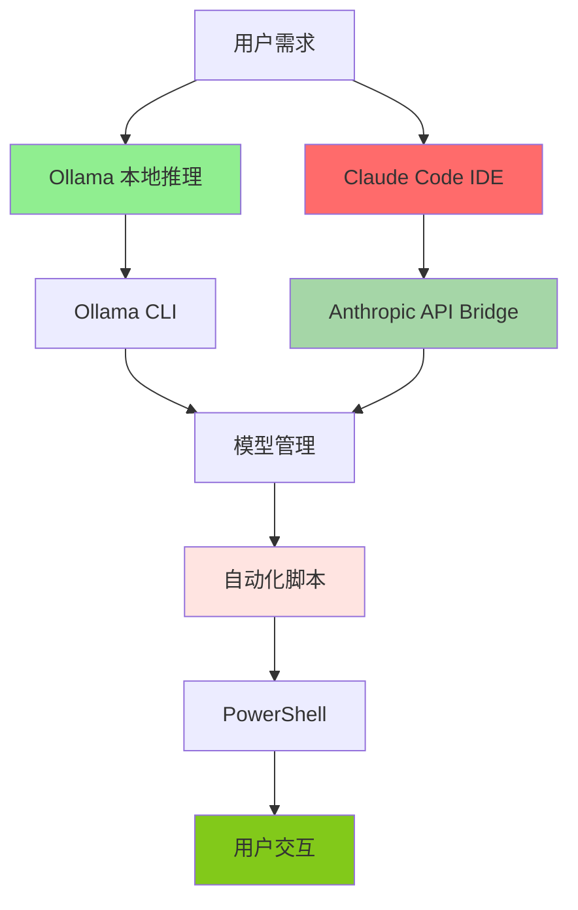

---

## 📌 核心内容

### 文档概述

本文档记录了使用 Ollama 和 Claude Code（Claude Desktop）构建完全开源的本地 AI 编程环境的完整过程。通过这个闭环，实现了：

- ✅ **本地化部署** - 使用 Ollama 作为本地推理引擎
- ✅ **模型管理** - 通过 Ollama CLI 管理多个开源模型
- ✅ **IDE 集成** - Claude Code 通过 Anthropic API 鰃用本地模型
- ✅ **自动化脚本** - PowerShell 脚本实现模型下载和切换
- ✅ **零成本运行** - 完全离线运行，无 API 消耗

### 核心成果

| 成果 | 说明 | 状态 |
|------|------|------|
| **环境搭建** | Ollama + Claude Code 完整集成 | ✅ 已完成 |
| **脚本开发** | PowerShell 自动化脚本 | ✅ 已完成 |
| **模型管理** | 多个模型自动下载和切换 | ✅ 已完成 |
| **接口验证** | 成功调用本地模型 | ✅ 已完成 |
| **文档记录** | 完整的配置和操作流程 | ✅ 已完成 |

---

### 文档概述

本文档记录了使用 Ollama 和 Claude Code（Claude Desktop）构建完全开源的本地 AI 编程环境的完整过程。通过这个闭环，实现了：

- ✅ **本地化部署** - 使用 Ollama 作为本地推理引擎
- ✅ **模型管理** - 通过 Ollama CLI 管理多个开源模型
- ✅ **IDE 集成** - Claude Code 通过 Anthropic API 调用本地模型
- ✅ **自动化脚本** - PowerShell 脚本实现模型下载和切换
- ✅ **零成本运行** - 完全离线运行，无 API 费用

### 核心成果

| 成果 | 说明 | 状态 |
|------|------|------|
| **环境搭建** | Ollama + Claude Code 完整集成 | ✅ 已完成 |
| **脚本开发** | PowerShell 自动化脚本 | ✅ 已完成 |
| **模型管理** | 多个模型自动下载和切换 | ✅ 已完成 |
| **接口验证** | 成功调用本地模型 | ✅ 已完成 |
| **文档记录** | 完整的配置和操作流程 | ✅ 已完成 |

---

## 🎯 核心技术方案

### 技术架构



### 核心组件

| 组件 | 工具/技术 | 作用 |
|------|-----------|------|
| **推理引擎** | Ollama | 本地运行开源大模型 |
| **开发环境** | Claude Code | Anthropic IDE |
| **模型管理** | Ollama CLI | 下载、切换、管理模型 |
| **API 桥接** | Anthropic API | 让 Claude Code 调用本地 Ollama 模型 |
| **自动化工具** | PowerShell | 自动化脚本 |
| **模型列表** | qwen3:latest, glm-4.7-flash | 开源中文模型 |

---

## 📝 详细技术实现

### 1. Claude Code 配置

#### 环境变量设置

```powershell
# Configure Claude Code to use local Ollama (Anthropic-compatible API)
$env:ANTHROPIC_AUTH_TOKEN = "ollama"
$env:ANTHROPIC_BASE_URL = "http://localhost:11434"
$env:ANTHROPIC_API_KEY = "ollama"

# Optional: run Claude Code (uncomment to use)
# $model = "qwen3:latest"
# $modelExists = (ollama list | Select-String -SimpleMatch $model)

if (-not $modelExists) {
    Write-Host "Model '$model' not found locally. Pulling via Ollama..."
    ollama pull $model
} else {
    Write-Host "Model '$model' already exists locally. Using Ollama..."
}

# Set the model for Claude Code
$model = "qwen3:latest"

# Run Claude Code
claude --model $model
```

```powershell
# Configure Claude Code to use local Ollama (Anthropic-compatible API)
$env:ANTHROPIC_AUTH_TOKEN = "ollama"
$env:ANTHROPIC_BASE_URL = "http://localhost:11434"
$env:ANTHROPIC_API_KEY = "ollama"

# Optional: run Claude Code (uncomment to use)
# $model = "qwen3:latest"
# $modelExists = (ollama list | Select-String -SimpleMatch $model)

if (-not $modelExists) {
    Write-Host "Model '$model' not found locally. Pulling via Ollama..."
    ollama pull $model
} else {
    Write-Host "Model '$model' already exists locally. Using Ollama..."
}

# Set the model for Claude Code
$model = "gemma3:1b"

# Run Claude Code
claude --model $model
```


#### 配置说明

| 参数 | 说明 | 示例 |
|------|------|------|
| `AUTH_TOKEN` | 认证令牌 | "ollama" |
| `BASE_URL` | API 基础地址 | "http://localhost:11434" |
| `API_KEY` | API 密钥 | "ollama" |
| `model` | 指定模型 | "qwen3:latest" |

---

### 2. Ollama 模型管理

#### 模型列表

| 模型名称 | 类型 | 用途 | 特点 |
|----------|------|------|
| **qwen3:latest** | 主力模型 | 日常开发 | 对 Claude Code 支持较好 |
| **glm-4.7-flash** | 备用模型 | Claude Code 支持不佳，切换使用 | 开源中文模型 |

#### 命令操作

```powershell
# 拉取模型
ollama pull qwen3:latest
ollama pull glm-4.7-flash

# 列出已安装模型
ollama list

# 运行指定模型
ollama run qwen3:latest "写一个Python脚本"
```

---

### 3. PowerShell 自动化脚本

#### 脚本名称
`claude-code-ollama-qwen3.ps1`

#### 脚本逻辑

```powershell
# 1. 环境变量设置
$env:ANTHROPIC_AUTH_TOKEN = "ollama"
$env:ANTHROPIC_BASE_URL = "http://localhost:11434"
$env:ANTHROPIC_API_KEY = "ollama"

# 2. 模型存在性检查
$modelExists = (ollama list | Select-String -SimpleMatch $model)

# 3. 自动拉取模型（如果不存在）
if (-not $modelExists) {
    Write-Host "Model '$model' not found locally. Pulling via Ollama..."
    ollama pull $model
}

# 4. 启动 Claude Code
claude --model $model
```

#### 脚本使用方法

1. **编辑模型变量** - 修改 `$model = "模型名称"`
2. **右键运行** - 在 PowerShell 中右键脚本文件
3. **自动执行** - 脚本会自动检查和下载模型
4. **模型切换** - 支持在脚本中切换不同模型（如 glm-4.7-flash）

---

## 💡 我的理解与分析

### 核心观点

1. **创新的技术方案** - 通过 Anthropic API 桥接，让 Claude Code 能够调用本地 Ollama 模型，这是一个巧妙的解决方案
2. **开源免费闭环** - 完全基于开源工具（Ollama + 开源模型），零成本运行
3. **本地化运行** - 所有推理在本地进行，保护隐私，无需网络传输
4. **自动化脚本** - PowerShell 脚本实现了模型的自动检查和下载，提升开发体验
5. **多模型支持** - 支持多个开源中文模型，可以根据需要灵活切换

### 个人思考

#### 核心价值是什么？

这个方案的核心价值在于**实现了"云端 IDE + 本地推理"的完美结合**：

1. **保留 IDE 体验** - 继续使用 Claude Code 的优秀 IDE 体验
2. **降低运行成本** - 使用本地免费模型，零 API 费用
3. **提升响应速度** - 本地推理避免了网络延迟
4. **数据隐私保护** - 代码和数据都在本地运行
5. **开源生态利用** - 利用丰富的开源大模型生态

#### 技术亮点

| 亮点 | 说明 |
|------|------|
| **API 桥接** | Ollama 实现 Anthropic API 接口，让 Claude Code 无缝调用 |
| **自动拉取** | 脚本自动检查模型并从 Hugging Face 下载 |
| **模型切换** | 支持在 qwen3 和 glm-4.7-flash 之间切换 |
| **多模型共存** - 可以同时安装多个开源模型，按需使用 |
| **零配置启动** | 一键脚本运行，自动完成环境配置 |
| **完全离线** - 本地推理，不需要联网 |

---

## 🔑 关键要点

| 要点 | 说明 |
|------|------|
| **Ollama CLI** | 命令行工具，用于下载、运行、管理开源大模型 |
| **Anthropic API** | Anthropic 提供的标准化 API 接口 |
| **Claude Code** | Anthropic 官方 IDE，支持多种模型调用 |
| **API 桥接** | Ollama 实现的 Anthropic API 兼容接口，关键创新点 |
| **环境变量** | 通过环境变量配置 Claude Code 的 API 调用 |
| **模型拉取** | Ollama 从 Hugging Face 自动下载模型权重 |
| **qwen3:latest** | 通义千问 3（Qwen3）模型，适合 Claude Code |
| **glm-4.7-flash** | 智谱 GLM-4-7-Flash 模型，开源中文模型 |

---

## 🏷️ 分类标签

### 内容类型
- #技术方案
- #本地开发
- #AI工具
- #Ollama
- #Claude Code
- #自动化脚本

### 领域标签
- #AI本地部署
- #开源模型
- #API桥接
- #技术笔记

### 优先级
- #优先级/高

---

## 🔗 关联链接

### 相关网页

- [[Ollama 官网]] - https://ollama.com/
- [[Claude Code 官网]] - https://claude.ai/claude-code
- [[Anthropic API 文档]] - https://docs.anthropic.com/
- [[Hugging Face]] - https://huggingface.co/

### PARA 关联

#### Project - 可能的项目

- [[_templates/para/📁 quick/Project]] - 开发本地 AI 编程环境
  - 目标：优化和完善 Ollama + Claude Code 集成方案
  - 截止日期：待定
  - 进度：已完成基础闭环

#### Area - 相关领域

- [[_templates/para/📁 quick/Area]] - AI 工具与技术
  - 维护目标：持续关注本地 AI 部署和开源模型
  - 学习频率：每周关注新技术

- [[_templates/para/📁 quick/Area]] - 开发能力提升
  - 维护目标：提升脚本编程和自动化能力
  - 改进方向：学习 Python 脚本编写

#### Resource - 相关资源

- [[_templates/para/📁 quick/Resource]] - Ollama 技术文档
  - 类型：工具文档
  - 用途：Ollama CLI 参考手册

- [[_templates/para/📁 quick/Resource]] - 开源模型库
  - 类型：模型资源
  - 用途：Hugging Face 模型参考

---

## 📋 后续行动

### 待办事项

- [x] **完成基础闭环** - 已成功运行 Claude Code 调用本地 Ollama
- [ ] **模型对比测试** - 对比 qwen3 和 glm-4.7 的性能和效果
- [ ] **优化 Claude Code 配置** - 调整 Claude Code 设置以更好地支持本地模型
- [ ] **Python 脚本开发** - 考虑开发 Python 脚本替代 PowerShell
- [ ] **模型扩展** - 尝试更多开源模型（如 LLaMA、Mistral 等）
- [ ] **文档完善** - 将配置和使用过程整理为完整文档

### 整理方向

#### 转化为 Literature Note

- 提取 API 桥接的实现原理和关键技术点
- 记录 Ollama CLI 的核心命令和使用方法
- 整理 PowerShell 脚本的编程技巧和最佳实践
- 收集开源模型的评估和选择标准

#### 转化为 Permanent Note

- **本地化 AI 方案** - 总结云端 IDE + 本地推理的技术方案
- **API 桥接模式** - 记录这种兼容性设计的思路和实现
- **自动化脚本最佳实践** - 提炼配置管理和错误处理的通用方法

#### 归入特定 Area

- **AI 工具与技术** - 作为本地 AI 部署的实践案例
- **开源生态利用** - 作为开源工具使用的参考

---

## 📊 方案评估

### 优势

| 优势 | 说明 | 重要程度 |
|------|------|----------|
| **零成本** | 完全免费，无 API 费用 | ⭐⭐⭐⭐⭐ |
| **隐私保护** | 数据和代码都在本地 | ⭐⭐⭐⭐⭐ |
| **响应速度快** | 本地推理，无网络延迟 | ⭐⭐⭐⭐ |
| **无限制使用** | 无 token 限制 | ⭐⭐⭐⭐⭐ |
| **开源生态** | 利用丰富的开源模型 | ⭐⭐⭐⭐ |
| **IDE 体验** | 保留 Claude Code 的优秀体验 | ⭐⭐⭐⭐ |

### 挑战与改进

| 挑战 | 说明 | 解决方案 |
|------|------|----------|
| **模型兼容性** | 不是所有开源模型都完美兼容 Claude Code | 测试和选择最佳模型 |
| **技术栈复杂度** | 需要多个工具（Ollama、Claude Code、PowerShell） | 简化脚本，编写文档 |
| **学习成本** | 需要理解 Ollama CLI 和 Anthropic API | 编写教程文档 |
| **维护成本** | 需要更新模型和工具版本 | 建立定期更新机制 |
| **资源占用** | 本地模型占用大量磁盘空间 | 定期清理不需要的模型 |

---

## 💡 创新想法

### 潜在应用场景

#### 1. 多 IDE 支持

> **想法**: 开发一个通用的 API 桥接，支持多个 IDE
> **价值**: 不仅限于 Claude Code，还支持 Cursor、Windsurf 等
> **实现**: 使用标准化 Anthropic API 接口

#### 2. 模型性能对比

> **想法**: 开发一个自动化工具，对比不同模型的性能
> **价值**: 科学选择最佳模型，优化开发体验
> **实现**: 使用标准化测试集，自动生成性能报告

#### 3. 团队协作环境

> **想法**: 多人共享本地模型和配置
> **价值**: 团队协作，统一开发环境
> **实现**: 使用 Docker 容器化部署，配置共享配置

#### 4. 自动化测试

> **想法**: 编写自动化测试脚本，自动测试模型兼容性
> **价值**: 节省手动测试时间，快速发现问题
> **实现**: CI/CD 集成，自动运行测试套件

---

## 📝 备注

**文档说明**: 本分析报告基于原文档的详细内容进行结构化整理和技术分析。

**技术栈总结**:
- Ollama v0.15.0 (或更高版本)
- Claude Code (支持 Anthropic API)
- PowerShell 5.1+
- qwen3:latest (通义千问)
- glm-4.7-flash (智谱 GLM)
- Windows 11 或更高

**适用场景**:
- 本地 AI 开发
- 开源大模型研究和测试
- 零成本编程环境
- 数据隐私要求高的场景

**学习建议**:
1. 熟悉 Ollama CLI 常用命令
2. 了解 Anthropic API 规范
3. 学习 PowerShell 脚本编程
4. 关注开源模型发展动态
5. 定期更新 Ollama 和 Claude Code 版本

---

> [!tip] 技术提示
> 1. **版本兼容性** - 确保 Ollama 版本支持所需的 API 桥接功能
> 2. **硬件要求** - 本地运行需要足够的 GPU/CPU 资源
> 3. **模型质量** - 选择经过验证的高质量开源模型
> 4. **定期备份** - 定期备份配置和脚本，避免数据丢失

---

> [!info] 使用场景
> - 发现有价值的本地 AI 部署方案
> - 零成本、隐私保护的 AI 开发环境
> - 开源工具的集成和优化方法
> - 自动化脚本的开发和管理

---

**报告生成时间**: 2026-01-29
**报告版本**: v1.0
**状态**: ✅ 完成
