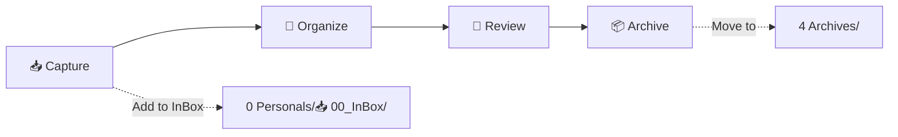
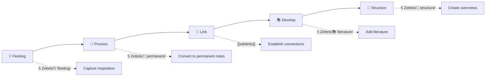

# 🧠 AI-value Knowledge Management System


 [English](README.md) | [[README_zh-CN|简体中文]] | [[README_zh-TW| 繁体中文]]

## Overview

> PARA is a productivity methodology proposed by [Tiago Forte](https://fortelabs.co/) for organizing personal knowledge and tasks.

> A personal knowledge management system based on PARA methodology, integrated with Obsidian, designed to systematically organize information.
---

## Table of Contents

- [✨ Features](#-features)
- [🏗️ System Structure](#️-system-structure)
- [📊 PARA Methodology](#-para-methodology)
- [🔄 Workflows](#-workflows)
- [🏷️ Tag System](#️-tag-system)
- [🛠️ Claude Code Commands](#️-claude-code-commands)
- [📖 Best Practices](#-best-practices)
- [📚 Documentation Resources](#-documentation-resources)
- [🤝 Contributing Guide](#-contributing-guide)
- [❓ FAQ](#-faq)

---

## ✨ Features

| Feature | Description | Status |
|---------|-------------|--------|
| 📥 **InBox** | Quick capture of ideas and notes | ✅ Enabled |
| 🎯 **PARA Organization** | Organize information by actionability | ✅ Enabled |
| 🧠 **Zettelkasten** | Atomic knowledge network | ✅ Enabled |
| 🤖 **Claude Code** | AI-assisted knowledge management | ✅ Enabled |
| 📊 **Skills System** | On-demand module loading | ✅ Enabled |
| 🌐 **Multi-language** | Simplified Chinese/Traditional Chinese/English | ✅ Enabled |

---

## 🏗️ System Structure

```
AI-value/
├── 📁 0 Personals/              # 📥 Personal projects and InBox
│   └── 📥 00_InBox/           #   Quick capture / Inbox
├── 📁 1 Projects/               # 🎯 Active projects with deadlines
├── 📁 2 Areas/                  # 🌳 Long-term responsibility areas
├── 📁 3 Resources/              # 📚 Topics of ongoing interest
├── 📁 4 Archives/               # 🗃️ Completed or inactive content
├── 📁 5 Zettels/                # 💎 Atomic notes
│   ├── 💡 fleeting/           #   Fleeting notes
│   ├── 📌 permanent/          #   Permanent notes
│   ├── 📚 literature/         #   Literature notes
│   └── 📁 structure/          #   Structure notes
├── 📁 _Template/                # 📋 Template library
├── 📁 _meta/                    # ⚙️ System metadata
└── 📁 .claude/                  # 🤖 Claude Code configuration
```

---

## 📊 PARA Methodology

| Category | Folder | Description | Examples |
|----------|--------|-------------|----------|
| 🔴 **Projects** | `1 Projects/` | Active projects with deadlines | "2026 Annual Plan", "Product Launch", "New Website Launch", "Tax Filing" |
| 🟢 **Areas** | `2 Areas/` | Long-term responsibilities without deadlines | "Health Management", "Career Development" |
| 🔵 **Resources** | `3 Resources/` | Topics of ongoing interest | "Obsidian Tips", "AI News", "Productivity Tips", "Cooking Recipes", "Market Research" |
| ⚪ **Archives** | `4 Archives/` | Completed or inactive content | "2025 Annual Summary", old projects, outdated resources |

### Classification Decision Tree

```
❓ Does this have a clear goal and deadline?
  └─ ✅ Yes → Projects (Time-bound projects)
  └─ ❌ No → Continue

❓ Does this require ongoing maintenance?
  └─ ✅ Yes → Areas (Long-term responsibilities)
  └─ ❌ No → Continue

❓ Am I interested but don't need immediate action?
  └─ ✅ Yes → Resources (Topics of interest)
  └─ ❌ No → Archive
```

---

## 🔄 Workflows

### 1️⃣ PARA Workflow



| Step | Action | Command |
|------|--------|---------|
| 1️⃣ Capture | Add new information to InBox | Manual add |
# 整理
| 3️⃣ Review | Review library status | `/para-库概览` |
| 4️⃣ Archive | Move to completed | Manual move |

### 2️⃣ Zettelkasten Workflow



| Step | Action | Location |
|------|--------|----------|
| 1️⃣ Create | Quick capture of ideas | `💡 fleeting/` |
| 2️⃣ Process | Convert to permanent notes | `📌 permanent/` |
| 3️⃣ Link | Connect related concepts | wikilinks |
| 4️⃣ Develop | Add literature notes | `📚 literature/` |
| 5️⃣ Structure | Create overview notes | `📁 structure/` |

---

## 🏷️ Tag System

The vault uses a unified tag system to organize and categorize notes across all methodologies.

### Tag Architecture

```
┌─────────────────────────────────────────────────────────────────┐
│              Unified Tag System                               │
└─────────────────────────────────────────────────────────────────┘
                              │
        ┌─────────────────────┼─────────────────────┐
        │                     │                     │
   PARA Core            Specialized           General Utility
   Tags                Knowledge Base        Auxiliary Tags
        │                     │                     │
   ┌────┴────┐           ┌────┴────┐           ┌────┴────┐
   │         │           │         │           │         │
 #para   #status   #type   #system   #report  #zettel
           #priority  #topic   #workflow
                     #discipline  #method
```

### Quick Tag Reference

| Category | Tags | Usage |
|----------|------|-------|
| **PARA Area** | `#para/area/health`, `#para/area/career`, etc. | Long-term responsibility areas |
| **PARA Project** | `#para/project/work`, `#para/project/learning` | Active projects |
| **PARA Resource** | `#para/resource/tech`, `#para/resource/learning` | Reference materials |
| **Status** | `#status/active`, `#status/completed` | Track progress |
| **Priority** | `#priority/high`, `#priority/urgent` | Task importance |
| **Zettelkasten** | `#zettel/type/permanent`, `#zettel/type/literature` | Note classification |
| **Specialized KB** | `#type/`, `#topic/`, `#discipline/`, `#method/` | Knowledge base organization |
| **Yixue** | `#yixue/basics`, `#yixue/hexagram` | I Ching knowledge base |

### Documentation

For complete tag system specifications and usage examples, see:

- [[tag-system-guide]] - Comprehensive tag system guide
- [[tag-quick-reference]] - Quick lookup table
- [[示例笔记-领域标签使用]] - Area tag examples
- [[示例笔记-项目标签使用]] - Project tag examples
- [[示例笔记-资源标签使用]] - Resource tag examples
- [[示例笔记-Zettelkasten标签使用]] - Zettelkasten tag examples

---

## 🛠️ Claude Code Commands

### 📊 PARA Management Commands

| Command | Function | Description |
|---------|----------|-------------|
| `/para-库概览` | 📊 Display library overview | View file count and status by category |
# 整理
| `/para-刷新缓存` | 🔄 Refresh cache | Update performance cache files |

### 🔍 Auxiliary Commands

| Command | Function | Description |
|---------|----------|-------------|
| `/search` | 🔍 Search content | Quickly search InBox and PARA |
| `/obsidian` | 📎 Auto-select skill | Choose Obsidian skill based on file type |
| `/claudian` | 🤖 PARA assistant | Interactive menu for PARA management |
| `/export: weekly` | 📅 Export weekly report | Generate weekly report from daily notes |
| `/export: monthly` | 📆 Export monthly report | Generate monthly report from weekly notes |

### ⚡ Quick Operations

```bash
# Search for notes containing "Obsidian"
/search Obsidian

# View PARA library status
/para-库概览

# Organize InBox
# 整理

# Auto-select skill
/obsidian
```

---

## 📖 Best Practices

### ✅ Using InBox

- 📝 **Quick capture** - Don't worry about format, just write it down
- 📅 **Regular organization** - Organize daily or weekly
- 🧹 **Empty principle** - Keep InBox minimal

### ✅ PARA Classification

- 🎯 **Has deadline** → Projects
- 🌳 **Long-term responsibility** → Areas
- 📚 **Topic of interest** → Resources
- 📦 **Completed** → Archives

### ✅ Zettelkasten Principles

- 💎 **Atomicity** - One idea per note
- 🔢 **Unique ID** - Use `YYYYMMDD-XXXX`
- 🔗 **Adequate linking** - Connect related concepts
- 📦 **Self-contained** - Understandable independently

### ✅ File Naming

- 📛 **Descriptive names** - Clearly describe content
- ␣ **Use spaces** - Obsidian wikilinks support
- 🚫 **Avoid special characters** - `: * ? " < > | /`
- 📋 **Template prefix** - `_template-`

---

## 📚 Documentation Resources

### 📖 Core Documents

| Document                                                        | Description            | Priority |
| --------------------------------------------------------------- | ---------------------- | -------- |
| [📘 CLAUDE](CLAUDE.md)                                          | Claude Code core rules | ⭐⭐⭐      |
| [🧠 PARA Methodology](.claude/skills/para-methodology/SKILL.md) | Complete PARA guide    | ⭐⭐⭐      |
| [📎 Obsidian Syntax](.claude/skills/obsidian-syntax/SKILL.md)   | Syntax reference       | ⭐⭐⭐      |

### 🛠️ Skills Documentation

| Skill | Description |
|-------|-------------|
| [para-methodology](.claude/skills/para-methodology/SKILL.md) | PARA structure, workflow, metadata |
| [obsidian-syntax](.claude/skills/obsidian-syntax/SKILL.md) | Wikilinks, callouts, properties |
| [repo-context](.claude/skills/repo-context/SKILL.md) | Repository structure, paths, Git |
| [markdown-standards](.claude/skills/markdown-standards/SKILL.md) | File naming, multilingual support |
| [claude-commands](.claude/skills/claude-commands/SKILL.md) | Command usage and workflows |
| [zettelkasten-workflow](.claude/skills/zettelkasten-workflow/SKILL.md) | Atomic notes, linking, unique IDs |

---

## 🤝 Contributing Guide

Contributions are welcome! You can:

- 📝 **Submit improvements** - Report issues or feature requests
- 🔧 **Submit Pull Requests** - Contribute code or documentation
- 💬 **Participate in discussions** - Exchange ideas in Issues

---

## ❓ FAQ

<details>
<summary>❓ How do I get started?</summary>

1. Open Obsidian
2. Import AI-value repository
3. Start capturing ideas in `0 Personals/📥 00_InBox/`
# 整理

</details>

<details>
<summary>❓ What's the difference between PARA and Zettelkasten?</summary>

- **PARA** - Organize by actionability (Projects/Areas/Resources/Archives)
- **Zettelkasten** - Organize by knowledge atoms (Fleeting/Permanent/Literature/Structure)

They can be used together!

</details>

<details>
<summary>❓ How do I add new notes?</summary>

1. Capture ideas in InBox
# 整理
3. Or manually move to appropriate folder

</details>

<details>
<summary>❓ Is multi-language support available?</summary>

Yes! The system supports:
- Simplified Chinese (default)
- Traditional Chinese
- English

</details>

---

## 📞 Contact

| Channel | Link |
|---------|------|
| 🐙 **GitHub** | [AI-value](https://github.com/kmjade/AI-value.git) |
| 🐛 **Issues** | [Report issues](https://github.com/kmjade/AI-value/issues) |

---

## 📄 License

<div align="center">

Apache License 2.0

</div>

---

> 💡 **Tip**: Use `/obsidian` command to automatically select the appropriate skill based on file type!

**🌟 Start your knowledge management journey!**

---

<div align="center">

Made with ❤️ by AI-value Team

</div>
