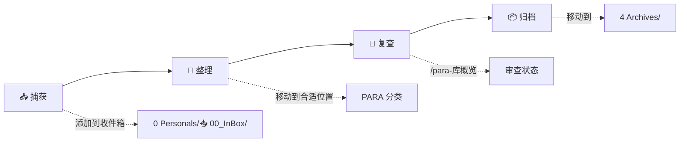
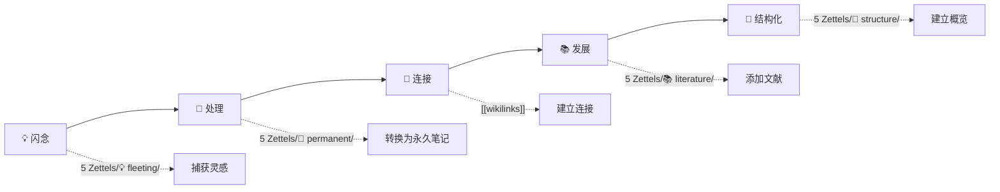

# 🧠 AI-value 知识管理系统


[English](README.md) | [[README_zh-CN|简体中文]] | [[README_zh-TW| 繁体中文]]

---

## 概述

> PARA 是由 [Tiago Forte](https://fortelabs.co/) 提出的一种生产力方法论，用于组织个人知识和任务。

> 基于 PARA 方法论的个人知识管理系统，集成 Obsidian，系统化地组织信息。

---

## 目录

- [特性亮点](#-特性亮点)
- [系统结构](#-系统结构)
- [PARA 方法论](#-para-方法论)
- [工作流程](#-工作流程)
- [标签系统](#-标签系统)
- [Claude Code 命令](#-claude-code-命令)
- [最佳实践](#-最佳实践)
- [文档资源](#-文档资源)
- [贡献指南](#-贡献指南)
- [常见问题](#-常见问题)

---

## 特性亮点

| 特性 | 说明 | 状态 |
|------|------|------|
| 📥 **InBox 收件箱** | 快速捕获想法和笔记 | ✅ 已启用 |
| 🎯 **PARA 组织** | 按可执行性分类信息 | ✅ 已启用 |
| 🧠 **Zettelkasten** | 原子化知识网络 | ✅ 已启用 |
| 🤖 **Claude Code** | AI 辅助知识管理 | ✅ 已启用 |
| 📊 **Skills 系统** | 按需加载模块 | ✅ 已启用 |
| 🏷️ **标签系统** | 统一的标签体系 | ✅ 已启用 |
| 🌐 **多语言支持** | 简体中文/繁体中文/English | ✅ 已启用 |

---

## 系统结构

```
AI-value/
├── 📁 0 Personals/              # 📥 个人项目与收件箱
│   └── 📥 00_InBox/           #   快速捕获 / Inbox
├── 📁 1 Projects/               # 🎯 有截止日期的活跃项目
├── 📁 2 Areas/                  # 🌳 长期责任领域
├── 📁 3 Resources/              # 📚 持续感兴趣的主题
├── 📁 4 Archives/               # 🗃️ 已完成或非活跃内容
├── 📁 5 Zettels/                # 💎 原子化笔记
│   ├── 💡 fleeting/           #   闪念笔记
│   ├── 📌 permanent/          #   永久笔记
│   ├── 📚 literature/         #   文献笔记
│   └── 📁 structure/          #   结构笔记
├── 📁 _templates/               # 📋 模板库
├── 📁 _meta/                    # ⚙️ 系统元数据
└── 📁 .claude/                  # 🤖 Claude Code 配置
```

---

## PARA 方法论

| 分类               | 文件夹            | 说明         | 示例                                            |
| ---------------- | -------------- | ---------- | --------------------------------------------- |
| 🔴 **Projects**  | `1 Projects/`  | 有截止日期的活跃项目 | "2026年度计划", "产品发布", "发布新网站", "完成报税"           |
| 🟢 **Areas**     | `2 Areas/`     | 长期责任领域     | "健康管理", "职业发展"                                |
| 🔵 **Resources** | `3 Resources/` | 持续感兴趣的主题   | "Obsidian技巧", "AI资讯", "生产力技巧", "烹饪食谱", "市场调研" |
| ⚪ **Archives**   | `4 Archives/`  | 已完成或非活跃内容  | "2025年度总结", 旧项目, 过时的资源                        |

### 分类决策树

```
❓ 这件事有明确的目标和截止日期吗？
  └─ ✅ 是 → Projects（有期限项目）
  └─ ❌ 否 → 继续

❓ 这件事需要持续维护吗？
  └─ ✅ 是 → Areas（长期责任）
  └─ ❌ 否 → 继续

❓ 这件事我感兴趣但不需要立即行动？
  └─ ✅ 是 → Resources（感兴趣话题）
  └─ ❌ 否 → 归档
```

---

## 工作流程

### PARA 工作流


```mermaid
flowchart LR
    A[📥 捕获] --> B[🧹 整理]
    B --> C[👀 复查]
    C --> D[📦 归档]

    A -.-> |"添加到收件箱"| A1[0 Personals/📥 00_InBox/]
    B -.-> |"移动到合适位置"| B1[PARA 分类]
    C -.-> |"/para-库概览"| C1[审查状态]
    D -.-> |"移动到"| D1[4 Archives/]
```

| 步骤 | 操作 | 命令 |
|------|------|------|
| 1️⃣ 捕获 | 将新信息添加到收件箱 | 手动添加 |
| 2️⃣ 整理 | 分类到合适位置 | `/para-整理收集` 或手动移动 |
| 3️⃣ 复查 | 审查库状态 | `/para-库概览` |
| 4️⃣ 归档 | 移至已完成 | 手动移动 |

### Zettelkasten 工作流


```mermaid
flowchart LR
    A[💡 闪念] --> B[📌 处理]
    B --> C[🔗 连接]
    C --> D[📚 发展]
    D --> E[📁 结构化]

    A -.-> |"5 Zettels/💡 fleeting/"| A1[捕获灵感]
    B -.-> |"5 Zettels/📌 permanent/"| B1[转换为永久笔记]
    C -.-> |"[[wikilinks]]"| C1[建立连接]
    D -.-> |"5 Zettels/📚 literature/"| D1[添加文献]
    E -.-> |"5 Zettels/📁 structure/"| E1[建立概览]
```

| 步骤 | 操作 | 位置 |
|------|------|------|
| 1️⃣ 创建 | 快速捕获想法 | `💡 fleeting/` |
| 2️⃣ 处理 | 转换为永久笔记 | `📌 permanent/` |
| 3️⃣ 连接 | 连接相关概念 | wikilinks |
| 4️⃣ 发展 | 添加文献笔记 | `📚 literature/` |
| 5️⃣ 结构化 | 建立概览笔记 | `📁 structure/` |

---

## 标签系统

本知识库使用统一的标签系统来组织和分类所有笔记。

### 标签架构

```
┌─────────────────────────────────────────────────────────────────┐
│                    统一标签体系                              │
└─────────────────────────────────────────────────────────────────┘
                              │
        ┌─────────────────────┼─────────────────────┐
        │                     │                     │
   PARA 核心               专用知识库             通用功能
   标签体系                标签系统                辅助标签
        │                     │                     │
   ┌────┴────┐           ┌────┴────┐           ┌────┴────┐
   │         │           │         │           │         │
 #para   #status   #type   #system   #report  #zettel
           #priority  #topic   #workflow
                     #discipline  #method
```

### 快速标签参考

| 类别 | 标签 | 用途 |
|------|------|------|
| **PARA 领域** | `#para/area/health`, `#para/area/career` 等 | 长期责任领域 |
| **PARA 项目** | `#para/project/work`, `#para/project/learning` | 活跃项目 |
| **PARA 资源** | `#para/resource/tech`, `#para/resource/learning` | 参考资料 |
| **状态** | `#status/active`, `#status/completed` | 跟踪进度 |
| **优先级** | `#priority/high`, `#priority/urgent` | 任务重要性 |
| **Zettelkasten** | `#zettel/type/permanent`, `#zettel/type/literature` | 笔记分类 |
| **专用知识库** | `#type/`, `#topic/`, `#discipline/`, `#method/` | 知识库组织 |
| **易学** | `#yixue/basics`, `#yixue/hexagram` | 易学知识库 |

### 文档链接

完整的标签系统规范和使用示例：

- [[tag-system-guide]] - 完整的标签系统指南
- [[tag-quick-reference]] - 快速查找表
- [[示例笔记-领域标签使用]] - 领域标签示例
- [[示例笔记-项目标签使用]] - 项目标签示例
- [[示例笔记-资源标签使用]] - 资源标签示例
- [[示例笔记-Zettelkasten标签使用]] - Zettelkasten 标签示例

---

## Claude Code 命令

### PARA 管理命令

| 命令 | 功能 | 说明 |
|------|------|------|
| `/para-库概览` | 📊 显示库概览 | 查看各分类的文件数量和状态 |
| `/para-整理收集` | 🧹 整理收件箱 | 将收件箱中的文件分类到 PARA |

### 辅助命令

| 命令 | 功能 | 说明 |
|------|------|------|
| `/search` | 🔍 搜索内容 | 快速搜索收件箱和 PARA |
| `/obsidian` | 📎 自动选择技能 | 根据文件类型选择 Obsidian 技能 |
| `/claudian` | 🤖 PARA 助手 | PARA 管理的交互式菜单 |
| `/export: weekly` | 📅 导出周报 | 从日报生成周报 |
| `/export: monthly` | 📆 导出月报 | 从周报生成月报 |

### 快速操作

```bash
# 搜索包含 "Obsidian" 的笔记
/search Obsidian

# 查看 PARA 库状态
/para-库概览

# 整理收件箱
/para-整理收集

# 自动选择技能
/obsidian
```

---

## 最佳实践

### 使用收件箱

- 📝 **快速捕获** - 不要担心格式，先记下来
- 📅 **定期整理** - 每天或每周整理一次
- 🧹 **清空原则** - 保持收件箱最小化

### PARA 分类

- 🎯 **有截止日期** → Projects
- 🌳 **长期责任** → Areas
- 📚 **感兴趣话题** → Resources
- 📦 **已完成** → Archives

### Zettelkasten 原则

- 💎 **原子性** - 每个笔记一个想法
- 🔢 **独特 ID** - 使用 `YYYYMMDD-XXXX`
- 🔗 **充分连接** - 连接相关概念
- 📦 **自包含** - 独立可理解

### 文件命名

- 📛 **描述性名称** - 清晰描述内容
- ␣ **使用空格** - Obsidian wikilinks 支持
- 🚫 **避免特殊字符** - `: * ? " < > | /`
- 📋 **模板前缀** - `_template-`

---

## 文档资源

### 核心文档

| 文档                                                        | 说明               | 优先级 |
| --------------------------------------------------------- | ---------------- | --- |
| [📘 CLAUDE.md](CLAUDE.md)                                 | Claude Code 核心规则 | ⭐⭐⭐ |
| [[tag-system-guide]]                                      | 标签系统完整指南         | ⭐⭐⭐ |
| [PARA 工作流](.claude/skills/para-methodology/SKILL.md)      | 完整 PARA 指南       | ⭐⭐⭐ |
| [📎 Obsidian 语法](.claude/skills/obsidian-syntax/SKILL.md) | 语法参考             | ⭐⭐⭐ |

### Skills 文档

| Skill                                                                  | 说明               |
| ---------------------------------------------------------------------- | ---------------- |
| [para-methodology](.claude/skills/para-methodology/SKILL.md)           | PARA 结构、工作流、元数据  |
| [obsidian-syntax](.claude/skills/obsidian-syntax/SKILL.md)             | Wikilinks、提示块、属性 |
| [repo-context](.claude/skills/repo-context/SKILL.md)                   | 仓库结构、路径、Git      |
| [markdown-standards](.claude/skills/markdown-standards/SKILL.md)       | 文件命名、多语言支持       |
| [claude-commands](.claude/skills/claude-commands/SKILL.md)             | 命令使用和工作流         |
| [zettelkasten-workflow](.claude/skills/zettelkasten-workflow/SKILL.md) | 原子笔记、连接、唯一 ID    |

---

## 贡献指南

欢迎贡献！您可以：

- 📝 **提交改进建议** - 报告问题或功能请求
- 🔧 **提交 Pull Requests** - 贡献代码或文档
- 💬 **参与讨论** - 在 Issues 中交流

---

## 常见问题

<details>
<summary>如何开始使用？</summary>

1. 打开 Obsidian
2. 导入 AI-value 仓库
3. 开始在 `0 Personals/📥 00_InBox/` 中捕获想法
4. 使用 `/para-整理收集` 整理内容

</details>

<details>
<summary>PARA 和 Zettelkasten 有什么区别？</summary>

- **PARA** - 按可执行性组织信息（Projects/Areas/Resources/Archives）
- **Zettelkasten** - 按知识原子化组织（闪念/永久/文献/结构）

两者可以结合使用！

</details>

<details>
<summary>如何添加新笔记？</summary>

1. 在收件箱捕获想法
2. 使用 `/para-整理收集` 自动分类
3. 或手动移动到对应文件夹

</details>

<details>
<summary>支持多语言吗？</summary>

是的！系统支持：
- 简体中文（默认）
- 繁体中文
- English

</details>

<details>
<summary>标签系统如何使用？</summary>

新创建的笔记应直接使用统一的标签体系。参考 [[tag-system-guide]] 获取完整规范，查看示例笔记了解正确的标签组合方式。

</details>

---

## 联系方式

| 渠道 | 链接 |
|------|------|
| 🐙 **GitHub** | [knowledge-value](https://github.com/kmjade/knowledge-value.git) |
| 🐛 **Issues** | [报告问题](https://github.com/kmjade/knowledge-value/issues) |

---

## 许可证

<div align="center">

Apache License 2.0

</div>

---

> 💡 **提示**：使用 `/obsidian` 命令可以根据文件类型自动选择合适的技能！

**🌟 开始你的知识管理之旅！**

---

<div align="center">

Made with ❤️ by AI-value Team

</div>
