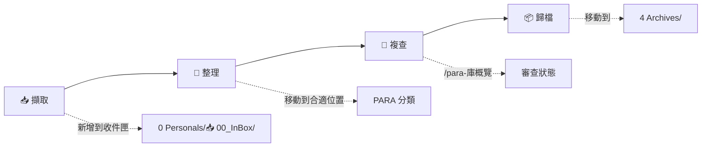
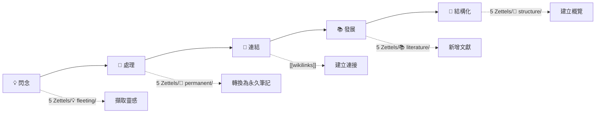

# 🧠 AI-value 知識管理系統


[English](README.md) | [[README_zh-CN|简体中文]] | [[README_zh-TW| 繁体中文]]

---

## 概述

> PARA 是由 [Tiago Forte](https://fortelabs.co/) 提出的一種生產力方法論，用於組織個人知識和任務。

> 基於 PARA 方法論的個人知識管理系統，整合 Obsidian，系統化地組織資訊。

---

## 目錄

- [特性亮點](#-特性亮點)
- [系統結構](#-系統結構)
- [PARA 方法論](#-para-方法論)
- [工作流程](#-工作流程)
- [標籤系統](#-標籤系統)
- [Claude Code 指令](#-claude-code-指令)
- [最佳實踐](#-最佳實踐)
- [文件資源](#-文件資源)
- [貢獻指南](#-貢獻指南)
- [常見問題](#-常見問題)

---

## 特性亮點

| 特性 | 說明 | 狀態 |
|------|------|------|
| 📥 **InBox 收件匣** | 快速擷取想法和筆記 | ✅ 已啟用 |
| 🎯 **PARA 組織** | 按可執行性分類資訊 | ✅ 已啟用 |
| 🧠 **Zettelkasten** | 原子化知識網路 | ✅ 已啟用 |
| 🤖 **Claude Code** | AI 輔助知識管理 | ✅ 已啟用 |
| 📊 **Skills 系統** | 按需載入模組 | ✅ 已啟用 |
| 🏷️ **標籤系統** | 統一的標籤體系 | ✅ 已啟用 |
| 🌐 **多語言支援** | 簡體中文/繁體中文/English | ✅ 已啟用 |

---

## 系統結構

```
AI-value/
├── 📁 0 Personals/              # 📥 個人專案與收件匣
│   └── 📥 00_InBox/           #   快速擷取 / Inbox
├── 📁 1 Projects/               # 🎯 有期限的活躍專案
├── 📁 2 Areas/                  # 🌳 長期責任領域
├── 📁 3 Resources/              # 📚 持續感興趣的主題
├── 📁 4 Archives/               # 🗃️ 已完成或非活躍內容
├── 📁 5 Zettels/                # 💎 原子化筆記
│   ├── 💡 fleeting/           #   閃念筆記
│   ├── 📌 permanent/          #   永久筆記
│   ├── 📚 literature/         #   文獻筆記
│   └── 📁 structure/          #   結構筆記
├── 📁 _templates/               # 📋 範本庫
├── 📁 _meta/                    # ⚙️ 系統中繼資料
└── 📁 .claude/                  # 🤖 Claude Code 設定
```

---

## PARA 方法論

| 分類 | 資料夾 | 說明 | 範例 |
|------|--------|------|------|
| 🔴 **Projects** | `1 Projects/` | 有截止日期的活躍專案 | "2026年度計劃", "產品發佈", "發佈新網站", "完成報稅" |
| 🟢 **Areas** | `2 Areas/` | 長期責任領域 | "健康管理", "職業發展" |
| 🔵 **Resources** | `3 Resources/` | 持續感興趣的主題 | "Obsidian技巧", "AI資訊", "生產力技巧", "烹飪食譜", "市場調研" |
| ⚪ **Archives** | `4 Archives/` | 已完成或非活躍內容 | "2025年度總結", 舊專案, 過時的資源 |

### 分類決策樹

```
❓ 這件事有明確的目標和截止日期嗎？
  └─ ✅ 是 → Projects（有期限專案）
  └─ ❌ 否 → 繼續

❓ 這件事需要持續維護嗎？
  └─ ✅ 是 → Areas（長期責任）
  └─ ❌ 否 → 繼續

❓ 這件事我感興趣但不需要立即行動？
  └─ ✅ 是 → Resources（感興趣話題）
  └─ ❌ 否 → 歸檔
```

---

## 工作流程

### PARA 工作流



| 步驟 | 操作 | 指令 |
|------|------|------|
| 1️⃣ 擷取 | 將新資訊新增到收件匣 | 手動新增 |
| 2️⃣ 整理 | 分類到合適位置 | `/para-整理收集` 或手動移動 |
| 3️⃣ 複查 | 審查庫狀態 | `/para-庫概覽` |
| 4️⃣ 歸檔 | 移至已完成 | 手動移動 |

### Zettelkasten 工作流



| 步驟 | 操作 | 位置 |
|------|------|------|
| 1️⃣ 建立 | 快速擷取想法 | `💡 fleeting/` |
| 2️⃣ 處理 | 轉換為永久筆記 | `📌 permanent/` |
| 3️⃣ 連結 | 連接相關概念 | wikilinks |
| 4️⃣ 發展 | 新增文獻筆記 | `📚 literature/` |
| 5️⃣ 結構化 | 建立概覽筆記 | `📁 structure/` |

---

## 標籤系統

本知識庫使用統一的標籤系統來組織和分類所有筆記。

### 標籤架構

```
┌─────────────────────────────────────────────────────────────────┐
│                    統一標籤體系                              │
└─────────────────────────────────────────────────────────────────┘
                              │
        ┌─────────────────────┼─────────────────────┐
        │                     │                     │
   PARA 核心               專用知識庫             通用功能
   標籤體系                標籤系統                輔助標籤
        │                     │                     │
   ┌────┴────┐           ┌────┴────┐           ┌────┴────┐
   │         │           │         │           │         │
 #para   #status   #type   #system   #report  #zettel
           #priority  #topic   #workflow
                     #discipline  #method
```

### 快速標籤參考

| 類別 | 標籤 | 用途 |
|------|------|------|
| **PARA 領域** | `#para/area/health`, `#para/area/career` 等 | 長期責任領域 |
| **PARA 專案** | `#para/project/work`, `#para/project/learning` | 活躍專案 |
| **PARA 資源** | `#para/resource/tech`, `#para/resource/learning` | 參考資料 |
| **狀態** | `#status/active`, `#status/completed` | 追蹤進度 |
| **優先級** | `#priority/high`, `#priority/urgent` | 任務重要性 |
| **Zettelkasten** | `#zettel/type/permanent`, `#zettel/type/literature` | 筆記分類 |
| **專用知識庫** | `#type/`, `#topic/`, `#discipline/`, `#method/` | 知識庫組織 |
| **易學** | `#yixue/basics`, `#yixue/hexagram` | 易學知識庫 |

### 文件連結

完整的標籤系統規範和使用範例：

- [[tag-system-guide]] - 完整的標籤系統指南
- [[tag-quick-reference]] - 快速查詢表
- [[示例筆記-領域標籤使用]] - 領域標籤範例
- [[示例筆記-專案標籤使用]] - 專案標籤範例
- [[示例筆記-資源標籤使用]] - 資源標籤範例
- [[示例筆記-Zettelkasten標籤使用]] - Zettelkasten 標籤範例

---

## Claude Code 指令

### PARA 管理指令

| 指令 | 功能 | 說明 |
|------|------|------|
| `/para-庫概覽` | 📊 顯示庫概覽 | 查看各分類的檔案數量和狀態 |
| `/para-整理收集` | 🧹 整理收件匣 | 將收件匣中的檔案分類到 PARA |

### 輔助指令

| 指令 | 功能 | 說明 |
|------|------|------|
| `/search` | 🔍 搜尋內容 | 快速搜尋收件匣和 PARA |
| `/obsidian` | 📎 自動選擇技能 | 根據檔案類型選擇 Obsidian 技能 |
| `/claudian` | 🤖 PARA 助手 | PARA 管理的互動式選單 |
| `/export: weekly` | 📅 導出週報 | 從日報生成週報 |
| `/export: monthly` | 📆 導出月報 | 從週報生成月報 |

### 快速操作

```bash
# 搜尋包含 "Obsidian" 的筆記
/search Obsidian

# 查看 PARA 庫狀態
/para-庫概覽

# 整理收件匣
/para-整理收集

# 自動選擇技能
/obsidian
```

---

## 最佳實踐

### 使用收件匣

- 📝 **快速擷取** - 不要擔心格式，先記下來
- 📅 **定期整理** - 每天或每週整理一次
- 🧹 **清空原則** - 保持收件匣最小化

### PARA 分類

- 🎯 **有截止日期** → Projects
- 🌳 **長期責任** → Areas
- 📚 **感興趣話題** → Resources
- 📦 **已完成** → Archives

### Zettelkasten 原則

- 💎 **原子性** - 每個筆記一個想法
- 🔢 **獨特 ID** - 使用 `YYYYMMDD-XXXX`
- 🔗 **充分連結** - 連接相關概念
- 📦 **自包含** - 獨立可理解

### 檔案命名

- 📛 **描述性名稱** - 清晰描述內容
- ␣ **使用空格** - Obsidian wikilinks 支援
- 🚫 **避免特殊字元** - `: * ? " < > | /`
- 📋 **範本前綴** - `_template-`

---

## 文件資源

### 核心文件

| 文件 | 說明 | 優先級 |
|------|------|--------|
| [📘 CLAUDE.md](CLAUDE.md) | Claude Code 核心規則 | ⭐⭐⭐ |
| [[tag-system-guide]] | 標籤系統完整指南 | ⭐⭐⭐ |
| [[PARA 工作流]](.claude/skills/para-methodology/SKILL.md) | 完整 PARA 指南 | ⭐⭐⭐ |
| [📎 Obsidian 語法](.claude/skills/obsidian-syntax/SKILL.md) | 語法參考 | ⭐⭐⭐ |

### Skills 文件

| Skill | 說明 |
|-------|------|
| [para-methodology](.claude/skills/para-methodology/SKILL.md) | PARA 結構、工作流、中繼資料 |
| [obsidian-syntax](.claude/skills/obsidian-syntax/SKILL.md) | Wikilinks、提示塊、屬性 |
| [repo-context](.claude/skills/repo-context/SKILL.md) | 儲存庫結構、路徑、Git |
| [markdown-standards](.claude/skills/markdown-standards/SKILL.md) | 檔案命名、多語言支援 |
| [claude-commands](.claude/skills/claude-commands/SKILL.md) | 指令使用和工作流 |
| [zettelkasten-workflow](.claude/skills/zettelkasten-workflow/SKILL.md) | 原子筆記、連結、唯一 ID |

---

## 貢獻指南

歡迎貢獻！您可以：

- 📝 **提交改進建議** - 報告問題或功能請求
- 🔧 **提交 Pull Requests** - 貢獻代碼或文件
- 💬 **參與討論** - 在 Issues 中交流

---

## 常見問題

<details>
<summary>如何開始使用？</summary>

1. 打開 Obsidian
2. 匯入 AI-value 儲存庫
3. 開始在 `0 Personals/📥 00_InBox/` 中擷取想法
4. 使用 `/para-整理收集` 整理內容

</details>

<details>
<summary>PARA 和 Zettelkasten 有什麼區別？</summary>

- **PARA** - 按可執行性組織資訊（Projects/Areas/Resources/Archives）
- **Zettelkasten** - 按知識原子化組織（閃念/永久/文獻/結構）

兩者可以結合使用！

</details>

<details>
<summary>如何新增筆記？</summary>

1. 在收件匣擷取想法
2. 使用 `/para-整理收集` 自動分類
3. 或手動移動到對應資料夾

</details>

<details>
<summary>支援多語言嗎？</summary>

是的！系統支援：
- 簡體中文（預設）
- 繁體中文
- English

</details>

<details>
<summary>標籤系統如何使用？</summary>

新建立的筆記應直接使用統一的標籤體系。參考 [[tag-system-guide]] 獲取完整規範，查看範例筆記了解正確的標籤組合方式。

</details>

---

## 聯絡方式

| 管道 | 連結 |
|------|------|
| 🐙 **GitHub** | [knowledge-value](https://github.com/kmjade/knowledge-value.git) |
| 🐛 **Issues** | [報告問題](https://github.com/kmjade/knowledge-value/issues) |

---

## 授權條款

<div align="center">

Apache License 2.0

</div>

---

> 💡 **提示**：使用 `/obsidian` 指令可以根據檔案類型自動選擇合適的技能！

**🌟 開始你的知識管理之旅！**

---

<div align="center">

Made with ❤️ by AI-value Team

</div>
