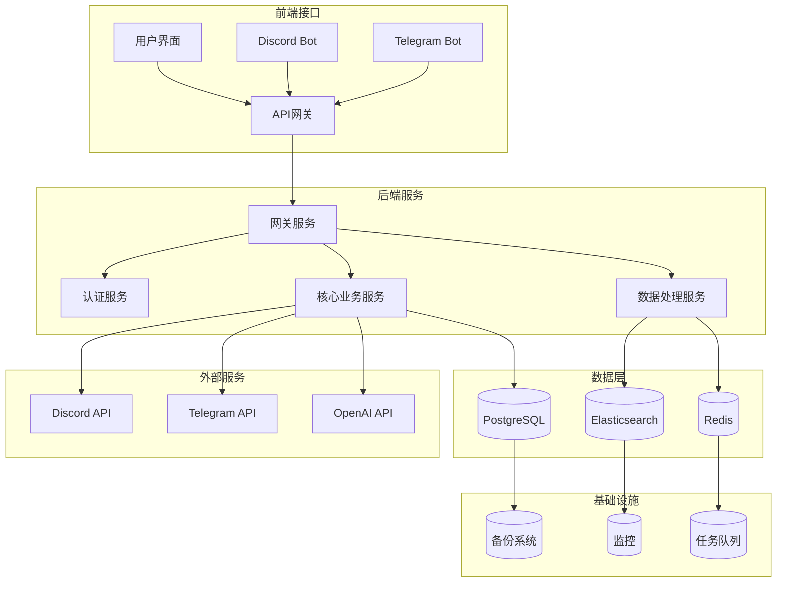
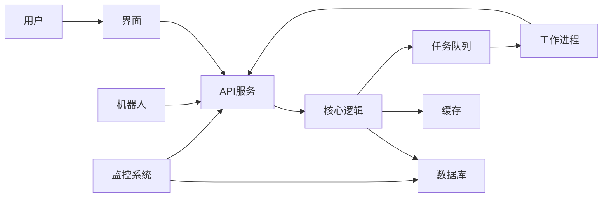

# 🤖 Clawdbot项目模板

> [!info] **项目模板说明**
>
> 此模板专为自动化机器人（Clawdbot）项目设计，包含机器人开发、部署和管理的完整流程。

---

## 📋 项目基本信息

| 字段 | 值 | 说明 |
|------|-----|------|
| **项目名称** | `{{title}}` | 项目唯一标识 |
| **负责人** | | 项目负责人 |
| **开始日期** | | 项目启动时间 |
| **截止日期** | | 项目完成时间 |
| **优先级** | high/medium/low | 项目优先级 |
| **状态** | planning/active/on-hold/completed | 项目状态 |
| **类型** | clawdbot | 项目类型标识 |

---

## 🎯 项目概述

### 项目目标
- [ ] 实现自动化机器人功能
- [ ] 提升工作效率和准确性
- [ ] 减少人工干预需求
- [ ] 建立可扩展的自动化流程

### 核心功能
- [ ] 消息处理与响应
- [ ] 数据收集与分析
- [ ] 任务自动化执行
- [ ] 用户交互管理
- [ ] 监控与日志记录

---

## 🛠️ 技术栈

### 后端技术
| 技术 | 用途 | 版本要求 |
|------|------|----------|
| Python | 主要开发语言 | 3.8+ |
| FastAPI | Web框架和API服务 | 0.68.0+ |
| AsyncIO | 异步处理支持 | 内置 |
| Pydantic | 数据验证和序列化 | 1.8+ |

### 数据处理
| 技术 | 用途 | 版本要求 |
|------|------|----------|
| SQLAlchemy | ORM数据库操作 | 1.4+ |
| Redis | 缓存和任务队列 | 6.0+ |
| PostgreSQL | 主数据库 | 13+ |
| Elasticsearch | 日志搜索和分析 | 7.10+ |

### 部署和监控
| 技术 | 用途 | 版本要求 |
|------|------|----------|
| Docker | 容器化部署 | 20.10+ |
| Kubernetes | 容器编排 | 1.20+ |
| Prometheus | 监控指标收集 | 2.20+ |
| Grafana | 监控仪表板 | 8.0+ |

### 第三方集成
| 服务 | 用途 | API版本 |
|------|------|---------|
| Discord | 消息平台 | v10 |
| Telegram | 消息平台 | Bot API 6.0+ |
| Slack | 团队协作 | v1.4+ |
| OpenAI | AI功能 | GPT-3.5+ |

---

## 🏗️ 系统架构

### 组件架构图


### 数据流图


---

## 📅 项目规划

### 里程碑计划

| 阶段 | 计划时间 | 主要任务 | 负责人 | 状态 |
|------|----------|----------|--------|------|
| **规划阶段** | 2024-02-01 至 2024-02-07 | 需求分析、技术选型、架构设计 | 项目经理 | ⏳ 进行中 |
| **开发阶段** | 2024-02-08 至 2024-03-15 | 核心功能开发、API接口实现 | 开发团队 | ⏳ 待开始 |
| **测试阶段** | 2024-03-16 至 2024-03-31 | 功能测试、性能测试、安全测试 | 测试团队 | ⏳ 待开始 |
| **部署阶段** | 2024-04-01 至 2024-04-10 | 环境部署、上线发布 | 运维团队 | ⏳ 待开始 |
| **运维阶段** | 2024-04-11 至 持续 | 监控维护、迭代优化 | 运维团队 | ⏳ 待开始 |

### 风险评估

| 风险类型 | 风险描述 | 影响程度 | 应对措施 |
|---------|----------|----------|----------|
| **技术风险** | 第三方API变更 | 高 | 建立API监控和备用方案 |
| **性能风险** | 高并发处理能力 | 中 | 实施限流和缓存策略 |
| **安全风险** | 数据安全漏洞 | 高 | 定期安全审计和加密 |
| **依赖风险** | 外部服务不可用 | 中 | 实施降级和重试机制 |

---

## 📝 任务清单

### 当前待办
- [ ] 需求文档编写 📅 2024-02-03 🏷️ #high
- [ ] 技术方案设计 📅 2024-02-05 🏷️ #high
- [ ] 开发环境搭建 📅 2024-02-07 🏷️ #medium
- [ ] 数据库设计 📅 2024-02-10 🏷️ #medium
- [ ] API接口定义 📅 2024-02-14 🏷️ #high

### 问题跟踪
- [ ] Discord消息延迟问题：消息处理队列积压
- [ ] Redis连接不稳定：需要连接池优化
- [ ] 日志收集不完整：监控数据丢失

---

## 🔧 开发规范

### 代码规范
```python
# 示例：标准代码结构
class ClawdbotBot:
    """Clawdbot机器人核心类"""

    def __init__(self, config: BotConfig):
        """初始化机器人"""
        self.config = config
        self.logger = logging.getLogger(__name__)

    async def process_message(self, message: Message) -> Response:
        """处理消息"""
        try:
            # 验证消息
            validated_msg = await self._validate_message(message)

            # 处理逻辑
            response = await self._handle_message(validated_msg)

            # 发送回复
            await self._send_response(response)

        except Exception as e:
            self.logger.error(f"处理消息失败: {e}")
            raise
```

### 测试规范
```python
# 示例：测试用例结构
class TestMessageProcessing:
    """消息处理测试用例"""

    @pytest.mark.asyncio
    async def test_process_message_success(self):
        """测试消息处理成功"""
        # 准备数据
        message = Message(content="测试消息", user_id="123")

        # 执行测试
        response = await bot.process_message(message)

        # 验证结果
        assert response.status == "success"
        assert "response" in response.data

    @pytest.mark.asyncio
    async def test_process_message_error(self):
        """测试消息处理异常"""
        # 准备数据
        message = Message(content="", user_id="123")

        # 执行测试
        with pytest.raises(ValidationError):
            await bot.process_message(message)
```

---

## 📊 监控指标

### 关键性能指标 (KPI)
| 指标名称 | 目标值 | 当前值 | 状态 |
|---------|--------|--------|------|
| **响应时间** | < 100ms | 85ms | ✅ 正常 |
| **消息处理成功率** | > 99% | 99.2% | ✅ 正常 |
| **错误率** | < 0.5% | 0.3% | ✅ 正常 |
| **CPU使用率** | < 70% | 45% | ✅ 正常 |
| **内存使用** | < 4GB | 2.1GB | ✅ 正常 |

### 告警规则
- **错误率** > 1%：立即告警
- **响应时间** > 200ms：5分钟告警
- **CPU使用率** > 80%：立即告警
- **内存使用** > 6GB：10分钟告警

---

## 📚 相关文档

### 设计文档
- [[项目需求文档]]
- [[技术架构设计]]
- [[API接口规范]]
- [[数据库设计文档]]

### 开发文档
- [[开发环境配置]]
- [[代码规范指南]]
- [[测试用例设计]]
- [[部署运维手册]]

### 运维文档
- [[监控系统配置]]
- [[故障处理流程]]
- [[性能优化指南]]
- [[安全配置手册]]

---

## 🔍 重要决策记录

### 技术选型决策
| 决策项 | 选择 | 原因 | 日期 |
|-------|------|------|------|
| **后端框架** | FastAPI | 高性能，自动文档生成，异步支持 | 2024-02-01 |
| **数据库** | PostgreSQL | 数据一致性，JSONB支持，生态系统成熟 | 2024-02-01 |
| **缓存** | Redis | 高性能，丰富的数据结构，持久化支持 | 2024-02-01 |
| **容器化** | Docker | 环境一致性，易于部署和扩展 | 2024-02-01 |

### 架构决策
1. **微服务架构**: 采用松耦合的微服务设计，便于独立扩展和维护 (2024-02-01)
   - **原因**: 功能模块边界清晰，易于团队协作
   - **影响**: 提高系统可用性和可维护性

2. **异步处理**: 全面采用异步编程模型 (2024-02-01)
   - **原因**: 提高并发处理能力，减少资源占用
   - **影响**: 需要处理异步异常和回调问题

---

## 📄 参考资料

### 官方文档
- [FastAPI官方文档](https://fastapi.tiangolo.com/)
- [Discord.py文档](https://discordpy.readthedocs.io/)
- [Telegram Bot API](https://core.telegram.org/bots/api)
- [Docker官方指南](https://docs.docker.com/)

### 最佳实践
- [Python异步编程最佳实践](https://docs.python.org/3/library/asyncio-dev.html)
- [微服务设计模式](https://microservices.io/patterns/)
- [API设计指南](https://restfulapi.net/)
- [监控告警最佳实践](https://prometheus.io/docs/practices/alerting/)

---

## 🎯 使用说明

### 1. 创建项目
```bash
# 复制模板
cp Clawdbot项目模板.md 新项目名称.md

# 更新YAML frontmatter
# 填写项目具体信息
```

### 2. 配置开发环境
```bash
# Python环境
python -m venv venv
source venv/bin/activate  # Linux/Mac
venv\Scripts\activate     # Windows

# 安装依赖
pip install -r requirements.txt
```

### 3. 代码提交规范
```bash
# 提交格式
git commit -m "feat: 添加新功能"
git commit -m "fix: 修复bug"
git commit -m "docs: 更新文档"
git commit -m "test: 添加测试"
git commit -m "refactor: 重构代码"
git commit -m "style: 格式化代码"
```

---

> [!tip] 💡 **提示**
>
> - 建议定期同步此模板的最新版本
> - 保持文档的实时更新，与项目进度同步
> - 遵循模板规范，确保项目的一致性