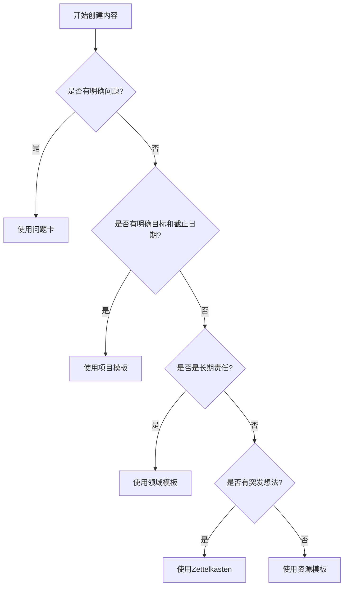

# 🛠️ Templater 完整使用指南

> [!info] **指南概览**
>
> 本指南详细说明如何在 Obsidian 中配置和使用 Templater 插件，配合 PARA 模板系统实现自动化内容生成。包含安装配置、使用流程、故障排除和最佳实践。

---

## 📋 目录

- [📦 前置要求](#📦-前置要求)
- [⚙️ 安装配置](#⚙️-安装配置)
- [🚀 使用流程](#🚀-使用流程)
- [📝 模板详解](#📝-模板详解)
- [🔧 故障排除](#🔧-故障排除)
- [🌟 最佳实践](#🌟-最佳实践)
- [💡 进阶技巧](#💡-进阶技巧)

---

## 📦 前置要求

### 必需插件

| 插件 | 用途 | 必需程度 |
|------|------|----------|
| **Templater** | 模板引擎，动态内容生成 | ✅ 必需 |
| **Dataview** | 数据查询和表格显示 | ✅ 必需 |
| **Tasks** | 任务管理和追踪 | ✅ 必需 |
| **QuickAdd** | 快速创建和选择 | ⚠️ 可选 |

### 系统要求

- **Obsidian 版本**: 1.4.0+
- **操作系统**: Windows / macOS / Linux
- **存储空间**: 至少 1GB 可用空间
- **模板目录**: `_templates/` 模板文件夹

---

## ⚙️ 安装配置

### 1. 安装 Templater 插件

```bash
# 方法一：社区插件市场
1. 打开 Obsidian
2. 进入 Settings → Community plugins
3. 关闭 Safe Mode
4. 搜索 "Templater"
5. 点击 Install，然后 Enable

# 方法二：手动安装
1. 下载最新版本：https://github.com/SilentVoid13/Templater
2. 解压到 .obsidian/plugins/templater-obsidian/
3. 重启 Obsidian
```

### 2. 基础配置

```
Settings → Templater

Template folder location: _templates/
Date format: YYYY-MM-DD
Time format: HH:mm:ss

Trigger Templater on new file creation: ✅
Enable System Command Functions: ✅
```

### 3. 高级设置

```
Settings → Templater

Global filter: ✅
Enable JavaScript queries: ✅
Enable inline queries: ✅

Auto-compile templates in the background: ✅
```

### 4. 插件协同配置

**Tasks 插件配置**:
```
Settings → Tasks
Date format: YYYY-MM-DD
Time format: HH:mm
```

**Dataview 插件配置**:
```
Settings → Dataview
Enable JavaScript queries: ✅
Enable inline queries: ✅
```

---

## 🚀 使用流程

### 方法一：命令面板方式

```bash
1. Ctrl/Cmd + P → 打开命令面板
2. 输入 "Templater" 或 "Templates"
3. 选择 "Templates: Insert template"
4. 从列表选择模板
5. 确认应用模板
```

### 方法二：右键菜单方式

```bash
1. 右键点击编辑器空白处
2. 选择 "Templater"
3. 选择 "Insert template"
4. 选择模板并应用
```

### 方法三：自动触发方式

```bash
1. 已启用 "Trigger Templater on new file creation"
2. 新建文件时自动弹出模板选择
3. 选择模板后自动应用
```

### 模板应用步骤

1. **选择模板**：根据内容类型选择合适模板
2. **替换占位符**：将 `{{title}}` 等替换为实际内容
3. **填写必填字段**：按要求填写必要信息
4. **检查自动字段**：确认日期、ID等自动生成内容
5. **保存文件**：完成模板应用

---

## 📝 模板详解

### 🎯 项目模板 (_template-project.md)

**适用场景**：
- 有明确目标和截止日期的工作项目
- 需要任务管理和进度跟踪的项目
- 多人协作的项目管理

**核心字段**：
```yaml
title: 项目名称
due: YYYY-MM-DD          # 截止日期
priority: high|medium|low # 优先级
status: planning|active|on-hold|completed # 状态
```

**任务格式示例**：
```markdown
## 任务清单
- [ ] 需求分析 📅 2024-02-15 🏷️ #high
- [ ] 原型设计 📅 2024-02-20 🏷️ #medium
- [ ] 开发实施 📅 2024-03-01 🏷️ #high
- [ ] 测试验收 📅 2024-03-15 🏷️ #medium
```

### 🌱 领域模板 (_template-area.md)

**适用场景**：
- 长期责任领域（健康、财务、职业等）
- 需要持续维护的责任管理
- 定期回顾和目标追踪

**核心字段**：
```yaml
title: 领域名称
status: active|inactive|archived
importance: high|medium|low
```

**定期回顾结构**：
```markdown
## 定期回顾

### 月度回顾
**本月重点：**
- [ ] 关键目标1
- [ ] 关键目标2

**完成情况：**
> 上月目标的完成情况

### 季度规划
| 季度 | 关键目标 |
|------|---------|
| Q1 | 目标描述 |
| Q2 | 目标描述 |
| Q3 | 目标描述 |
| Q4 | 目标描述 |
```

### 📚 资源模板 (_template-resource.md)

**适用场景**：
- 持续感兴趣的学习材料
- 有价值的参考资源
- 工具和软件收集

**资源类型**：
```yaml
type:
  - article    # 文章/博客/论文
  - book       # 书籍/电子书
  - podcast    # 播客/音频
  - tool       # 工具/软件
  - course     # 在线课程
```

**标签分类**：
```markdown
## 主题标签
- #AI
- #编程
- #设计

## 难度等级
- #beginner
- #intermediate
- #advanced

## 内容类型
- #reference
- #tutorial
- #inspiration
```

### 🗃️ 归档模板 (_template-archive.md)

**适用场景**：
- 已完成或取消的项目
- 过时或不再需要的内容
- 需要保留但不活跃的内容

**核心字段**：
```yaml
archived: YYYY-MM-DD      # 归档日期
archive_reason: completed|cancelled|obsolete|merged|moved
```

**归档原因**：
- `completed` - 已完成
- `cancelled` - 已取消
- `obsolete` - 已过时
- `merged` - 已合并
- `moved` - 已移动

### 🧠 Zettelkasten 模板 (_template-zettel.md)

**适用场景**：
- 知识点和概念的记录
- 产生新想法的临时笔记
- 建立知识网络的核心单元

**自动字段**：
```yaml
zettel_id: YYYYMMDDHHmmss  # 唯一ID
type: fleeting|literature|permanent|structure
```

**卡片类型**：
- `fleeting` - 临时想法
- `literature` - 文献笔记
- `permanent` - 永久知识
- `structure` - 结构化知识

---

## 🔧 故障排除

### 常见问题 Q&A

#### Q1: Templater 命令找不到？

**问题表现**：
- 命令面板中没有 Templater 相关命令
- 右键菜单中没有 Templater 选项

**解决方案**：
```bash
1. 检查插件是否已安装并启用
   Settings → Community plugins → Templater → 确认已启用

2. 检查插件是否正确加载
   打开开发者工具：Ctrl+Shift+I
   Console 标签查看是否有错误信息

3. 重启 Obsidian
   完全关闭并重新启动 Obsidian
```

#### Q2: 日期没有自动生成？

**问题表现**：
- `{{date}}` 占位符没有被替换
- 显示为原文字符串而不是实际日期

**解决方案**：
```bash
1. 检查 Templater 设置
   Settings → Templater
   确保 Date format: YYYY-MM-DD
   确保 Time format: HH:mm:ss

2. 检查占位符语法
   确认使用正确的占位符：
   - {{date}} - 当前日期
   - now("YYYY-MM-DD HH:mm:ss") - 当前时间戳

3. 尝试手动触发
   按 Ctrl+Shift+P → Templates → Update templates
```

#### Q3: Dataview 查询不显示？

**问题表现**：
- Dataview 代码块没有结果
- 显示为空白或错误信息

**解决方案**：
```bash
1. 检查 Dataview 插件
   Settings → Dataview → 确认已启用
   Enable JavaScript queries: ✅
   Enable inline queries: ✅

2. 检查查询语法
   确保语法正确：
   ```dataview
   TABLE field
   FROM "path"
   ```

3. 等待索引完成
   首次使用需要等待索引构建完成
   可在 Dataview 插件设置中手动重建索引
```

#### Q4: 任务格式不被 Tasks 识别？

**问题表现**：
- 任务显示为普通文本，没有特殊样式
- 截止日期和标签不起作用

**解决方案**：
```bash
1. 检查 Tasks 插件
   Settings → Tasks → 确认已启用

2. 检查任务格式
   标准格式：
   - [ ] 任务描述 📅 2024-02-15 🏷️ #high
   - [x] 已完成任务 ✅ 2024-02-14

3. 验证正则表达式
   确保使用标准正则表达式：
   - `- \\[ \\]` - 未完成
   - `- \\[x\\]` - 已完成
   - `📅` - 截止日期
   - `🏷️ #` - 标签
```

#### Q5: 模板中的 {{title}} 没有替换？

**问题表现**：
- {{title}} 占位符未被替换
- 显示为原文字符串

**解决方案**：
```bash
1. 手动替换占位符
   - 应用模板后，手动将 {{title}} 替换为实际标题
   - 或使用快捷键 Ctrl+F → 查找 {{title}} → 替换

2. 检查变量作用域
   确认变量名称和作用域：
   - {{title}} - 文件标题
   - {{current_date}} - 当前日期
   - <% tp.file.title %> - Templater 语法

3. 使用动态变量
   在模板中使用：
   ```
   <%* const title = await tp.system.prompt("请输入标题"); %>
   # <%= title %>
   ```
```

---

## 🌟 最佳实践

### 1. 模板选择策略



### 2. 文件命名规范

| 类型 | 命名格式 | 示例 |
|------|----------|------|
| 项目 | `2024-02-14_项目名称` | `2024-02-14_网站重构` |
| 领域 | `领域名称` | `健康管理` |
| 资源 | `YYYY-MM-DD_资源名称` | `2024-02-14_Python教程` |
| 归档 | `YYYY-MM-DD_原名称归档` | `2024-02-14_旧项目归档` |
| Zettel | `YYYYMMDDHHmmss_核心思想` | `20240214143025_机器学习基础` |

### 3. 标签体系

```markdown
## 项目相关标签
- #high / #medium / #low - 优先级
- #planning / #active / #on-hold / #completed - 状态
- #urgent / #important / #normal - 紧急程度

## 领域相关标签
- #health / #career / #finance / #learning - 领域分类
- #weekly / #monthly / #quarterly - 回顾周期

## 资源相关标签
- #to-read / #reading / #completed - 阅读状态
- #beginner / #intermediate / #advanced - 难度等级
- #reference / #tutorial / #inspiration - 内容类型

## Zettel相关标签
- #fleeting / #literature / #permanent / #structure - 卡片类型
- #draft / #refined / #verified - 卡片状态
- #connection / #concept / #method - 知识类型
```

### 4. 定期维护策略

**每周维护**：
- 检查项目进度和任务完成情况
- 更新任务状态和优先级
- 归档已完成的任务

**每月维护**：
- 审查领域目标和进展
- 更新月度和季度计划
- 清理过时的资源和项目

**季度维护**：
- 全面回顾所有 PARA 项目
- 归档不再活跃的内容
- 调整长期规划和目标

---

## 💡 进阶技巧

### 1. 自定义变量

```javascript
// 模板中的自定义变量示例
<%*
const title = await tp.system.prompt("请输入标题");
const priority = await tp.system.suggest(["high", "medium", "low"], "选择优先级");
const dueDate = await tp.system.prompt("请输入截止日期 (YYYY-MM-DD):");
%>

# <%= title %>

**优先级**: <%= priority %>
**截止日期**: <%= dueDate %>
```

### 2. 条件渲染

```javascript
<%*
const hasDueDate = await tp.system.prompt("是否设置截止日期? (y/n)", "n") === "y";
%>

<% if (hasDueDate) { %>
## 截止日期
📅 <%= await tp.system.prompt("请输入截止日期") %>
<% } else { %>
## 无截止日期
<% } %>
```

### 3. 循环操作

```javascript
<%*
const tasks = [];
let moreTasks = true;
while (moreTasks) {
    const task = await tp.system.prompt("请输入任务 (留空结束):");
    if (task) {
        tasks.push(task);
    } else {
        moreTasks = false;
    }
}
%>

## 任务清单
<% tasks.forEach((task, index) => { %>
- [ ] <%= task %> 📅 2024-02-<%= String(index + 15).padStart(2, '0') %> 🏷️ #medium
<% }); %>
```

### 4. 文件操作

```javascript
// 创建相关文件
<%*
const relatedNote = await tp.file.create_new("相关内容", "related");
await tp.file.move(`../${relatedNote}`);
%>

## 相关文档
[[<%= relatedNote %>]]
```

### 5. 数据查询

```javascript
// 查询特定类型的内容
<%*
const relatedFiles = await tp.system.prompt("请输入要查询的文件夹:");
const query = `
TABLE WITHOUT ID file.link, file.mtime
FROM "${relatedFiles}"
SORT file.mtime DESC
LIMIT 5
`;
await tp.file.insert(query);
%>
```

---

## 📊 性能优化

### 提升加载速度

1. **模板文件管理**
   - 保持模板文件精简
   - 避免过大的模板文件
   - 定期清理未使用的模板

2. **索引优化**
   - 定期重建 Dataview 索引
   - 避免过复杂的查询
   - 使用索引缓存

3. **内存管理**
   - 关闭不必要的系统命令
   - 限制同时打开的模板数量
   - 定期重启 Obsidian

---

## 🔗 相关资源

### 官方文档
- [Templater 官方文档](https://silentvoid13.github.io/Templater/)
- [Templater GitHub](https://github.com/SilentVoid13/Templater)
- [Dataview 文档](https://blacksmithgu.github.io/obsidian-dataview/)
- [Tasks 文档](https://publish.obsidian.md/tasks/About)

### 社区资源
- [Obsidian 官方论坛](https://forum.obsidian.md/)
- [Templater 用户讨论](https://forum.obsidian.md/c/plugins/templater/11)
- [PARA 方法论](https://fortelabs.com/blog/para/)

### 模板资源
- [模板市场](https://github.com/obsidianmd/obsidian-community/tree/master/templates)
- [模板分享社区](https://forum.obsidian.md/c/community-plugins-11/templater/11)

---

> [!success] 🎉 **Templater 配置完成！**
>
> ✅ 插件安装配置完成
> ✅ 模板使用流程掌握
> ✅ 故障排除指南掌握
> ✅ 最佳实践理解
>
> 开始使用 Templater 提升工作效率吧！