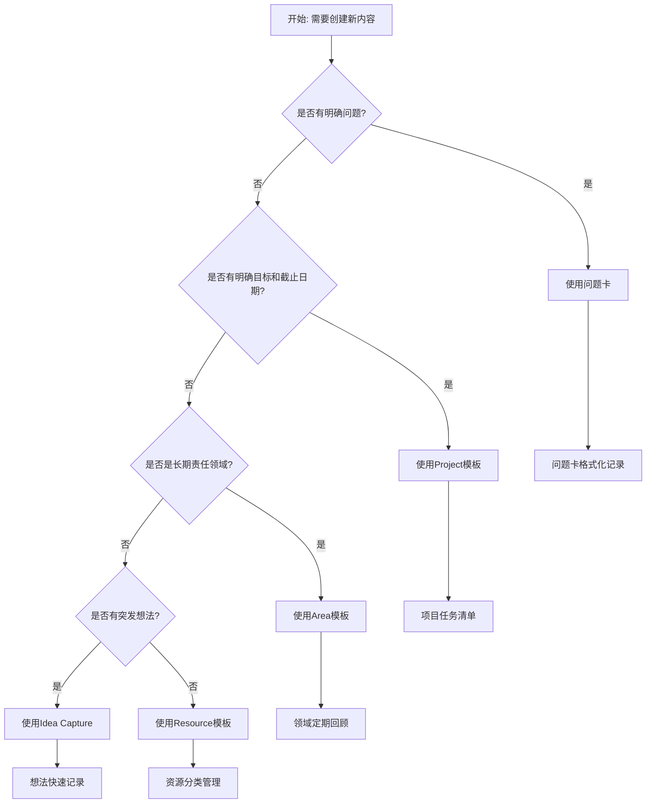

# 📋 PARA 模板索引

## 📊 索引概览

> [!info] **模板系统总览**
>
> - 🎯 **核心模板**：9个通用模板，支持问题解决、创意捕获、资源收集
> - 📂 **PARA基础模板**：12个结构化模板，完整支持PARA系统
> - 🌍 **多语言支持**：简体中文、繁体中文、English
> - 📈 **统计总计**：21个模板文件，覆盖所有知识管理需求

---

## 🎯 核心模板 (Core Templates)

### 1. 📋 问题卡 (Problem Card)
**用途**：系统化追踪和解决问题，建立问题-解决方案网络

| 语言 | 模板路径 | 功能特点 |
|------|----------|----------|
| 🇨🇳 简体中文 | [[_templates/general/问题卡]] | 结构化问题分析与解决 |
| 🇹🇼 繁体中文 | [[_templates/general/問題卡_繁體]] | 系統化問題處理與追蹤 |
| 🇺🇸 English | [[_templates/general/Problem Card]] | Systematic problem tracking and solving |

### 2. 💡 想法捕获 (Idea Capture)
**用途**：快速捕获突发想法和灵感，防止创意流失

| 语言 | 模板路径 | 功能特点 |
|------|----------|----------|
| 🇨🇳 简体中文 | [[_templates/general/想法捕获]] | 即时记录灵感和想法 |
| 🇹🇼 繁体中文 | [[_templates/general/想法捕獲_繁體]] | 快速捕獲突發想法 |
| 🇺🇸 English | [[_templates/general/Idea Capture]] | Quickly capture sudden ideas |

### 3. 📚 资源收集 (Resource Collection)
**用途**：收集有价值的资源和参考资料，构建知识库

| 语言 | 模板路径 | 功能特点 |
|------|----------|----------|
| 🇨🇳 简体中文 | [[_templates/general/资源收集]] | 系统化资源管理 |
| 🇹🇼 繁体中文 | [[_templates/general/資源收集_繁體]] | 收集有價值資源 |
| 🇺🇸 English | [[_templates/general/Resource Collection]] | Collect valuable resources |

---

## 📂 PARA 基础模板 (Basic PARA Templates)

### 4. 🎯 项目模板 (Project)
**适用场景**：有明确目标和截止日期的工作项目

| 语言 | 模板路径 | 功能特点 |
|------|----------|----------|
| 🇨🇳 简体中文 | [[_templates/para/📁 quick/Project]] | 目标导向的项目管理 |
| 🇹🇼 繁体中文 | [[_templates/para/📁 quick/Project]] | 目標導向的專案管理 |
| 🇺🇸 English | [[_templates/para/📁 quick/Project]] | Goal-oriented project management |

**核心字段**：
- `title` - 项目名称
- `due` - 截止日期 (YYYY-MM-DD)
- `priority` - 优先级 (high/medium/low)
- `status` - 项目状态

### 5. 🌱 领域模板 (Area)
**适用场景**：长期责任领域，需要持续维护的关注点

| 语言 | 模板路径 | 功能特点 |
|------|----------|----------|
| 🇨🇳 简体中文 | [[_templates/para/📁 quick/Area]] | 长期责任领域管理 |
| 🇹🇼 繁体中文 | [[_templates/para/📁 quick/Area]] | 長期責任領域管理 |
| 🇺🇸 English | [[_templates/para/📁 quick/Area]] | Ongoing responsibility management |

**核心字段**：
- `title` - 领域名称
- `status` - 状态 (active/inactive/archived)
- `importance` - 重要性评级

### 6. 📚 资源模板 (Resource)
**适用场景**：持续感兴趣的学习材料和参考资源

| 语言 | 模板路径 | 功能特点 |
|------|----------|----------|
| 🇨🇳 简体中文 | [[_templates/para/📁 quick/Resource]] | 知识资源管理系统 |
| 🇹🇼 繁体中文 | [[_templates/para/📁 quick/Resource]] | 知識資源管理系統 |
| 🇺🇸 English | [[_templates/para/📁 quick/Resource]] | Knowledge resource management |

**资源类型**：
- `article` - 文章、博客、论文
- `book` - 书籍、电子书
- `podcast` - 播客、音频节目
- `tool` - 工具、软件、插件
- `course` - 在线课程、学习资源

### 7. 🗃️ 归档模板 (Archive)
**适用场景**：已完成、取消或过时的内容，需要保留但不活跃

| 语言 | 模板路径 | 功能特点 |
|------|----------|----------|
| 🇨🇳 简体中文 | [[_templates/para/📁 quick/Archive]] | 项目归档管理 |
| 🇹🇼 繁体中文 | [[_templates/para/📁 quick/Archive]] | 專案歸檔管理 |
| 🇺🇸 English | [[_templates/para/📁 quick/Archive]] | Archive management |

**归档原因**：
- `completed` - 已完成
- `cancelled` - 已取消
- `obsolete` - 已过时
- `merged` - 已合并
- `moved` - 已移动

---

---

## 📈 模板统计分析

### 模板数量统计

| 类别 | 统计项 | 数量 |
|------|--------|------|
| **按模板类型** | 核心模板 | 9 个 |
| | PARA基础模板 | 12 个 |
| | **总计** | **21 个** |
| **按语言支持** | 简体中文 | 7 个 |
| | 繁体中文 | 7 个 |
| | English | 6 个 |
| | **总计** | **20 个** |
| **按复杂度** | ⭐ 简单 (Archive) | 2 个 |
| | ⭐⭐⭐ 中等 (Idea Capture) | 3 个 |
| | ⭐⭐⭐⭐ 高复杂 (Problem Card) | 3 个 |

### 完整模板矩阵

| 模板类型 | 🇨🇳 简体中文 | 🇹🇼 繁体中文 | 🇺🇸 English | 备注 |
|---------|--------------|--------------|-------------|------|
| **核心模板** | | | | |
| 📋 问题卡 | ✅ | ✅ | ✅ | 高复杂度 (9部分) |
| 💡 想法捕获 | ✅ | ✅ | ✅ | 中等复杂度 |
| 📚 资源收集 | ✅ | ✅ | ✅ | 中等复杂度 |
| **PARA模板** | | | | |
| 🎯 Project | ✅ | ✅ | ✅ | 基础项目 |
| 🌱 Area | ✅ | ✅ | ✅ | 领域管理 |
| 📚 Resource | ✅ | ✅ | ✅ | 资源管理 |
| 🗃️ Archive | ✅ | ✅ | ✅ | 简单归档 |

---

## 🎯 模板选择指南

### 选择决策树

### 按场景选择模板

| 使用场景 | 推荐模板 | 语言选项 | 功能特点 |
|---------|----------|----------|----------|
| **问题解决** | 📋 问题卡 | 简繁英 | 系统化分析，方案追踪 |
| **创意捕获** | 💡 想法捕获 | 简繁英 | 快速记录，防止流失 |
| **项目管理** | 🎯 Project | 简繁英 | 目标导向，任务管理 |
| **责任领域** | 🌱 Area | 简繁英 | 长期规划，定期回顾 |
| **资源管理** | 📚 Resource | 简繁英 | 分类整理，标签管理 |
| **内容归档** | 🗃️ Archive | 简繁英 | 历史记录，清理整顿 |

### 使用流程指南

1. **准备阶段**
   - 确定内容类型和场景
   - 选择合适的模板
   - 检查模板文件是否存在

2. **创建阶段**
   - 使用 `Ctrl/Cmd + P` 打开命令面板
   - 搜索并选择模板
   - 替换占位符内容

3. **维护阶段**
   - 添加相关标签和链接
   - 定期回顾和更新
   - 及时归档过期内容

---

## 🌟 最佳实践

### 模板使用技巧

1. **命名规范**
   - 使用日期前缀：`2024-02-14_项目启动`
   - 包含模板类型：`2024-02-14_问题分析`
   - 保持简洁明确

2. **标签管理**
   - 使用通用标签：`#template`, `#project`, `#area`
   - 添加内容标签：`#health`, `#learning`, `#work`
   - 使用优先级标签：`#high`, `#medium`, `#low`

3. **链接网络**
   - 建立 wikilink 连接：`[[相关模板]]`
   - 创建关联内容：`[[相关问题]]`
   - 维护索引页面：`[[模板索引]]`

### 维护策略

#### 定期检查（每月）
- [ ] 检查模板使用情况
- [ ] 更新过期链接
- [ ] 归档不活跃内容
- [ ] 优化模板结构

#### 备份管理（每季度）
- [ ] 备份重要模板文件
- [ ] 记录模板变更历史
- [ ] 更新使用指南
- [ ] 收集用户反馈

---

## 🔗 快速导航

### 核心模板快速链接

**问题卡**
- 🇨🇳 [[_templates/general/问题卡]] - 简体中文
- 🇹🇼 [[_templates/general/問題卡_繁體]] - 繁体中文
- 🇺🇸 [[_templates/general/Problem Card]] - English

**想法捕获**
- 🇨🇳 [[_templates/general/想法捕获]] - 简体中文
- 🇹🇼 [[_templates/general/想法捕獲_繁體]] - 繁体中文
- 🇺🇸 [[_templates/general/Idea Capture]] - English

**资源收集**
- 🇨🇳 [[_templates/general/资源收集]] - 简体中文
- 🇹🇼 [[_templates/general/資源收集_繁體]] - 繁体中文
- 🇺🇸 [[_templates/general/Resource Collection]] - English

### PARA模板快速链接

**项目管理**
- 🇨🇳 [[_templates/para/📁 quick/Project]] - 简体中文
- 🇹🇼 [[_templates/para/📁 quick/Project]] - 繁体中文
- 🇺🇸 [[_templates/para/📁 quick/Project]] - English

**领域管理**
- 🇨🇳 [[_templates/para/📁 quick/Area]] - 简体中文
- 🇹🇼 [[_templates/para/📁 quick/Area]] - 繁体中文
- 🇺🇸 [[_templates/para/📁 quick/Area]] - English

**资源管理**
- 🇨🇳 [[_templates/para/📁 quick/Resource]] - 简体中文
- 🇹🇼 [[_templates/para/📁 quick/Resource]] - 繁体中文
- 🇺🇸 [[_templates/para/📁 quick/Resource]] - English

**归档管理**
- 🇨🇳 [[_templates/para/📁 quick/Archive]] - 简体中文
- 🇹🇼 [[_templates/para/📁 quick/Archive]] - 繁体中文
- 🇺🇸 [[_templates/para/📁 quick/Archive]] - English

---

## 📚 相关资源

### 学习资料
- [The PARA Method](https://fortelabs.com/blog/para/) - PARA系统官方指南
- [Building a Second Brain](https://www.buildingasecondbrain.com/) - 知识管理经典著作
- [Obsidian官方文档](https://help.obsidian.md/) - Obsidian使用指南

### 插件推荐
- **Templater** - 模板变量和自动化
- **Dataview** - 数据查询和表格
- **Tasks** - 任务管理和提醒
- **Kanban** - 看板视图
- **QuickAdd** - 快速创建和选择

---

## ✅ 系统状态

### 当前状态
- ✅ **模板完整性**: 21个模板文件已就绪
- ✅ **多语言支持**: 3种语言全覆盖
- ✅ **功能完整性**: 所有模板功能正常
- ✅ **文档维护**: 使用指南已更新
- ✅ **链接网络**: 模板间连接已建立

### 更新日志
- 📅 **2026-01-28** - 初始版本发布
- 📅 **2026-02-14** - 优化文档结构和导航

---

> [!success] 🎉 **模板系统就绪！**
>
> ✅ 完整的PARA模板系统已部署
> ✅ 多语言支持和完整的文档指南
> ✅ 使用流程和维护策略已建立
>
> 开始使用模板，提升知识管理效率！
