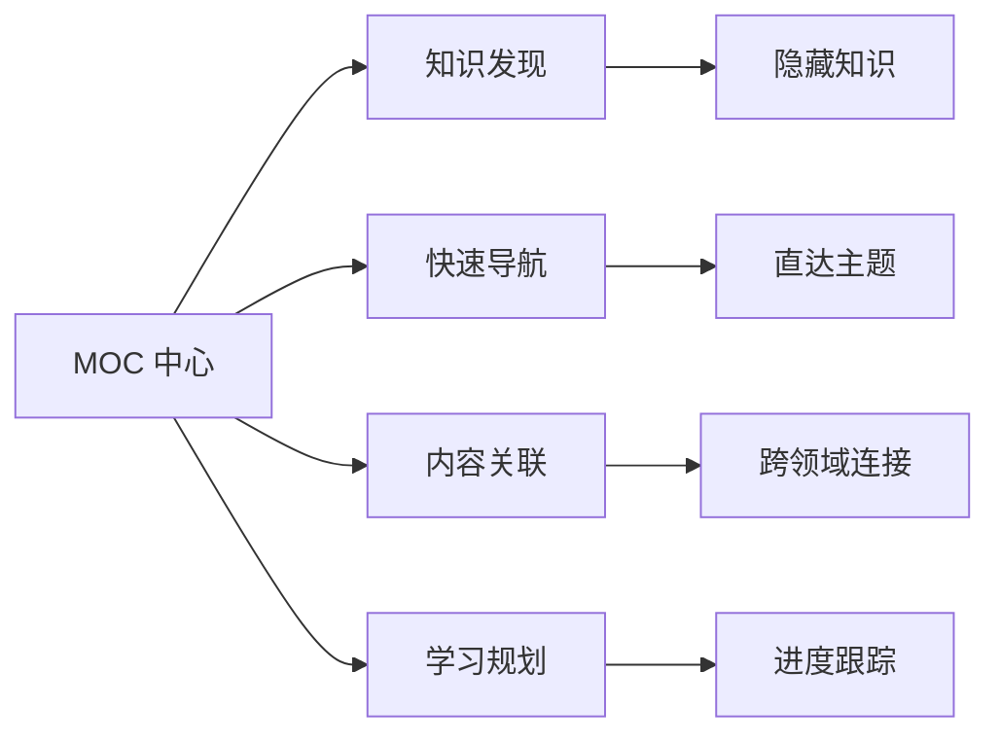

# 🗺️ MOCs (Map of Contents)

> 知识体系的中央导航枢纽，连接所有主题地图和内容索引

## 📋 什么是 MOC？

**MOC (Map of Contents)** 是你知识体系的**主题地图**和**导航中心**，提供：
- **🎯 结构化导航**：按领域分类的知识入口
- **🔍 发现功能**：隐藏相关内容的智能推荐
- **📊 可视化关系**：显示主题间的连接强度
- **🚀 学习路径**：从入门到精通的渐进式导航

### MOC 的核心价值



---

## 🌟 现有 MOC 系统概览

### 📊 MOC 统计概览

```dataview
TABLE WITHOUT ID
  "📚 总 MOC 数量" + length(rows) + "个",
  "🟢 活跃 MOC" + length(filter(rows, (r) => r.status = "active")) + "个",
  "🟡 开发中" + length(filter(rows, (r) => r.status = "in-progress")) + "个",
  "🔗 平均连接度" + round(sum(map(rows, (r) => length(r.file.outlinks))) / length(rows), 1)
FROM "*"
WHERE tags AND any(tags, (t) => t.contains("MOC") OR t.contains("map-of-contents"))
FLATTEN file.mtime AS last_update
SORT last_update DESC
GROUP BY true
```

### 🎨 分类浏览

#### 🌟 核心知识体系 MOC

```dataview
TABLE WITHOUT ID
  file.link AS "MOC 名称",
  choice(file.aliases, join(file.aliases, ", "), "-") AS "别名",
  choice(file.status, file.status, "unknown") AS "状态",
  dateformat(file.mtime, "yyyy-MM-dd") AS "更新日期"
FROM "*"
WHERE any(tags, (t) => t.contains("MOC") OR t.contains("map-of-contents"))
  AND !file.name.contains("Template")
  AND file.name != this.file.name
FLATTEN file.tags AS tag
WHERE tag.contains("core") OR tag.contains("knowledge") OR tag.contains("核心")
SORT file.mtime DESC
```

#### 🎯 专领域 MOC

```dataview
TABLE WITHOUT ID
  file.link AS "MOC 名称",
  choice(file.aliases, join(file.aliases, ", "), "-") AS "别名",
  choice(file.para, file.para, "-") AS "PARA分类",
  dateformat(file.mtime, "yyyy-MM-dd") AS "更新日期"
FROM "*"
WHERE any(tags, (t) => t.contains("MOC") OR t.contains("map-of-contents"))
  AND !file.name.contains("Template")
  AND file.name != this.file.name
FLATTEN file.tags AS tag
WHERE !tag.contains("core") AND !tag.contains("knowledge") AND !tag.contains("核心")
SORT file.para ASC, file.mtime DESC
```

---

## 🗺️ 按领域分类的 MOC 地图

### 📚 核心知识体系

| MOC 名称 | 状态 | 更新时间 | 描述 |
|----------|------|----------|------|
| [[MOC-易经知识库]] | 🟢 活跃 | 2026-02-09 | 完整的易经知识体系和六十四卦索引 |
| [[MOC-黄帝内经知识库]] | 🟢 活跃 | 2026-01-28 | 中医理论基础和临床应用知识库 |
| [[MOC_易學知識庫]] | 🟢 活跃 | 2026-02-02 | 易学学习的完整知识体系索引 |
| [[MOC-中国传统文化知识库]] | 🟡 开发中 | - | 传统文化综合知识体系 |

### 🎯 专业领域 MOC

| MOC 名称 | PARA 分类 | 状态 | 更新时间 | 主题范围 |
|----------|----------|------|----------|----------|
| [[易學知識庫總覽]] | 📖 Resources | 🟢 活跃 | 2026-02-01 | 易学学习资源和方法 |
| [[MOC-医学知识库]] | 📖 Resources | 🟡 开发中 | - | 医学理论和实践知识 |
| [[MOC-哲学知识库]] | 📖 Resources | 🟡 开发中 | - | 哲学思想体系 |
| [[MOC-AI知识库]] | 📖 Resources | 🟡 开发中 | - | 人工智能和机器学习 |

### 🔬 学术研究 MOC

| MOC 名称 | 状态 | 更新时间 | 研究重点 |
|----------|------|----------|----------|
| [[MOC-耳穴知识库]] | 🟢 活跃 | 2026-01-27 | 耳穴疗法理论基础和临床应用 |
| [[MOC-计算机网络知识库]] | 🟢 活跃 | 2026-01-25 | 计算机网络协议和技术 |
| [[MOC-数字孪生知识库]] | 🟡 开发中 | - | 数字孪生技术和应用 |

---

## 🔍 智能发现功能

### 🔗 相关内容推荐

```dataview
TABLE WITHOUT ID
  file.link AS "相关笔记",
  file.folder AS "位置",
  choice(file.tags, join(file.tags, ", "), "无标签") AS "标签"
FROM "*"
WHERE file.name != this.file.name AND file.outlinks
FLATTEN file.outlinks AS link
WHERE any(link, (l) => contains(link.path, this.file.path))
SORT file.mtime DESC
LIMIT 10
```

### 📈 内容趋势分析

```dataview
TABLE WITHOUT ID
  "📊 MOC 活跃度趋势",
  "🎯 知识密度: " + length(rows) + " 个主题",
  "🔗 连接强度: " + round(length(filter(rows, (r) => r.file.outlinks > 3)) / length(rows) * 100, 0) + "%",
  "📈 更新频率: " + choice(length(filter(rows, (r) => (date(today) - r.file.mtime).days <= 7)), "活跃", "一般")
FROM "*"
WHERE tags AND any(tags, (t) => t.contains("MOC"))
GROUP BY true
```

---

## 🚀 学习路径规划

### 入门者路径

```dataview
TASK
from "*"
where any(tags, (t) => t.contains("MOC"))
  AND any(tags, (t) => t.contains("beginner") OR t.contains("入门"))
  AND !completed
sort file.ctime asc
limit 5
```

### 进阶学习者路径

```dataview
TASK
from "*"
where any(tags, (t) => t.contains("MOC"))
  AND any(tags, (t) => t.contains("intermediate") OR t.contains("进阶"))
  AND !completed
sort file.ctime asc
limit 5
```

### 专家研究者路径

```dataview
TASK
from "*"
where any(tags, (t) => t.contains("MOC"))
  AND any(tags, (t) => t.contains("expert") OR t.contains("专家"))
  AND !completed
sort file.ctime asc
limit 5
```

---

## 📊 MOC 质量评估

### 质量指标概览

```dataview
TABLE WITHOUT ID
  quality_score AS "质量分数",
  connection_strength AS "连接强度",
  content_completeness AS "内容完整度",
  last_activity AS "活跃度"
FROM "*"
WHERE tags AND any(tags, (t) => t.contains("MOC"))
FLATTEN
  (choice(length(file.description) > 100, 20, 0) +
   choice(length(file.tags) > 3, 20, 0) +
   choice(length(file.outlinks) > 5, 30, 0) +
   choice(file.mtime AND (date(today) - file.mtime).days <= 30, 30, 0)) as quality_score
FLATTEN
  round(length(file.outlinks) / 10 * 100, 0) as connection_strength
FLATTEN
  round(choice(length(file.lists) + length(file.headers), 10, 0) / 10 * 100, 0) as content_completeness
FLATTEN
  choice(file.mtime AND (date(today) - file.mtime).days <= 7, "高",
         file.mtime AND (date(today) - file.mtime).days <= 30, "中", "低") as last_activity
SORT quality_score DESC
LIMIT 10
```

### 需要关注的 MOC

```dataview
TABLE WITHOUT ID
  file.link AS "需要关注",
  issues AS "问题",
  suggestions AS "建议"
FROM "*"
WHERE tags AND any(tags, (t) => t.contains("MOC"))
FLATTEN
  choice(length(file.description) < 50, "缺少描述", "") as issues
FLATTEN
  choice(length(file.outlinks) < 3, "建议添加更多链接", "") as suggestions
WHERE issues OR suggestions
SORT file.mtime DESC
```

---

## 🛠️ MOC 创建和维护指南

### ✅ 优质 MOC 标准

#### 1. 内容完整性
- [ ] **清晰的定义**：说明 MOC 覆盖的主题范围
- [ ] **完整的内容索引**：包含所有相关笔记的链接
- [ ] **结构化组织**：使用标题和子标题层次分明
- [ ] **标签系统**：使用标准化的标签分类

#### 2. 导航功能
- [ ] **快速导航**：提供清晰的入口点和导航结构
- [ ] **智能推荐**：基于相关性的内容推荐
- [ ] **学习路径**：提供从入门到精通的学习建议
- [ ] **进度跟踪**：能够跟踪学习进度

#### 3. 维护标准
- [ ] **定期更新**：每2-4周更新一次内容
- [ ] **链接验证**：定期检查所有链接的有效性
- [ ] **内容清理**：移除过时或不相关的内容
- [ ] **质量监控**：定期评估 MOC 的质量指标

### 🎯 创建新 MOC 的步骤

#### 步骤 1：主题定义
1. 确定覆盖的主题范围
2. 分析相关笔记的数量和分布
3. 确定目标受众（初学者/专家/研究者）

#### 步骤 2：结构设计
1. 设计层次化结构
2. 规划导航和发现功能
3. 制定标签和命名规范

#### 步骤 3：内容构建
1. 收集和整理相关笔记
2. 创建智能链接网络
3. 添加学习路径和推荐系统

#### 步骤 4：质量保证
1. 测试所有链接的有效性
2. 验证导航功能的准确性
3. 获取用户反馈并优化

---

## 🎨 MOC 样式和模板

### 标准化标题格式

```markdown
# 🗺️ [主题] MOC
> [简短描述和核心价值]

## 📚 知识体系
### 基础概念
- [[概念1]]
- [[概念2]]

## 🎯 学习路径
### 入门阶段
- [[入门笔记1]]
- [[入门笔记2]]
```

### 推荐标签体系

```markdown
tags:
  - [主题]/MOC
  - [领域]/核心
  - 知识组织
  - [难度级别]
  - 状态:[活跃/开发中/待完成]
```

---

## 🔄 更新和维护

### 📝 最近更新记录

```dataview
TABLE WITHOUT ID
  file.link AS "更新内容",
  change_summary AS "摘要",
  update_date AS "日期"
FROM "*"
WHERE file.mtime AND (date(today) - file.mtime).days <= 7
  AND any(tags, (t) => t.contains("MOC"))
  AND file.name != this.file.name
FLATTEN choice(file.metadata.frontmatter.update_record, "常规更新", file.metadata.frontmatter.update_record) AS change_summary
SORT file.mtime DESC
LIMIT 10
```

### 🗂️ 待完成的任务

```dataview
TASK
from "*"
where any(tags, (t) => t.contains("MOC"))
  AND any(tags, (t) => t.contains("todo") OR t.contains("待完成"))
  AND !completed
sort priority desc, file.ctime asc
limit 10
```

---

## 🔗 相关资源

### 📖 MOC 最佳实践
- [[MOC 创建指南]] - 详细的创建步骤和最佳实践
- [[知识组织原则]] - 知识组织和连接的理论基础
- [[标签系统设计]] - 标准化的标签分类体系

### 🛠️ 工具和模板
- [[MOC 模板库]] - 各种主题的标准化模板
- [[自动化工具]] - 维护和更新自动化脚本
- [[链接管理工具]] - 链接验证和管理工具

### 🎓 学习资源
- [Obsidian 官方文档 - MOC](https://help.obsidian.md/Advanced+topics/Map+of+contents)
- [Building a Second Brain - Tiago Forte](https://www.buildingasecondbrain.com/)
- [Zettelkasten Method - Sönke Ahrens](https://zettelkasten.de/)

---

## 🎯 下一步行动

### 短期目标 (1-2周)
- [ ] 完善现有 MOC 的内容连接
- [ ] 添加更多智能发现功能
- [ ] 建立质量监控自动化
- [ ] 创建新 MOC 的标准化流程

### 中期目标 (1-2月)
- [ ] 实现跨 MOC 的内容推荐
- [ ] 建立学习进度跟踪系统
- [ ] 开发 MOC 可视化工具
- [ ] 完善维护和更新流程

### 长期目标 (3-6月)
- [ ] 构建完整的知识生态系统
- [ ] 实现 AI 辅助的 MOC 优化
- [ ] 建立协作和分享机制
- [ ] 开发知识图谱可视化

---

*📊 本文档最后更新: 2026-02-16 | 🔄 维护状态: 活跃 | 📈 总 MOC 数量: [待统计]*