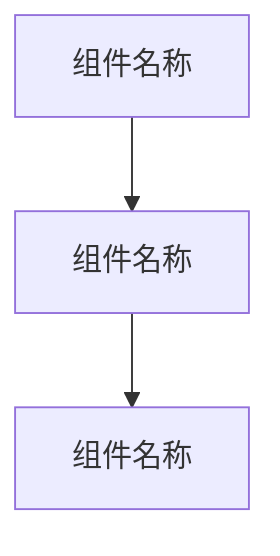
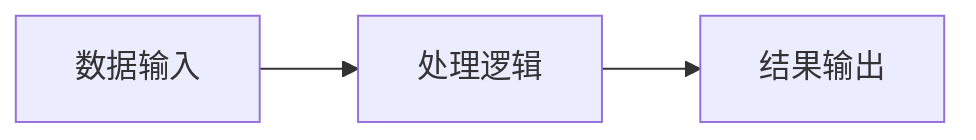

# Clawdbot项目模板

## 这是一个用于自动化机器人项目的Obsidian笔记模板

### 使用方法
1. 复制此模板文件
2. 重命名为你的项目名称
3. 填写具体的项目信息
4. 删除此说明部分

---
title: {项目名称}
status: active|on-hold|completed|cancelled
priority: high|medium|low
due: YYYY-MM-DD
tags: [automation/robot, project/{status}]
aliases: [{项目别名1}, {项目别名2}]
created: YYYY-MM-DD
updated: YYYY-MM-DD
---

# {项目名称}

## 项目概述

### 项目目标
{简要描述项目要实现的目标}

### 核心功能
- {功能点1}
- {功能点2}
- {功能点3}

## 技术栈

### 后端技术
- {技术1}: {用途说明}
- {技术2}: {用途说明}

### 前端技术
- {技术1}: {用途说明}

### 基础设施
- {技术1}: {用途说明}

## 项目结构

### 主要组件

### 数据流

## 开发计划

### 里程碑
| 阶段 | 计划时间 | 主要任务 | 状态 |
|------|----------|----------|------|
| 需求分析 | YYYY-MM-DD | {任务描述} | □ |
| 设计 | YYYY-MM-DD | {任务描述} | □ |
| 开发 | YYYY-MM-DD | {任务描述} | □ |
| 测试 | YYYY-MM-DD | {任务描述} | □ |
| 部署 | YYYY-MM-DD | {任务描述} | □ |

## 相关笔记

### 设计文档
- [[{相关文档1}]]
- [[{相关文档2}]]

### 开发记录
- [[{相关文档3}]]

### 参考资料
- [[{相关文档4}]]

## 任务清单

### 待办事项
- [ ] {任务1}
- [ ] {任务2}
- [ ] {任务3}

### 问题跟踪
- [ ] {问题1}: {问题描述}
- [ ] {问题2}: {问题描述}

## 决策记录

### 技术选型
| 决策 | 选择 | 原因 | 日期 |
|------|------|------|------|
| {技术类别} | {选择的技术} | {选择原因} | YYYY-MM-DD |

### 重要决策
1. **{决策主题}**: {决策内容} ({日期})
   - **原因**: {决策原因}
   - **影响**: {影响范围}

## 参考资料

- [[{参考资料1}]]
- [[{参考资料2}]]

---
*最后更新: YYYY-MM-DD*
*分类: 1 Projects*