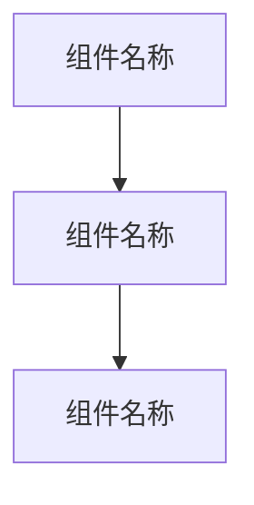

---
# 專案
status: template
priority: normal
tags: [template, clawdbot, project]
created: 2024-01-30
---

# 專案

# 專案

# 方法
# 檔案
# 專案
# 專案
# 刪除

---
# 專案
status: active|on-hold|completed|cancelled
priority: high|medium|low
due: YYYY-MM-DD
tags: [automation/robot, project/{status}]
# 專案
created: YYYY-MM-DD
updated: YYYY-MM-DD
---

# 專案

# 專案

# 專案
# 專案

### 核心功能
- {功能点1}
- {功能点2}
- {功能点3}

## 技术栈

### 后端技术
- {技术1}: {用途说明}
- {技术2}: {用途说明}

### 前端技术
- {技术1}: {用途说明}

### 基础设施
- {技术1}: {用途说明}

# 專案

### 主要组件


# 數據
```mermaid
flowchart LR
# 數據
# 輸出
```

# 開發

### 里程碑
| 阶段 | 计划时间 | 主要任务 | 状态 |
|------|----------|----------|------|
# 分析
# 設計
# 開發
# 測試
# 部署

# 筆記

# 設計
- [[{相关文檔1}]]
- [[{相关文檔2}]]

# 開發
- [[{相关文檔3}]]

### 参考资料
- [[{相关文檔4}]]

## 任务清单

### 待办事项
- [ ] {任务1}
- [ ] {任务2}
- [ ] {任务3}

### 问题跟踪
- [ ] {问题1}: {问题描述}
- [ ] {问题2}: {问题描述}

# 記錄

### 技术选型
| 决策 | 选择 | 原因 | 日期 |
|------|------|------|------|
| {技术类别} | {选择的技术} | {选择原因} | YYYY-MM-DD |

### 重要决策
1. **{决策主题}**: {决策内容} ({日期})
   - **原因**: {决策原因}
   - **影响**: {影响范围}

## 参考资料

- [[{参考资料1}]]
- [[{参考资料2}]]

---
# 更新
# 分類